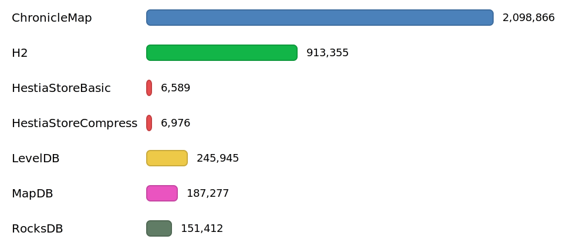
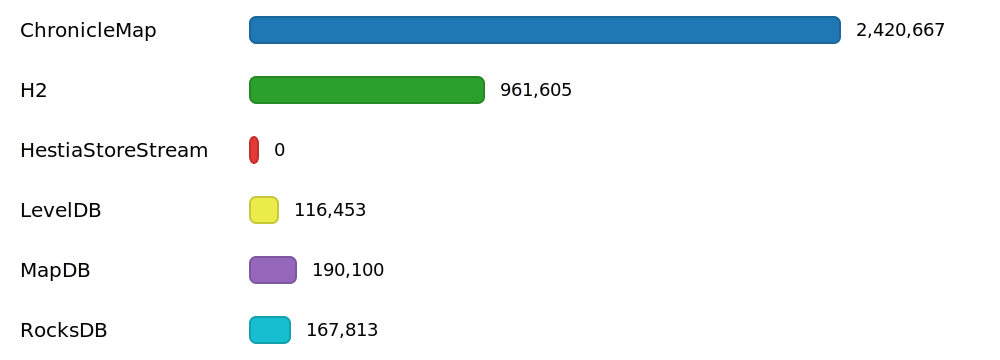

# 

[](https://github.com/jajir/HestiaStore/actions/workflows/maven.yml?query=branch%3Amain)


[](https://www.gnu.org/licenses/lgpl-3.0)
[](https://www.bestpractices.dev/projects/10654)

[](https://javadoc.io/doc/org.hestiastore.index/core)
[](https://sonarcloud.io/summary/new_code?id=jajir_HestiaStore)
[](https://sonarcloud.io/summary/new_code?id=jajir_HestiaStore)
[](https://sonarcloud.io/summary/new_code?id=jajir_HestiaStore)

HestiaStore is a lightweight, embeddable key‑value storage engine optimized for billions of records, designed to run in a single directory with high performance and minimal configuration.

Features:

```plaintext
 • Pure Java (no native dependencies), easy to embed
 • 200k+ ops/s; predictable I/O with configurable buffering
 • In‑memory or file‑backed storage, zero‑config setup
 • Pluggable filters: Snappy compression, CRC32 integrity, magic-number validation
 • Bloom filter for fast negative lookups (tunable false-positive rate)
 • Segmented structure with sparse index for efficient range scans
 • Custom key/value types via type descriptors
 • Single‑writer, multi‑reader (optional synchronized mode)
 • Test-friendly MemDirectory for fast, isolated tests
 • Roadmap: write-ahead logging and advanced compaction
```

## 🚀 Performance Comparison

All tests ran on a 2024 Mac mini with 16 GB RAM. Absolute numbers vary between runs, so focus on relative differences.

### Benchmark `write` throughput (ops/s, higher is better)

The following benchmark compares similar products by writing simple key-value pairs into a map. It includes a 3-minute warm-up to prime caches, followed by a 4-minute measurement period.


Detailed methodology and full benchmark artifacts are available at [benchmark results](https://hestiastore.org/why-hestiastore/out-write/).

### Benchmark `read` throughput (ops/s, higher is better)

The read benchmark measures random lookups over the same pre-populated dataset produced by the write test. Each engine is opened on that data and a single client issues random reads of existing keys (no deletes). A 3-minute warm-up primes OS and engine caches, followed by a 4-minute measurement window.



Detailed methodology and full benchmark artifacts are available at [benchmark results](https://hestiastore.org/why-hestiastore/out-read/).

### Benchmark `sequential read` throughput (ops/s, higher is better)

The sequential read benchmark scans the same pre‑populated dataset in key order using each engine’s iterator. Each engine is opened on that data and a single client performs a forward scan across all entries. A 3‑minute warm‑up primes OS and engine caches, followed by a 4‑minute measurement window.



Detailed methodology and full benchmark artifacts are available at [benchmark results](https://hestiastore.org/why-hestiastore/out-sequential/).

## 📊 Feature Comparison

Architecture & Concurrency

| Engine | Storage/Index | Concurrency | Background Work |
|:--|:--|:--|:--|
| HestiaStore | Segmented on-disk structure | Single-writer, multi-reader (optional synchronized) | Periodic segment flush/merge |
| RocksDB | LSM tree (leveled/uni) | Highly concurrent | Compaction + flush threads |
| LevelDB | LSM tree | Single-writer, multi-reader | Compaction |
| MapDB | B-tree/H-tree | Thread-safe (synchronized) | Periodic commits |
| ChronicleMap | Off-heap mmap hash map | Lock-free/low-lock | None (no compaction) |
| H2 | B-tree | Concurrent (MVCC) | Checkpoint/auto-vacuum |

Durability & Fit

| Engine | Durability | Compression | Runtime Deps | Typical Fit |
|:--|:--|:--|:--|:--|
| HestiaStore | File-backed; commit on close | Snappy | Pure Java (JAR-only) | Embedded KV with simple ops, large datasets |
| RocksDB | WAL + checkpoints (optional transactions) | Snappy/Zstd/LZ4 | Native library | High write throughput, low-latency reads |
| LevelDB | File-backed; no transactions | Snappy | JAR-only port/native bindings | Lightweight LSM, smaller footprints |
| MapDB | File-backed; optional TX | None/limited | Pure Java (JAR-only) | Simple embedded maps/sets |
| ChronicleMap | Memory-mapped persistence; no ACID TX | None | Pure Java (JAR-only) | Ultra-low latency shared maps |
| H2 | WAL + MVCC transactions | Optional | Pure Java (JAR-only) | SQL + transactional workloads |

Notes

- “Concurrency” describes the general access model; specifics depend on configuration and workload.
- HestiaStore focuses on predictable file I/O with configurable buffering; WAL/transactions are on the roadmap.

## 🤝 Contributing

We welcome contributions! Please read our [Contributing Guidelines](CONTRIBUTING.md) before submitting a pull request.

## 📚 Documentation

- [Index architecture](https://hestiastore.org/architecture/arch-index/)
- [Getting started](https://hestiastore.org/how-to-use/) with a quick start and examples
- [Configuration](https://hestiastore.org/configuration/) — properties overview and guidance
- [Logging](https://hestiastore.org/configuration/logging/) — how to set up logging
- [Releases](https://hestiastore.org/development/release/) — versioning and release process

<!--
* [Segment implementation details](segment.md)
-->

## 📦 Installation and Basic Usage

To include HestiaStore in your Maven project, add the following dependency to your `pom.xml`:

```xml
<dependencies>
  <dependency>
    <groupId>org.hestiastore.index</groupId>
    <artifactId>core</artifactId>
    <version><!--latest verson--></version>
  </dependency>
</dependencies>
```

Replace the version number with the latest available from Maven Central [org.hestiastore.index:core](https://central.sonatype.com/artifact/org.hestiastore.index/core).

**Note**: HestiaStore requires Java 17 or newer.

You can create a new index using the builder pattern as shown below:

```java
// Create an in-memory file system abstraction
Directory directory = new MemDirectory();

// Prepare index configuration
IndexConfiguration<String, String> conf = IndexConfiguration
        .<String, String>builder()//
        .withKeyClass(String.class)//
        .withValueClass(String.class)//
        .withName("test_index") //
        .build();

// Create a new index
SegmentIndex<String, String> index = SegmentIndex.<String, String>create(directory, conf);

// Perform basic operations
index.put("Hello", "World");

String value = index.get("Hello");
System.out.println("Value for 'Hello': " + value);

index.close();
```

For more integration details, see the [Getting Started](how-to-use/index.md) section.

## 🗺️ Roadmap

Planned improvements include:

- Full Multithreaded Storage Engine – Currently this is the biggest performance limitation. Disk I/O consumes only about 40% of available CPU, leaving significant unused capacity.
- Implement Asynchronous I/O – Explore alternative approaches for file system access. Replace the current java.io-based implementation.
- Example Application – Provide a simple, easy-to-run demo application that demonstrates HestiaStore’s capabilities.
For detailed tasks and progress, see the [GitHub Issues](https://github.com/jajir/HestiaStore/issues) page.

## ❓ Need Help or Have Questions?

If you encounter a bug, have a feature request, or need help using HestiaStore, please [create an issue](https://github.com/jajir/HestiaStore/issues).
