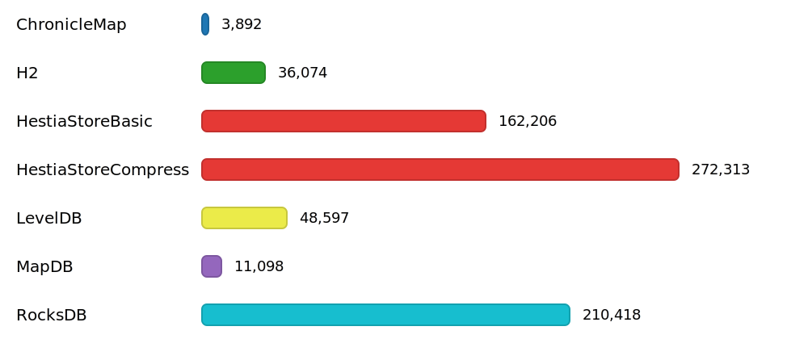
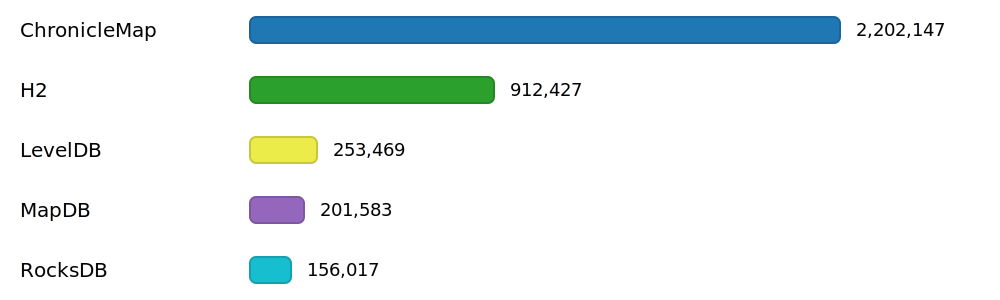

# 

HestiaStore is an embeddable Java key-value storage engine for large local
datasets. It is optimized for predictable file I/O, bounded-memory lookups,
range scans, and operational simplicity inside a single application process.

[](https://github.com/jajir/HestiaStore/actions/workflows/maven.yml?query=branch%3Amain)


[](https://www.gnu.org/licenses/lgpl-3.0)
[](https://www.bestpractices.dev/projects/10654)

[](https://javadoc.io/doc/org.hestiastore/engine)
[](https://sonarcloud.io/summary/new_code?id=jajir_HestiaStore)
[](https://sonarcloud.io/summary/new_code?id=jajir_HestiaStore)
[](https://sonarcloud.io/summary/new_code?id=jajir_HestiaStore)

## What it is a good fit for

- embedded storage inside a Java service or application
- datasets that do not fit comfortably in memory
- predictable local persistence with optional WAL-based crash recovery
- point lookups plus ordered iteration over large key ranges
- teams that want a pure-Java dependency without native libraries

## What it is not trying to be

- a distributed database
- a multi-node replication layer
- a cross-key ACID transaction engine
- a replacement for a full relational database when SQL is the primary need

## Start here

- [Evaluate HestiaStore](why-hestiastore/index.md) if you are deciding whether
  it matches your workload.
- [Install](how-to-use/install.md) and [Quick Start](how-to-use/quick-start.md)
  if you want a working example immediately.
- [Configuration](configuration/index.md) if you need to tune directories,
  caching, filters, or custom data types.
- [Operations](operations/index.md) if you need WAL, monitoring, backups, or
  tuning guidance.
- [Export & Import](operations/export-import.md) if you need the standalone
  operational CLI for logical backup, migration, or export to other systems.
- [Architecture](architecture/index.md) if you need implementation detail and
  internal contracts.
- [Contribute & Community](development/index.md) if you are contributing code,
  documentation, or release work.

## Key capabilities

- Pure Java embedding with no native dependency requirement
- In-memory or filesystem-backed directories
- Custom key and value type descriptors
- Bloom-filter assisted negative lookups
- Segment-based storage with ordered scans
- Optional write-ahead logging for local crash recovery
- Monitoring snapshots and optional monitoring modules

## Performance highlights

All tests ran on a 2024 Mac mini with 16 GB RAM. Absolute numbers vary between
runs, so treat the charts as relative comparisons, not absolute guarantees.

### Write throughput



### Random read throughput



### Sequential read throughput


### Multithread write throughput


### Multithread read throughput


Detailed methodology, workload notes, and links to raw artifacts are available
on the [Benchmarks](why-hestiastore/benchmarks.md) page.

## Minimal example

```java
import org.hestiastore.index.directory.Directory;
import org.hestiastore.index.directory.MemDirectory;
import org.hestiastore.index.segmentindex.IndexConfiguration;
import org.hestiastore.index.segmentindex.SegmentIndex;

Directory directory = new MemDirectory();

IndexConfiguration<String, String> conf = IndexConfiguration
    .<String, String>builder()
    .identity(identity -> identity
        .name("example")
        .keyClass(String.class)
        .valueClass(String.class))
    .build();

try (SegmentIndex<String, String> index = SegmentIndex.create(directory, conf)) {
    index.put("hello", "world");
    System.out.println(index.get("hello"));
}
```

For the next step after this example, go to [Quick Start](how-to-use/quick-start.md).

## Documentation paths

- [Alternatives](why-hestiastore/alternatives.md) for a side-by-side comparison
  against other embedded engines
- [Benchmarks](why-hestiastore/benchmarks.md) for evaluation
- [Quality & Testing](why-hestiastore/quality.md) for delivery confidence
- [Security](SECURITY.md) for reporting and posture
- [Release Process](development/release.md) for maintainers

## Support

- Search or open issues on [GitHub Issues](https://github.com/jajir/HestiaStore/issues)
- Read [Troubleshooting](how-to-use/troubleshooting.md) for common integration
  problems
