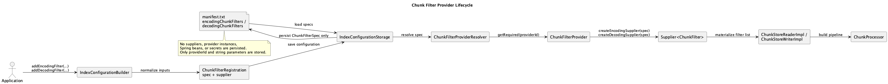
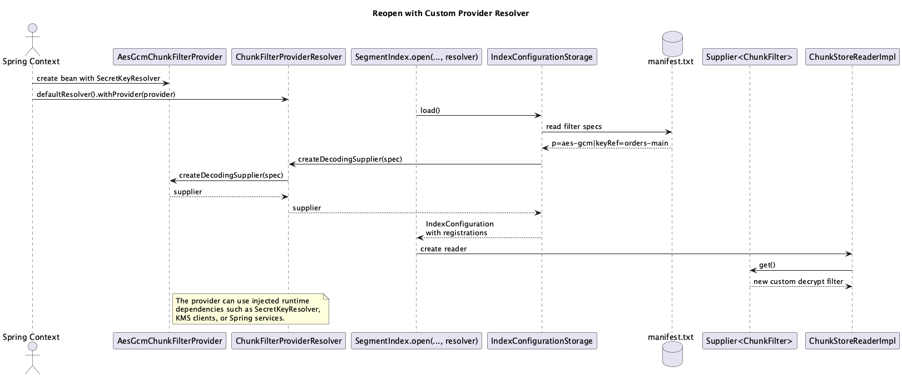

# Chunk Filter Provider Model

This page explains how HestiaStore persists chunk filter configuration without
persisting runtime objects such as `Supplier<ChunkFilter>`, secrets, or
Spring-managed services.

For filter behavior and ordering see [Filters & Integrity](filters.md). For
builder usage and code examples see
[Filter Configuration](../configuration/filters.md).

## Core invariants

- `ChunkFilterSpec` is the persisted contract. It stores a stable
  `providerId` and string parameters.
- `ChunkFilterProvider` is a runtime factory. It converts a
  `ChunkFilterSpec` into encoding and decoding suppliers.
- `ChunkFilterProviderRegistry` is an immutable runtime snapshot used during
  `SegmentIndex.create(...)` and `SegmentIndex.open(...)`.
- `ChunkFilterRegistration` is builder/runtime glue only. It couples a
  persisted `ChunkFilterSpec` with a runtime `Supplier<? extends ChunkFilter>`.
- Metadata never stores suppliers, secrets, Spring beans, or provider class
  names.

## Main flow



Source:
[chunk-filter-provider-lifecycle.plantuml](images/chunk-filter-provider-lifecycle.plantuml)

## Runtime reopening flow



Source:
[chunk-filter-provider-open.plantuml](images/chunk-filter-provider-open.plantuml)

## Main types

| Type | Responsibility | Persisted |
| --- | --- | --- |
| `ChunkFilterSpec` | Stable filter descriptor: `providerId` + parameters | Yes |
| `ChunkFilterRegistration` | Binds `ChunkFilterSpec` to a runtime supplier | No |
| `ChunkFilterProvider` | Creates encoding and decoding suppliers for one logical filter family | No |
| `ChunkFilterProviderRegistry` | Immutable lookup of provider id to provider instance | No |
| `ChunkFilterSpecCodec` | Serializes/deserializes filter specs in `manifest.txt` | Yes |

## Configure and persist

There are three builder entry points for filter configuration:

- `addEncodingFilter(ChunkFilter)` and `addDecodingFilter(ChunkFilter)`
- `addEncodingFilter(Class<? extends ChunkFilter>)` and
  `addDecodingFilter(Class<? extends ChunkFilter>)`
- `addEncodingFilter(Supplier<? extends ChunkFilter>, ChunkFilterSpec)` and
  `addDecodingFilter(Supplier<? extends ChunkFilter>, ChunkFilterSpec)`

All three forms end as `ChunkFilterRegistration`.

Built-in and legacy class-based filters derive their `ChunkFilterSpec`
automatically through `ChunkFilterSpecs`. Custom providers supply the
`ChunkFilterSpec` explicitly so metadata can be reopened later.

When `IndexConfigurationStorage` writes metadata, it stores only
`List<ChunkFilterSpec>`. Runtime suppliers are discarded at the persistence
boundary.

## Reopen and resolve

On reopen, `IndexConfigurationStorage` reads encoded filter specs from
`manifest.txt`, then asks `ChunkFilterProviderRegistry` to resolve each spec
back into an encoding or decoding supplier.

Built-in providers are available through
`ChunkFilterProviderRegistry.defaultRegistry()`. Custom providers must be added
to the registry passed into `SegmentIndex.create(...)`,
`SegmentIndex.open(...)`, or `SegmentIndex.tryOpen(...)`.

This separation is what allows a provider to depend on runtime services such as
Spring beans, a key resolver, or a KMS client while still keeping persisted
metadata stable.

## Metadata format

`ChunkFilterSpecCodec` stores one pipeline item as:

```text
p=<providerId>|<key>=<value>|<key>=<value>
```

Example:

```text
encodingChunkFilters=p=crc32,p=magic-number,p=snappy,p=aes-gcm|keyRef=orders-main
decodingChunkFilters=p=magic-number,p=aes-gcm|keyRef=orders-main,p=snappy,p=crc32
```

Legacy metadata containing only a class name is still supported and is mapped
to the built-in `java-class` provider.

The `aes-gcm` provider id in the example above is a custom provider id, not a
built-in default. A typical implementation materializes
`ChunkFilterAesGcmEncrypt` and `ChunkFilterAesGcmDecrypt` using a runtime key
resolver and the persisted `keyRef` parameter.

## Materialization and performance

Providers return `Supplier<? extends ChunkFilter>`, not chunk filter instances.
This keeps provider resolution out of the hot per-chunk path.

Supplier materialization happens when HestiaStore creates the chunk I/O runtime
for a reader or writer, where `ChunkStoreReaderImpl` and `ChunkStoreWriterImpl`
materialize a fresh filter list before building `ChunkProcessor`.

That means:

- providers can return stateful filters
- secrets can stay outside persisted metadata
- per-chunk processing still works with concrete filter instances only

## Built-in providers

The default registry ships with these provider ids:

- `crc32`
- `magic-number`
- `snappy`
- `xor`
- `do-nothing`
- `java-class`

Each provider id represents one logical encode/decode pair. For example,
`snappy` means `ChunkFilterSnappyCompress` on write and
`ChunkFilterSnappyDecompress` on read.

Provider ids outside that list, such as `aes-gcm`, must be supplied by the
application through an extended `ChunkFilterProviderRegistry`.

## Related docs

- [Filters & Integrity](filters.md)
- [Filter Configuration](../configuration/filters.md)
- [Write Path](segmentindex/write-path.md)
- [Read Path](segmentindex/read-path.md)
