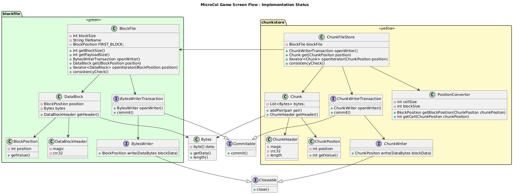

# Data Block and Chunk Design in HestiaStore

This document describes the structure and purpose of `Block` and `Chunk` objects in the HestiaStore storage engine.

---

## Block

A **Block** is the lowest-level physical unit of storage. It has a fixed size (typically a multiple of 4KB) and is directly written to disk.

### Key Characteristics:
- **Fixed Size**: Determined by `BlockFile#getBlockSize()`.
- **Header**: Each block includes a header with metadata (e.g. magic number, CRC32 checksum, data length).
- **Payload**: The remaining portion of the block contains user data (`getPayloadSize()` returns the usable size).

### Block Header Format:
| Offset | Size  | Field         | Description                          |
|--------|-------|---------------|--------------------------------------|
| 0      | 4 B   | `magic`       | Identifier for block integrity check |
| 4      | 4 B   | `crc32`       | CRC checksum for payload verification|
| 8      | 4 B   | `dataLength`  | Actual size of data in the block     |
| 12+    | N/A   | `payload`     | User data payload                    |

Blocks are stored and retrieved via the `BlockFile` abstraction.

---

## Chunk

A **Chunk** represents a variable-sized, logical data unit stored inside a block. It is used to store optionally compressed sets of key-value pairs.

### Key Characteristics:
- **Variable Size**: Can be smaller or span multiple blocks depending on compression.
- **Stored Inside Blocks**: Uses the `BlockFile` to persist data.
- **Compressible**: Designed for efficient compression and decompression.
- **Encapsulated Metadata**: Chunks also have a header to ensure validity and interpretability.

### Chunk Header Format:
| Offset | Size  | Field               | Description                          |
|--------|-------|---------------------|--------------------------------------|
| 0      | 4 B   | `magic`             | Chunk type signature                 |
| 4      | 4 B   | `crc32`             | CRC of compressed payload            |
| 8      | 4 B   | `compressedLength`  | Length of compressed data            |
| 12     | 4 B   | `uncompressedLength`| Length of original (uncompressed) data |
| 16+    | N/A   | `payload`           | Compressed chunk data                |

Chunks are managed through the `ChunkFileStore` and written using `ChunkWriter`.

---

## Relationships

- `BlockFile` provides the persistent storage mechanism.
- `ChunkFileStore` maps chunk positions to blocks and provides higher-level access.
- CRC validation is used in both blocks and chunks to ensure data consistency and detect corruption.

---
