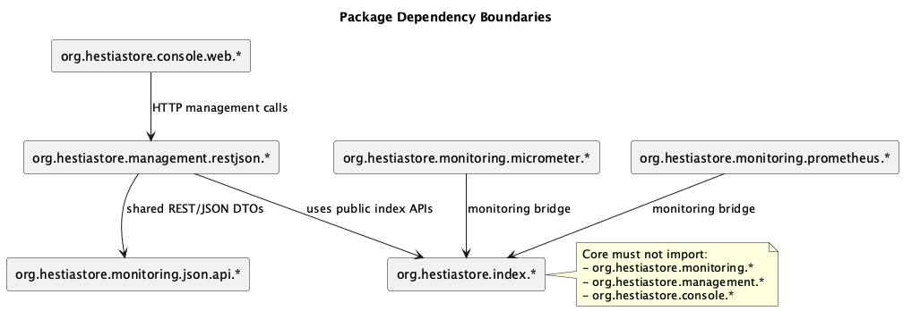

# Package Layout

This document defines dependency direction between HestiaStore packages so the
core remains lightweight and integration layers can evolve independently.

## Current module layout

This page also captures the current module-to-package alignment (previously
documented as "Module Current State").

| Domain                                  | Current module directory   | Current artifactId         | Current package root                    |
| --------------------------------------- | -------------------------- | -------------------------- | --------------------------------------- |
| Parent build                            | `.` (repository root)      | `hestiastore-parent`       | N/A (parent POM only)                   |
| Index core                              | `engine`                   | `engine`                   | `org.hestiastore.index`                 |
| Monitoring and management API contracts | `monitoring-rest-json-api` | `monitoring-rest-json-api` | `org.hestiastore.monitoring.json.api`   |
| Monitoring bridge (Micrometer)          | `monitoring-micrometer`    | `monitoring-micrometer`    | `org.hestiastore.monitoring.micrometer` |
| Monitoring bridge (Prometheus)          | `monitoring-prometheus`    | `monitoring-prometheus`    | `org.hestiastore.monitoring.prometheus` |
| Node monitoring/management REST bridge  | `monitoring-rest-json`     | `monitoring-rest-json`     | `org.hestiastore.management.restjson`   |
| Monitoring console web UI               | `monitoring-console-web`   | `monitoring-console-web`   | `org.hestiastore.console.web`           |

## Target package roles

- `org.hestiastore.index.*`
  Core storage/index engine and public data APIs.
- `org.hestiastore.monitoring.json.api.*`
  Shared monitoring/management REST JSON contracts.
- `org.hestiastore.monitoring.micrometer.*`
  Micrometer integration layer.
- `org.hestiastore.monitoring.prometheus.*`
  Prometheus integration layer.
- `org.hestiastore.management.restjson.*`
  Node-local management endpoints running in index JVM.
- `org.hestiastore.console.web.*`
  Central web console/control-plane UI.

## Allowed dependency direction

```text
index <- monitoring bridges
index + monitoring REST/JSON API contracts <- management REST/JSON bridge
management REST/JSON bridge <- console web (HTTP)
```

## Package dependency diagram



Source: [packages.plantuml](images/packages.plantuml)

Rules:

- Core must not import:
  - `org.hestiastore.monitoring.*`
  - `org.hestiastore.management.*`
  - `org.hestiastore.console.*`
- Monitoring must use only public core APIs (no package-private internals).
- Management/console REST JSON communication must reuse contracts from
  `org.hestiastore.monitoring.json.api.*` and avoid duplicate DTO definitions.

## Enforcement

The test `PackageDependencyBoundaryTest` enforces that core source files do not
import monitoring, management, or console packages.

This test is intentionally source-level and lightweight so it can run without
additional architecture tooling.
