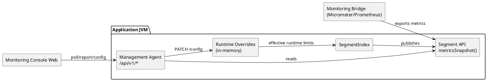

# 🧭 Architecture

This section is organized by responsibility to keep related topics together and
to centralize segment internals in one place.

## Monitoring (high level)

Runtime monitoring data comes from the Segment API surface on
`SegmentIndex.metricsSnapshot()`. The management agent reads snapshots for
`/api/v1/report`, and runtime-safe config overrides are applied in-memory only
for the running process. Monitoring and management APIs do not directly access
index files.

PlantUML source:
[`docs/architecture/monitoring/images/monitoring-runtime-flow.plantuml`](monitoring/images/monitoring-runtime-flow.plantuml)

## Sections

- [General](general/index.md) — cross-cutting format, integrity, recovery,
  limits, package boundaries, and glossary.
- [Monitoring](monitoring/index.md) — runtime monitoring bridge and management
  API contracts.
- [SegmentIndex](segmentindex/index.md) — top-level index orchestration:
  read/write paths, caching, performance, and index concurrency.
- [Segment](segment/index.md) — central place for segment internals:
  file layout, delta cache, Bloom filter, sparse/scarce index, and segment
  lifecycle.
- [Registry](registry/index.md) — segment registry state machine, cache-entry
  model, and concurrent loading/unloading flows.
