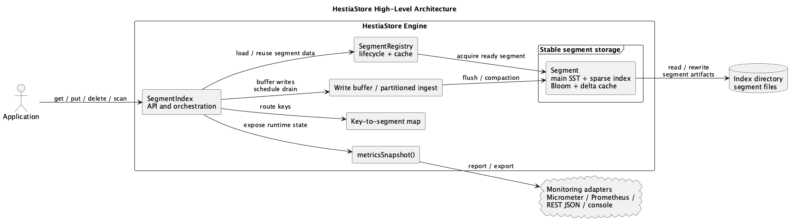

# Architecture

This section is organized by responsibility so cross-cutting engine topics live
at the top level and component internals stay grouped under dedicated section
indexes.

## High-level system view

HestiaStore is organized around a `SegmentIndex` orchestration layer that
routes operations across stable segments, keeps hot segment state in memory, and
exposes runtime metrics without letting monitoring code touch index files
directly.

Source: [system-overview.plantuml](images/system-overview.plantuml)

## Main runtime components

- **SegmentIndex** is the public engine entry point. It owns request routing,
  direct routed writes, flush/compaction scheduling, split orchestration, and
  runtime metrics.
- **Key-to-segment map** resolves which segment should serve a key range so the
  index can route reads and writes without scanning every segment.
- **SegmentRegistry** is the lifecycle and cache boundary between
  `SegmentIndex` and loaded segment data. It decides when segment resources are
  created, reused, evicted, and closed.
- **Segment** is the stable storage shard. A segment combines a main SST, a
  sparse index, a Bloom filter, and delta cache files to balance write cost and
  lookup latency.
- **Monitoring adapters** consume `SegmentIndex.metricsSnapshot()` and runtime
  management APIs. They observe the engine, but they do not read or rewrite
  segment files directly.

## High-level data flow

- **Write path**: requests enter `SegmentIndex`, are routed to one stable
  segment, and become immediately visible through that segment's write cache;
  flush and compaction later persist the segment state.
- **Read path**: `SegmentIndex` routes a key through the key-to-segment map,
  obtains the target segment through the registry, and then reads segment
  structures such as delta cache, Bloom filter, sparse index, and main SST.
- **Observability path**: monitoring integrations read immutable runtime
  snapshots from the engine and expose them through REST JSON or external
  metrics systems.

## Cross-cutting topics

- [Data Block Format](datablock.md) — low-level block and chunk structure.
- [Filters & Integrity](filters.md) — chunk filter pipeline and validation.
- [Chunk Filter Provider Model](chunk-filter-provider-model.md) — how filter
  specs, providers, registries, and runtime suppliers fit together.
- [Chain of Filters](chain-of-filters.md) — shared filter-chain helper.
- [Concurrency Model](concurrency.md) — index-wide synchronization model.
- [Consistency & Recovery](recovery.md) — crash-safety and recovery model.
- [Package Layout](package-boundaries.md) — module/package layout and
  dependency contracts.
- [Limitations & Trade-offs](limits.md) — current constraints and risks.
- [Glossary](glossary.md) — shared terminology.

## Component sections

- [Monitoring](monitoring/index.md) — runtime monitoring bridge and management
  API contracts.
- [SegmentIndex](segmentindex/index.md) — top-level index orchestration:
  read/write paths, caching, performance, and index concurrency.
- [Segment](segment/index.md) — central place for segment internals:
  file layout, delta cache, Bloom filter, sparse/scarce index, and segment
  lifecycle.
- [Registry](registry/index.md) — segment registry state machine, cache-entry
  model, and concurrent loading/unloading flows.
