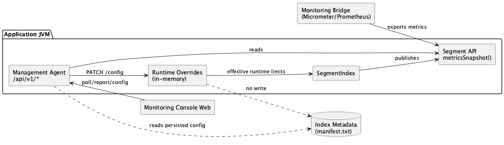

# 📡 Monitoring

Monitoring architecture covers runtime observability and runtime-safe operational
control.

## Scope

- **Monitoring Bridge**: optional adapters that export runtime snapshots to
  external systems (Micrometer/Prometheus).
- **Monitoring API**: node-local management API exposed by `monitoring-rest-json`
  (`/api/v1/*`) for reports, actions, and runtime config overrides.

## Module structure

- `engine`
- `monitoring-micrometer`
- `monitoring-prometheus`
- `monitoring-rest-json-api`
- `monitoring-rest-json`
- `monitoring-console-web`

## Runtime model

- `SegmentIndex.metricsSnapshot()` provides immutable runtime snapshots.
- `monitoring-rest-json` aggregates snapshots from all monitored indexes in one JVM.
- `monitoring-console-web` consumes the API and renders node/index runtime views.
- Runtime config overrides are applied **in memory only** and do not rewrite
  persisted index metadata.
- `GET /api/v1/config` exposes `supportedKeys`; the same list defines which
  keys are accepted by `PATCH /api/v1/config`.

## Pages

- [Monitoring Bridge](monitoring-bridge.md)
- [Monitoring API](monitoring-api.md)
