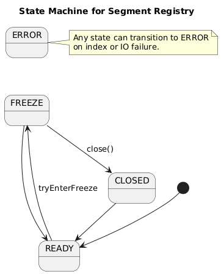

# Segment Registry Concurrency

This document describes the segment registry responsibilities and supported operations. 

## Scope
- The registry owns:
    - safe access to segment resources (load/create/delete)
    - in-memory segment cache (LRU)
    - registry-level state gate (`READY`, `CLOSED`, `ERROR`)
    - segment id allocation for new segments via `SegmentIdAllocator`
- The registry does **not** own split execution, scheduling, or in-flight
  tracking. Those belong to the segment index layer.
- The registry is about safe access to segment resources; it should not manage
  operations *on* those resources (flush/compact/split remain outside).

## Registry State Machine

Registry states are intentionally small and short‑lived.

### Transitions

| Original State | New State | When                           |
| -------------- | --------- | ------------------------------ |
| `READY`        | `CLOSED`  | index closing                  |
| any            | `ERROR`   | unrecoverable registry failure |

### Rules
- `getSegment()` and `deleteSegment()` return `BUSY` when the registry is not
  `READY` or when the target handler is locked.
- `CLOSED` and `ERROR` are terminal.

## Registry Operations

| Operation             | Description                                                      |
| --------------------- | ---------------------------------------------------------------- |
| `getSegment(id)`      | Load or return cached segment by id.                             |
| `allocateSegmentId()` | Allocate a new segment id for split or growth.                   |
| `createSegment()`     | Allocate id and create a new segment (returns segment instance). |
| `deleteSegment(id)`   | Close and delete a segment, then remove from cache.              |
| `close()`             | Close cached segments.                                           |

All registry operations return `SegmentRegistryAccess` so callers can react to
`BUSY`/`CLOSED`/`ERROR` states and (when available) acquire a handler lock via
`lock()/unlock()` without exposing the handler itself.

### `deleteSegment(id)` flow

1) Lock the cached handler (if present); return `BUSY` if it is already locked.
2) Close the segment with retry/backoff until it is `CLOSED` or returns `OK`.
3) Delete the segment directory and files on disk.
4) Evict the handler from the cache (unlock is unnecessary after eviction).

When the segment is not cached, deletion is best‑effort and only touches disk.

### Response Codes

`SegmentRegistryResultStatus` mirrors segment semantics:

| Code        | Description                                                      |
| ----------- | ---------------------------------------------------------------- |
| `OK`        | Segment returned or operation accepted.                          |
| `BUSY`      | Temporary refusal (registry not `READY` or lock conflict).       |
| `NOT_FOUND` | Requested segment does not exist in registry storage.            |
| `CLOSED`    | Registry closed; no further operations.                          |
| `ERROR`     | Unrecoverable registry failure.                                  |

## Split Workflow (Index Layer)

The split workflow is intentionally two‑phase: **prepare** outside the registry
and **apply** under short, targeted locks in the index layer (key‑map lock and
handler lock). Registry involvement is limited to safe segment access, id
allocation, and deletion of the old segment after a successful apply.

### Step‑by‑step (proposed)

1) **Lock handler and re‑check eligibility**  
   Acquire the `SegmentHandler` lock for the target segment to block
   non‑privileged access. Re‑check split eligibility under the handler lock.

2) **Open exclusive iterator**  
   Acquire `SegmentIteratorIsolation.FULL_ISOLATION` on the target segment.
   This blocks concurrent writes/flush/compact for the segment and yields a
   stable view.

3) **Split on maintenance executor**  
   Run the split in a background maintenance thread. Create two **new**
   segments (lower + upper) by streaming from the exclusive iterator.

4) **Persist key‑map update**  
   Update the key‑to‑segment map under the map lock:
   - remove the old segment id
   - add the new lower + upper segment ids with their key ranges
   - flush the map to disk

5) **Release segment resources**  
   Close the exclusive iterator and release segment locks. Close/free any
   temporary segment instances created for the split.

6) **Delete the old segment**  
   Call `SegmentRegistry.deleteSegment(oldId)` to lock the handler, close the
   segment, delete files, and evict it from cache.

### Split Outcome Mapping

| Split Status | Map Update                         | Directory Action       | Cache Update       |
| ------------ | ---------------------------------- | ---------------------- | ------------------ |
| `SPLIT`      | remove old + add lower + add upper | no swap (new ids only) | evict old instance |
| `COMPACTED`  | remove old + add lower             | no swap (new id only)  | evict old instance |

## Locking & Ordering Rules

- **Handler lock first, iterator lock second**  
  The `SegmentHandler` lock is acquired before opening the
  `FULL_ISOLATION` iterator. Eligibility is re‑checked under the handler lock.

- **Key-map lock remains required**  
  The registry does not replace the key‑to‑segment map’s own synchronization.
  Always use the map’s lock/adapter when mutating or reading the on‑disk map,
  because other index operations may bypass the registry lock.

- **Lock order (apply phase)**  
  During split apply, acquire the handler lock, then the key‑map lock.
  Release in reverse order.

- **No directory swap**  
  New segment ids are always created for split outputs; index data is not
  swapped in place.

- **Directory-backed id allocation**  
  Segment ids are allocated by `SegmentIdAllocator`, which scans the index
  directory for segment roots named `segment-00001` and returns max+1 (or 1
  when none exist). Allocation is not tied to the key-to-segment map.

- **Lock/unlock order is consistent**  
  Acquire locks in a single global order and release in reverse order
  (handler -> key‑map; unlock key‑map -> handler) to avoid deadlocks.

## Failure Handling

### Split failure before apply
- Close iterator and free any temporary segments.
- Registry remains `READY`, map is unchanged.
- Callers see `BUSY` or `ERROR` depending on root cause.

### Split failure during apply
- Apply failure keeps the registry in `READY`; map recovery is handled by the
  index layer, and orphaned segment directories are cleaned up on next open.

### Lock conflicts
- Segment directory lock conflicts return `BUSY` (retryable).

## Invariants

- **Map updates are consistent**: apply phase must fully replace the old
  segment with the new segment ids or transition to `ERROR`.
- **Map lock is short**: split IO happens outside the key‑map lock; only
  in‑memory updates and persistence run under the map lock.
- **No hidden compaction**: split does not implicitly run `compact()`.

## Relation to Segment Concurrency

The segment state machine (see `segment-concurrency.md`) guarantees that
`FULL_ISOLATION` blocks writes and maintenance while the split iterator is
open. The registry relies on that exclusivity to build new segments without
concurrent mutation, then applies the map update and finally deletes the old
segment via `SegmentRegistry.deleteSegment(...)`.
