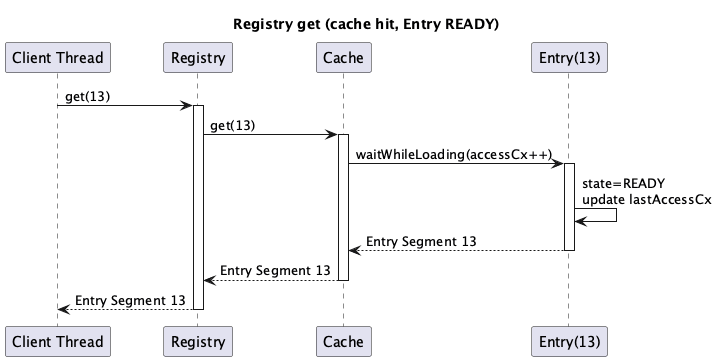
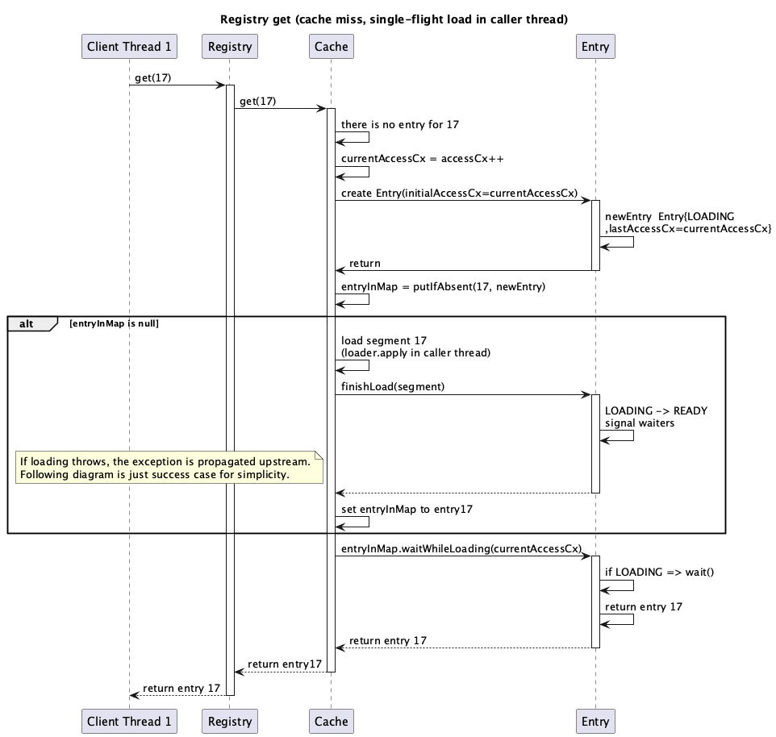
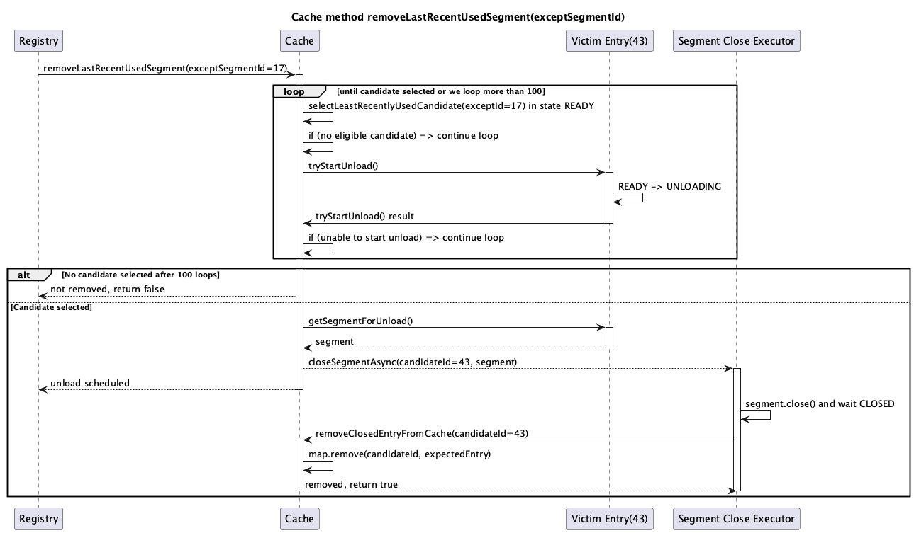

# Segment Registry

This document describes the segment registry responsibilities and supported operations. 

## Scope
- The registry owns:
    - safe access to segment resources (load/create/delete)
    - in-memory segment cache (LRU)
    - registry-level state gate (`READY`, `CLOSED`, `ERROR`, `FREEZE`)
    - segment id allocation for new segments via `SegmentIdAllocator`
- The registry does **not** own protection of "segment in use" vs "segment close/delete" races.
  This responsibility belongs to the Segment package. Segment implementations
  must remain safe when one thread uses a segment while another thread closes it.
- The registry does **not** own split execution, scheduling, or in-flight
  tracking. Those belong to the segment index layer.
- The registry is about safe access to segment resources; it should not manage
  operations *on* those resources (flush/compact/split remain outside).
- Segment load/open failures are status-driven:
  `getSegment()` and `createSegment()` return `ERROR` when loading/opening
  fails (including missing segment files), with no dedicated registry-status exception type.

## Registry State Machine

Registry starts in `FREEZE` during bootstrap and transitions to `READY`
when startup completes.

### Transitions

| Original State | New State | When                                      |
| -------------- | --------- | ----------------------------------------- |
| `READY`        | `FREEZE`  | is part of `close()` procedure            |
| `FREEZE`       | `READY`   | happens after starting procedure          |
| `FREEZE`       | `CLOSED`  | index closing while frozen (`close()`)    |
| any            | `ERROR`   | unrecoverable registry failure (`fail()`) |

### Rules

- Request operations (`getSegment()`, `allocateSegmentId()`, `createSegment()`,
  `deleteSegment()`) are state-gated:
  `READY` -> normal flow, `FREEZE` -> `BUSY`, `CLOSED` -> `CLOSED`,
  `ERROR` -> `ERROR`.
- In `READY`, `getSegment()` and `deleteSegment()` can still return `BUSY`
  on cache entry state conflict.
- `close()` is idempotent and moves `READY` to `FREEZE` and than to  `CLOSED`.
- `ERROR` is terminal for the state machine; `close()` does not transition
  `ERROR` to `CLOSED`.

## Registry Operations

| Operation             | Description                                                      |
| --------------------- | ---------------------------------------------------------------- |
| `getSegment(id)`      | Load or return cached segment by id (`SegmentRegistryResult<Segment>`). |
| `allocateSegmentId()` | Allocate a new segment id for split or growth (`SegmentRegistryResult<SegmentId>`). |
| `createSegment()`     | Allocate id and create a new segment (`SegmentRegistryResult<Segment>`). |
| `deleteSegment(id)`   | Close and delete a segment, then remove from cache (`SegmentRegistryResult<Void>`). |
| `close()`             | Close cached segments (`SegmentRegistryResult<Void>`).           |

All registry operations return `SegmentRegistryResult<T>` (status + optional value).
Registry BUSY/CLOSED/ERROR outcomes are propagated by `SegmentRegistryResultStatus`.
The primary safety model is the registry state
gate + per-key cache entry state machine, not caller-side pinning.

### Response Codes

`SegmentRegistryResultStatus` is carried by `SegmentRegistryResult<T>` with semantics:

| Code     | Description                                                                               |
| -------- | ----------------------------------------------------------------------------------------- |
| `OK`     | Segment returned or operation accepted.                                                   |
| `BUSY`   | Temporary refusal (cache entry state conflict, `UNLOADING`, or registry is `FREEZE`). |
| `CLOSED` | Registry closed; no further operations.                                                   |
| `ERROR`  | Unrecoverable registry failure.                                                           |

## Registry cache Entry

This section describes the target cache-entry model planned for implementation.

### Entry operations

| Operation                           | Entry state precondition | Outcome                                                                                                                                         | Used by                                  |
| ----------------------------------- | ------------------------ | ----------------------------------------------------------------------------------------------------------------------------------------------- | ---------------------------------------- |
| `tryStartLoad()`                    | `MISSING`                | Attempts to start load for the key by transitioning to `LOADING` for the winning caller. Returns not-started when another entry already exists. | `SegmentRegistryCache.get()` miss path   |
| `waitWhileLoading(currentAccessCx)` | Any                      | Waits while `LOADING` Returns value in `READY`, any exceptions in propagated. up                                                                | `SegmentRegistryCache.get()`             |
| `finishLoad(value)`                 | `LOADING`                | Stores value, transitions to `READY`, signals waiters.                                                                                          | cache load winner                        |
| `fail(exception)`                   | `LOADING`                | Stores failure, marks entry failed/unloading path, signals waiters; map entry is removed by cache loader error path.                            | cache loader error path                  |
| `tryStartUnload()`                  | `READY` with value       | Attempts atomic transition to `UNLOADING`. Returns `true` when unload was started, `false` otherwise.                                           | eviction and `invalidate()`              |
| `finishUnload()`                    | `UNLOADING`              | Clears value and signals waiters; entry is then treated as missing by readers.                                                                  | eviction and `invalidate()` finalization |
| `getEvictionOrder()`                | Any                      | Returns LRU order only for unloadable `READY` entry; otherwise returns sentinel (`Long.MAX_VALUE`).                                             | LRU candidate selection                  |

`waitWhileLoading(currentAccessCx)` blocks only while the entry is in `LOADING`.
It does not wait for `UNLOADING`; that case must be handled by higher-level
caller logic, because an unloaded entry is no longer valid.

### Per-key `Entry` state machine

Each cache key owns one `Entry` object with an independent lock/condition.
Only threads touching the same key can block each other.

#### States

| State       | Description                                                                                        |
| ----------- | -------------------------------------------------------------------------------------------------- |
| `LOADING`   | Entry was atomically installed with `putIfAbsent(key, Entry{LOADING})`; winner thread loads value. |
| `READY`     | Value is available; `get(key)` returns the value immediately and updates recency.                  |
| `UNLOADING` | Value is being closed/unloaded and entry is no longer usable for normal reads.                     |

`MISSING` is a virtual state: it means no entry was found in cache for the key yet, but an entry can still be instantiated by the loading path.

#### Transitions

| From        | To          | Trigger                                                               |
| ----------- | ----------- | --------------------------------------------------------------------- |
| `MISSING`   | `LOADING`   | Winning caller starts load (`tryStartLoad()`).                        |
| `LOADING`   | `READY`     | Loader completes successfully and signals waiters.                    |
| `LOADING`   | `MISSING`   | Loader fails; entry is removed and waiters are signaled with failure. |
| `READY`     | `UNLOADING` | Eviction/delete starts unload (`tryStartUnload()`).                   |
| `UNLOADING` | `MISSING`   | Unloader completes and entry is removed from cache.                   |

#### Guarantees

- At most one loader runs per key.
- Wait/notify is per key (`Entry`), not global.
- Keys with different `Entry` instances progress independently.
- Unload is started by direct per-entry transition (`READY -> UNLOADING`), not
  by reference pin counting.

## Thread model

### 1. Registry `get(id)` with cached

### 2. Registry get(id) with cached entry in LOADING state

When the registry entry exists in cache but is still `LOADING`, the cache waits until loading finishes before returning it. When the entry is `UNLOADING`, the registry treats it as temporarily unavailable and returns `BUSY`. The flow is shown below:

### 3. Registry `get(id)` cache miss with `putIfAbsent(LOADING)`

Please note that segment is loaded in callers thread.

### 4. Cache method `removeLastRecentUsedSegment()`

The diagram shows only the case where `segment.close()` succeeds. If `segment.close()` fails with exeception than the entry remains in `UNLOADING`. Which is fine.

### `deleteSegment(id)` flow

1. Try to transition the cached entry to `UNLOADING`; return `BUSY` when the entry is not unloadable.
1. Close the segment with retry/backoff until it is `CLOSED` or returns `OK`.
1. Delete the segment directory and files on disk.
1. Remove the unloaded entry from cache memory.

When the segment is not cached, deletion is best‑effort and only touches disk.
