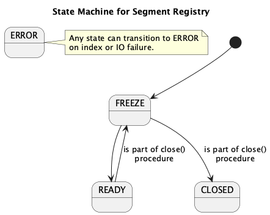
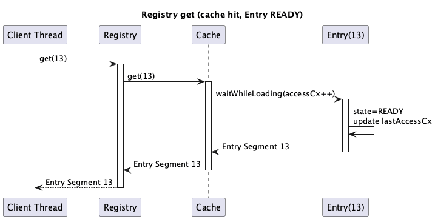
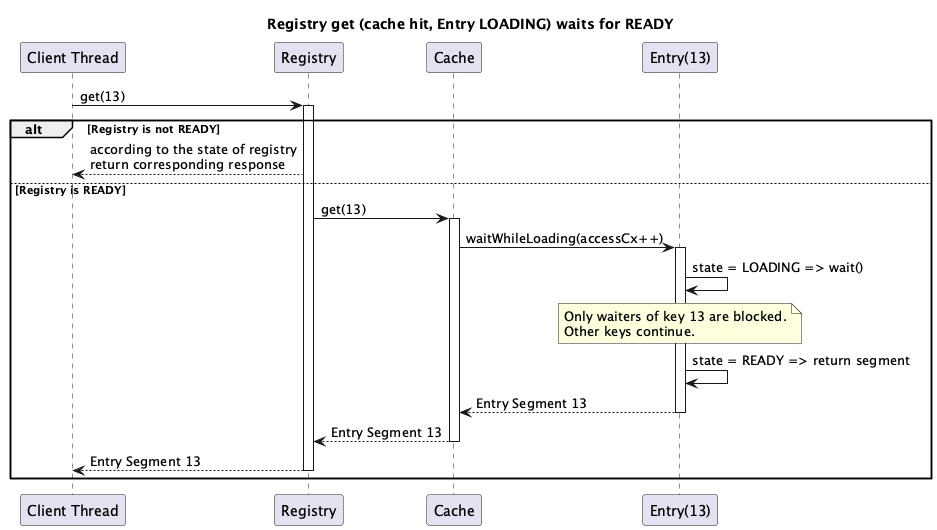
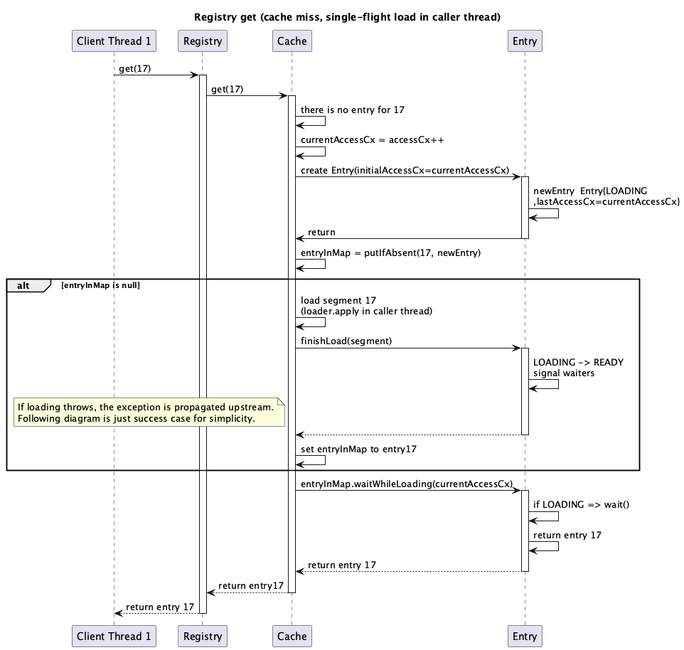

# Segment Registry

This document describes the segment registry responsibilities and supported operations. 

## Scope
- The registry owns:
    - safe access to segment resources (load/delete)
    - in-memory segment cache (LRU)
    - registry-level state gate (`READY`, `CLOSED`, `ERROR`, `FREEZE`)
    - segment id allocation for new segments via a `Supplier<SegmentId>`
    - physical deletion of normal, retired, and unpublished prepared segments
- The registry does **not** own protection of "segment in use" vs "segment close/delete" races.
  This responsibility belongs to the Segment package. Segment implementations
  must remain safe when one thread uses a segment while another thread closes it.
- The registry does **not** own split execution, scheduling, or in-flight
  tracking. Those belong to the segment index layer.
- The registry is about safe access to segment resources and now exposes
  `BlockingSegment` as the main public access point for loaded segments.
- `BlockingSegment` centralizes retry-aware blocking operations and segment
  runtime descriptors, while callers still own higher-level operation policy
  such as fail-fast routing, split coordination, and accepted-vs-completed
  maintenance behavior.
- Registry internals use the shared `OperationResult<T>` and `OperationStatus`
  protocol. The public `SegmentRegistry` facade translates those statuses into
  blocking results, `Optional`, `boolean`, or `IndexException`, depending on
  the selected operation.
- A missing segment directory is currently treated as `BUSY`. Consequently,
  `loadSegment()` retries until its busy timeout, while `tryGetSegment()`
  returns an empty result.

## Registry State Machine

The registry state machine starts in `FREEZE`. `SegmentRegistryImpl`
transitions it to `READY` during registry construction. This occurs when
`SegmentIndexBootstrapOperation` opens the registry, before the remaining
SegmentIndex runtime services and startup completion steps are assembled.

### Transitions

| Original State | New State | When                                      |
| -------------- | --------- | ----------------------------------------- |
| `READY`        | `FREEZE`  | is part of `close()` procedure            |
| `FREEZE`       | `READY`   | registry construction completes           |
| `FREEZE`       | `CLOSED`  | index closing while frozen (`close()`)    |
| any            | `ERROR`   | unrecoverable registry failure (`fail()`) |

### Rules

- Status-based load and delete operations are state-gated:
  `READY` -> normal flow, `FREEZE` -> `BUSY`, `CLOSED` -> `CLOSED`,
  `ERROR` -> `ERROR`.
- Materialization and runtime-limit mutations require `READY` and throw
  `IndexException` in every other registry state. Loaded-segment runtime
  snapshots return an empty list outside `READY`.
- In `READY`, loading and deletion can still return `BUSY`
  on cache entry state conflict.
- A segment close failure is not a cache conflict. The cache cancels the unload,
  restores the entry to `READY`, and propagates the failure. Delete operations
  report `ERROR`; registry close throws `IndexException` with the close failure
  as its cause.
- `close()` is idempotent and moves `READY` to `FREEZE` and then to `CLOSED`.
- Registry close attempts every cached entry before reporting accumulated close
  failures.
- `ERROR` is terminal for the state machine; `close()` does not transition
  `ERROR` to `CLOSED`.

## Registry Operations

| Operation                      | Description                                                                  |
| ------------------------------ | ---------------------------------------------------------------------------- |
| `loadSegment(id)`              | Load or return a cached `BlockingSegment`, retrying `BUSY` up to timeout.     |
| `tryGetSegment(id)`            | Attempt one load; return empty for `BUSY` or `CLOSED`.                        |
| `tryGetLoadedSegment(id)`      | Return an already cached segment without loading it.                         |
| `deleteSegment(id)`            | Close and delete a segment, retrying `BUSY` up to timeout.                    |
| `deleteRetiredSegment(id)`     | Delete an unreachable split parent using forced cache invalidation.          |
| `deleteSegmentIfAvailable(id)` | Attempt one deletion and report `false` when the segment remains busy.       |
| `metricsSnapshot()`            | Return immutable registry-cache counters.                                    |
| `updateCacheLimit(limit)`      | Apply a positive cache limit while the registry is ready.                    |
| `materialization()`            | Expose READY-gated segment-id allocation and prepared writer transactions.   |
| `runtime()`                    | Expose READY-gated runtime tuning and loaded snapshots; snapshots are empty outside READY. |
| `close()`                      | Close cached segments and transition the registry gate.                      |

The public facade returns `BlockingSegment` instances so the registry remains
the central access point for retry-aware segment operations. These blocking
segments translate retryable segment-operation outcomes (`BUSY`, transient
`CLOSED`) into bounded blocking calls while preserving the existing segment
state machine and background-maintenance semantics. `flush()` and `compact()`
on the handle block only until the request is accepted; they do not wait for
the background maintenance work to reach `READY`.

Single-attempt operations on `BlockingSegment` return the shared
`OperationResult<T>`. Blocking handle operations retry retryable statuses and
throw `IndexException` on timeout or terminal failure. The primary registry
safety model is the registry state gate plus the per-key cache entry state
machine, not caller-side pinning.

### Response Codes

Registry internals use the shared `OperationStatus` values with these semantics:

| Code     | Description                                                                               |
| -------- | ----------------------------------------------------------------------------------------- |
| `OK`     | Segment returned or operation accepted.                                                   |
| `BUSY`   | Temporary refusal (cache entry state conflict, `UNLOADING`, or registry is `FREEZE`). |
| `CLOSED` | Registry closed; no further operations.                                                   |
| `ERROR`  | Terminal operation failure, including a segment close or filesystem deletion failure.     |

The public facade translates these statuses as follows:

- `loadSegment()` retries `BUSY` and throws `IndexException` on timeout,
  `CLOSED`, or `ERROR`.
- Blocking delete operations retry `BUSY`, treat `CLOSED` as already deleted,
  and throw `IndexException` on timeout or `ERROR`.
- `tryGetSegment()` returns empty for `BUSY` and `CLOSED`, and throws for
  `ERROR`.
- `deleteSegmentIfAvailable()` returns `false` for `BUSY`; `CLOSED` is treated
  as already deleted.
- A missing segment directory follows the `BUSY` path rather than producing a
  distinct not-found or `ERROR` result.

## Registry Cache Entry

This section describes the implemented cache-entry model.

### Entry operations

| Operation                           | Entry state precondition | Outcome                                                                                                                                         | Used by                                  |
| ----------------------------------- | ------------------------ | ----------------------------------------------------------------------------------------------------------------------------------------------- | ---------------------------------------- |
| `tryStartLoad()`                    | `MISSING`                | Attempts to start load for the key by transitioning to `LOADING` for the winning caller. Returns not-started when another entry already exists. | `SegmentRegistryCache.get()` miss path   |
| `waitWhileLoading(currentAccessCx)` | Any                      | Waits while `LOADING` Returns value in `READY`, any exceptions in propagated. up                                                                | `SegmentRegistryCache.get()`             |
| `finishLoad(value)`                 | `LOADING`                | Stores value, transitions to `READY`, signals waiters.                                                                                          | cache load winner                        |
| `fail(exception)`                   | `LOADING`                | Stores failure, marks entry failed/unloading path, signals waiters; map entry is removed by cache loader error path.                            | cache loader error path                  |
| `tryStartUnload()`                  | `READY` with value       | Attempts atomic transition to `UNLOADING`. Returns `true` when unload was started, `false` otherwise.                                           | eviction and `invalidate()`              |
| `finishUnload()`                    | `UNLOADING`              | Clears value and signals waiters; entry is then treated as missing by readers.                                                                  | eviction and `invalidate()` finalization |
| `getEvictionOrder()`                | Any                      | Returns LRU order only for unloadable `READY` entry; otherwise returns sentinel (`Long.MAX_VALUE`).                                             | LRU candidate selection                  |

`waitWhileLoading(currentAccessCx)` blocks only while the entry is in `LOADING`.
It does not wait for `UNLOADING`; that case must be handled by higher-level
caller logic, because an unloaded entry is no longer valid.

### Per-key `Entry` state machine

Each cache key owns one `Entry` object with an independent lock/condition.
Only threads touching the same key can block each other.

#### States

| State       | Description                                                                                        |
| ----------- | -------------------------------------------------------------------------------------------------- |
| `LOADING`   | Entry was atomically installed with `putIfAbsent(key, Entry{LOADING})`; winner thread loads value. |
| `READY`     | Value is available; `get(key)` returns the value immediately and updates recency.                  |
| `UNLOADING` | Value is being closed/unloaded and entry is no longer usable for normal reads.                     |

`MISSING` is a virtual state: it means no entry was found in cache for the key yet, but an entry can still be instantiated by the loading path.

#### Transitions

| From        | To          | Trigger                                                               |
| ----------- | ----------- | --------------------------------------------------------------------- |
| `MISSING`   | `LOADING`   | Winning caller starts load (`tryStartLoad()`).                        |
| `LOADING`   | `READY`     | Loader completes successfully and signals waiters.                    |
| `LOADING`   | `MISSING`   | Loader fails; entry is removed and waiters are signaled with failure. |
| `READY`     | `UNLOADING` | Eviction/delete starts unload (`tryStartUnload()`).                   |
| `UNLOADING` | `READY`     | Segment close fails; unload is cancelled and the failure propagates. |
| `UNLOADING` | `MISSING`   | Unloader completes and entry is removed from cache.                   |

#### Guarantees

- At most one loader runs per key.
- Wait/notify is per key (`Entry`), not global.
- Keys with different `Entry` instances progress independently.
- Unload is started by direct per-entry transition (`READY -> UNLOADING`), not
  by reference pin counting.

## Thread model

### 1. Registry load with cached segment

### 2. Registry load with cached entry in LOADING state

When the registry entry exists in cache but is still `LOADING`, the cache waits until loading finishes before returning it. When the entry is `UNLOADING`, the registry treats it as temporarily unavailable and returns `BUSY`. The flow is shown below:

### 3. Registry load cache miss with `putIfAbsent(LOADING)`

The winning caller loads the segment in its own thread.

### 4. Synchronous LRU eviction

Capacity pressure selects the least-recently-used unloadable entry and closes
it in the loading caller's thread. Successful close removes the old entry and
reserves the slot for the new load. Failed close restores the old entry to
`READY`; the load fails with an `IndexException` whose cause identifies the
close failure.

### `deleteSegment(id)` flow

1. Try to transition the cached entry to `UNLOADING`; return `BUSY` when the entry is not unloadable.
1. Close the segment with retry/backoff until it is `CLOSED` or returns `OK`.
1. Delete the segment directory and files on disk.
1. Remove the unloaded entry from cache memory.

A close failure cancels the unload and produces `ERROR`; it is not reported as
`BUSY`. `SegmentImpl` logs the original exception at the point where the
segment core close fails.

When the segment is not cached, deletion is best‑effort and only touches disk.
Prepared split rollback uses this same registry deletion path, so unpublished
children are invalidated from the cache before their directories are removed.
