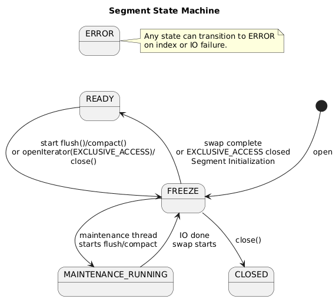

# Concurrency & Lifecycle

## Glossary
- Published view: immutable view of the main index, delta cache, bloom filter, and sparse index.
- Write cache: mutable map of recent writes not yet published.
- Segment version: monotonic epoch counter used by optimistic iterators.
- Maintenance thread: dedicated background thread for disk IO.

## Segment operations

Please look at main operations supported by segment. Other operations are from thread-safety not interesting.

| Operation                    | Description                                                            |
|------------------------------|------------------------------------------------------------------------|
| `Segment.builder(directory)` | Create a builder for constructing a segment with the provided directory. |
| `compact()`                  | Start compaction; returns once accepted.                                |
| `openIterator(isolation)`    | Open an iterator with the requested isolation level.                    |
| `put(key, value)`            | Write into the in-memory write cache.                                   |
| `flush()`                    | Flush write cache to delta cache; returns once accepted.                |
| `get(key)`                   | Perform a point lookup.                                                 |
| `getState()`                 | Return the current segment   state.                                     |
| `close()`                    | Start async close; transitions to `CLOSED` when finished.               |

- `flush()` and `compact()` return `SegmentResult<Void>`; completion is observed by `getState()` returning `READY`.
- `close()` returns `SegmentResult<Void>` only; completion is observed via `getState()`.
- Do not wait for `READY` while running on the segment maintenance
  executor thread; this can deadlock the maintenance queue.

### Response Codes

All method depending on segment state could replay with on of the follown codes: 

| Code     | Description                                                                                                   |
|----------|---------------------------------------------------------------------------------------------------------------|
| `OK`     | Processed successfully or operation was accepted and scheduled; completion is observed when the segment returns to `READY`. |
| `BUSY`   | Temporary refusal; retry makes sense.                                                                          |
| `CLOSED` | Segment permanently unavailable.                                                                               |
| `ERROR`  | Unrecoverable.                                                                                                 |

- `BUSY`/`CLOSED`/`ERROR` mean the operation was not started.

### Iterator Modes

Segmend can open iterator in following modes:

- `INTERRUPT_FAST` (default): optimistic read; throws on version change. Reads
  a snapshot of the merged view captured at open time.
- `STOP_FAST`: optimistic read; stops on version change. Reads a snapshot of the
  merged view captured at open time.
- `EXCLUSIVE_ACCESS`: stop-the-world maintenance; blocks other operations and
  must be short. Reads a merged snapshot captured while the segment is frozen.

## Segment States

Segment could be in one of following states. States:

- `READY`: normal operation.
- `MAINTENANCE_RUNNING`: background `flush()` or `compact()` is executing.
- `FREEZE`: short exclusive phase for snapshot or swap.
- `CLOSED`: segment closed.
- `ERROR`: unrecoverable.

If an operation is not allowed in the current state, return `BUSY` in `FREEZE` or `MAINTENANCE_RUNNING`, `CLOSED` in `CLOSED`, and `ERROR` in `ERROR`.

### Transitions

| Original State        | New State             | When                                                             |
|-----------------------|-----------------------|------------------------------------------------------------------|
| `READY`               | `FREEZE`              | start of `flush()`, `compact()`, `close` or `openIterator(EXCLUSIVE_ACCESS)` |
| `FREEZE`              | `MAINTENANCE_RUNNING` | maintenance thread starts `flush()` or `compact()`               |
| `MAINTENANCE_RUNNING` | `FREEZE`              | maintenance IO finished, swap to new files starts                |
| `FREEZE`              | `READY`               | swap complete or `openIterator(EXCLUSIVE_ACCESS)` closed         |
| any                   | `ERROR`               | index or IO failure                                              |
| `FREEZE`              | `CLOSED`              | `close()` completes                                              |

## Optimistic locking

Core concept is that all data read via an iterator are immutable to the reader. When
`flush()` is called, iterators must stop to avoid serving a stale snapshot. This is
done via optimistic locking: when a segment iterator is opened it reads the segment
version, and before each read it verifies the version has not changed. If the version
changes, the iterator is interrupted. The version increments when a new immutable
view is published (after `flush()` or `compact()` swaps in new files) and when
`EXCLUSIVE_ACCESS` is acquired.

### Iterator Isolation

optimistic locking allows distinguis following iteration modes:

- FAIL_FAST: optimistic read; any mutation can invalidate the iterator and
  terminate iteration early.
- FULL_ISOLATION: exclusive access for the iterator lifetime; blocks writes,
  flush/compact, and split on the same segment until closed.

## Segment Behavior

Segment can be accessd from multiple threads in paraell. Segment 

### Operation Behavior Matrix

| Operation | Allowed states | Version bump | Iterator impact | Read write cache | Read delta cache | Notes |
|---|---|---|---|---|---|---|
| `put` | `READY`; `MAINTENANCE_RUNNING` (until cache full) | No | None | N/A | N/A | Writes to write cache; in `MAINTENANCE_RUNNING`, returns `BUSY` if cache full. |
| `get` | `READY`, `MAINTENANCE_RUNNING` | No | None | Yes | Yes | No read lock required. |
| `flush` | `READY` | Yes (after publish) | Invalidates optimistic iterators | N/A | N/A | Serialized; concurrent request returns `BUSY`. May be triggered by full write cache. |
| `compact` | `READY` | Yes (after publish) | Invalidates optimistic iterators | N/A | N/A | Serialized; concurrent request returns `BUSY`. May be triggered by full delta cache. |
| `openIterator(INTERRUPT_FAST)` | `READY` | No | Throws on version change | Yes (snapshot) | Yes | Default mode. |
| `openIterator(STOP_FAST)` | `READY` | No | Stops on version change | Yes (snapshot) | Yes | Snapshot captured at open time. |
| `openIterator(EXCLUSIVE_ACCESS)` | `READY` | Yes (on lock acquisition) | Invalidates existing iterators; blocks others | Yes | Yes | Maintenance only; must be short. |
| `close` | `READY` | No | Invalidates existing iterators; blocks others | N/A | N/A | Sets `FREEZE`, optionally flushes the write cache, schedules close on maintenance thread, then transitions to `CLOSED`. |

## Flush/Compact Lifecycle
1. Caller enters `FREEZE`, drains in-flight ops, and prepares the maintenance
   plan (flush freezes the write cache; compact captures a snapshot).
2. Maintenance thread sets `MAINTENANCE_RUNNING` and performs IO.
3. When IO completes, state returns to `FREEZE` and new index/delta files are swapped in.
4. Version increments immediately after the swap (publication).
5. State becomes `READY`.
6. Concurrent `flush()`/`compact()` requests return `BUSY`.

## Failure & Cancellation
- On `flush()` or `compact()` failure, the current maintenance task aborts and
  the segment moves to `ERROR` (unless already `CLOSED`).
- If `close()` is called during maintenance, the segment returns `BUSY`.
  Retry after the segment returns to `READY`.

## Implementation details

---

---

## Core Rules
- Concurrent reads/writes are supported; published data is immutable to readers.
- No disk IO in caller threads; the maintenance thread performs disk IO.
- Keep locks short; the state machine is the admission control.
- `flush()` and `compact()` are commit points and are started asynchronously.
- `Segment` is thread-safe by contract; callers may access it concurrently.
- `FREEZE`: short exclusive phase for snapshot or swap of a published view or phafe closing or initilizing segment.
- A failure during maintenance moves the segment to `ERROR`.

## Thread Safety
- Segment version is stored in `VersionController` (currently an
  `AtomicInteger`).
- The write cache map uses a thread-safe implementation.
- Thread safety is achieved without external locks by:
  - in-flight counters for `get`/`put` operations (drained during maintenance),
  - atomic state transitions that freeze admissions before maintenance,
  - atomic publish of immutable views + version bump for iterator safety.

## Contracts

### Atomic Publish Invariant
- Publication of a new immutable view is atomic: readers see either the old view or the new view, never a partial mix.
- The view swap and version increment are linearized; operations after the swap observe the new view.

### FREEZE Prohibitions
- During `FREEZE`, all external operations return `BUSY`.
- Only internal maintenance steps (snapshot and swap) run in this phase.

### EXCLUSIVE_ACCESS Lifecycle
- `openIterator(EXCLUSIVE_ACCESS)` is allowed only in `READY`; otherwise it returns `BUSY`.
- On acquisition, the segment enters `FREEZE` and increments the version.
- While held, all other operations return `BUSY`. The iterator must be closed to return to `READY`.

### BUSY Reasons
- Write cache full during `MAINTENANCE_RUNNING` (backpressure).
- Segment is in `FREEZE`.
- `MAINTENANCE_RUNNING` and the requested operation is not allowed.
- `flush()` / `compact()` already running.
- `EXCLUSIVE_ACCESS` held or requested while not `READY`.

### Retry and Backpressure Guidance
- Treat `BUSY` as transient; retry with backoff and jitter.
- For write-cache full during `MAINTENANCE_RUNNING`, retry writes after maintenance publishes a new view.
- For maintenance or exclusive access, retry after the segment returns to `READY`.

### Automatic Maintenance Triggers
- If the delta cache becomes full, the segment schedules `compact()`.
- If the write cache becomes full, the segment schedules `flush()`.
- These triggers transition the segment out of `READY` (into `FREEZE`/`MAINTENANCE_RUNNING`) before refusing new writes.

### Memory Visibility
- The published view is swapped under `FREEZE` (exclusive); new reads see only the old or the new view, never a partial publish.
- Version increments provide an ordering point for optimistic iterators.

### Freshness vs Consistency
- `get` reads from the write cache and published view (freshest data).
- Iterators read a snapshot of the merged view (published + write cache) taken
  at open time; later `put()` calls are not visible. Iterators are invalidated
  only by version changes (publish or `EXCLUSIVE_ACCESS`).

### Serialized State Transitions
- State transitions are serialized; only one transition is in flight at a time.
- `flush()`, `compact()`, and `EXCLUSIVE_ACCESS` are mutually exclusive and linearized.

## Components
- **Segment**: user-facing API (`put`, `get`, `openIterator`, `flush`,
  `compact`) implemented by `SegmentImpl`.
- **SegmentImpl**: owns `SegmentStateMachine`, checks state, and delegates
  to `SegmentCore`. Schedules maintenance work on the provided executor.
- **SegmentCore**: single-threaded core with caches, on-disk access, and
  version tracking.
- **SegmentStateMachine**: atomic lifecycle transitions (`READY` →
  `FREEZE` → `MAINTENANCE_RUNNING` → `READY`).
- **SegmentCompacter**: performs full rewrite compaction using
  `SegmentCore`.
- **SegmentMaintenanceCoordinator** (segmentindex): decides when to call
  `flush()`/`compact()` after writes.
- **SegmentAsyncExecutor** + executor (segmentindex): maintenance executor
  provided to `SegmentImpl` via `SegmentRegistry`.
- **SegmentAsyncSplitCoordinator / SegmentSplitCoordinator** (segmentindex):
  schedule and perform segment splits.

## Responsibilities
- **SegmentImpl**: gates operations with the state machine, schedules
  maintenance on the executor, and reports status via `SegmentResult`.
- **SegmentCore**: executes single-threaded read/write/maintenance steps,
  manages caches and version updates, and performs no threading or state
  transitions.

## Implementation Mapping
- `EXCLUSIVE_ACCESS` in this document maps to
  `SegmentIteratorIsolation.FULL_ISOLATION` in code.
- `INTERRUPT_FAST` / `STOP_FAST` map to
  `SegmentIteratorIsolation.FAIL_FAST`.
- State transitions are enforced by `SegmentStateMachine` and executed in
  `SegmentImpl.startMaintenance(...)` and `SegmentImpl.runMaintenance(...)`.
- Maintenance scheduling lives in `SegmentMaintenanceCoordinator` and uses the
  executor from `SegmentRegistry` (`SegmentAsyncExecutor`).

## Future: MVCC
Currently unused. MVCC could support iterators that remain consistent across version changes, balancing deadlocks, performance, and memory.
