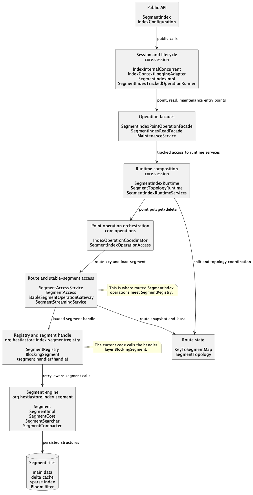

# SegmentIndex Implementation

This page is a locator map for the `SegmentIndex` implementation. It shows the
main layers from the public `SegmentIndex` interface down to the physical
`Segment` implementation, so maintainers can quickly decide where to inspect a
behavior before opening the detailed read, write, split, registry, or segment
pages.

## Layer Diagram

Source: [implementation-layers.plantuml](images/implementation-layers.plantuml)

## Layer Responsibilities

| Layer | Main classes | Responsibility |
| ----- | ------------ | -------------- |
| Public API | `SegmentIndex`, `IndexConfiguration`, `IndexConfigurationBuilder` | External create/open and user-facing operations. This is the compatibility boundary. |
| Session and lifecycle | `IndexInternalConcurrent`, `IndexContextLoggingAdapter`, `SegmentIndexImpl`, `SegmentIndexTrackedOperationRunner`, `IndexOperationTracker` | API method implementation, lifecycle state checks, close safety, context logging, and operation tracking. |
| Operation facades | `SegmentIndexPointOperationFacade`, `SegmentIndexReadFacade`, `MaintenanceService` | Small call-specific boundaries for point operations, iterator operations, and foreground maintenance. |
| Runtime composition | `SegmentIndexRuntime`, `SegmentTopologyRuntime`, `SegmentIndexRuntimeServices`, `SegmentIndexRuntimeServicesFactory` | Long-lived runtime graph for one open index: storage, topology, WAL, metrics, control plane, split runtime, and service wiring. |
| Point operations | `IndexOperationCoordinator`, `SegmentIndexOperationAccess` | Point `put`, `get`, `delete`, WAL append/replay, applied LSN recording, request counters, and operation latency metrics. |
| Route access | `SegmentAccessService`, `SegmentAccess`, `KeyToSegmentMap`, `SegmentTopology` | Key-to-segment lookup, route snapshot validation, route leases, retry on stale/draining routes, and scoped access to the routed segment. |
| Stable segment operations | `StableSegmentOperationGateway`, `StableSegmentOperationResult`, `StableSegmentOperationStatus`, `SegmentStreamingService`, `MaintenanceServiceImpl` | Single-attempt stable-segment calls used by iterator and maintenance paths, with `OK`, `BUSY`, `CLOSED`, and `ERROR` translated into index-level retry decisions. |
| Registry and segment handle | `SegmentRegistry`, `BlockingSegment` | Segment cache, lifecycle, loading/reloading, materialization helpers, runtime tuning view, and retry-aware access to a loaded segment. `BlockingSegment` is the current segment handler/handle layer. |
| Segment engine | `Segment`, `SegmentImpl`, `SegmentCore`, `SegmentSearcher`, `SegmentCompacter` | Segment-local reads, writes, flush, compaction, consistency checking, caches, sparse index, Bloom filter, and on-disk files. |

## Where to Look

- Public API behavior: start at `SegmentIndex` and `SegmentIndexImpl`.
- Operation rejected during close/open/error: inspect
  `SegmentIndexTrackedOperationRunner`, `IndexOperationTracker`, and
  `IndexStateCoordinator`.
- Point `put`, `get`, or `delete`: inspect `SegmentIndexPointOperationFacade`,
  `SegmentIndexRuntime`, and `IndexOperationCoordinator`.
- Key routing, route drains, or stale topology retries: inspect
  `SegmentAccessService`, `KeyToSegmentMap`, and `SegmentTopology`.
- Segment loading, registry cache, or retry-aware segment handles: inspect
  `SegmentRegistry` and `BlockingSegment`.
- Iterator and stream behavior: inspect `SegmentIndexReadFacade`,
  `SegmentTopologyRuntime`, `SegmentStreamingService`, and
  `DirectSegmentCoordinator`.
- Flush, compaction, and wait semantics: inspect `MaintenanceServiceImpl`,
  `StableSegmentOperationGateway`, and `SegmentImpl`.
- Actual per-segment data layout and lookup mechanics: inspect `Segment`,
  `SegmentImpl`, `SegmentCore`, `SegmentSearcher`, and `SegmentCompacter`.
- Split scheduling and route publication: inspect `SplitService`,
  `SplitPolicyCoordinator`, `RouteSplitCoordinator`, and
  `RouteSplitPublishCoordinator`.

## Related Docs

- [Read Path](read-path.md)
- [Write Path](write-path.md)
- [Segment Index Concurrency](segment-index-concurrency.md)
- [Segment Architecture](../segment/index.md)
- [Segment Registry](../registry/registry.md)
