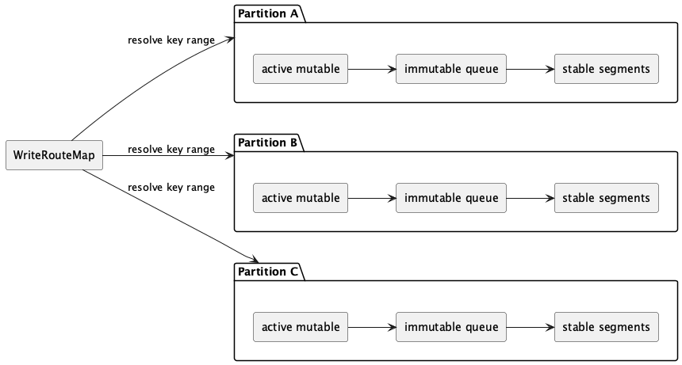
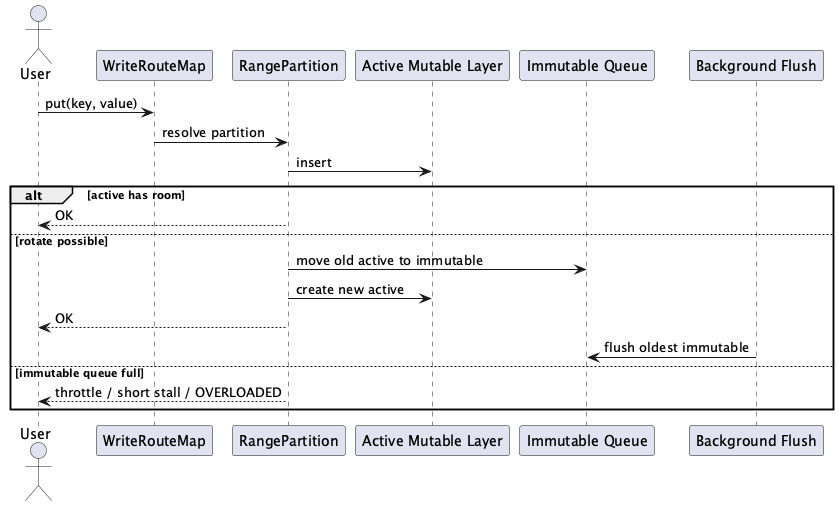
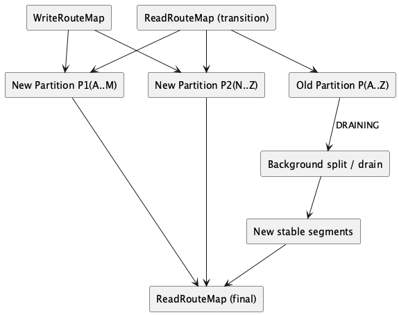

# Range-Partitioned Ingest Architecture

This page describes the target write-path architecture for `SegmentIndex`.
Its purpose is to preserve immediate read-after-write semantics while moving
long-running drain and split work out of the hot user write path.

This is an architecture page, not an implementation guide. It focuses on
contracts, invariants, and flow boundaries.

## Goals

- `put()` becomes visible to `get()` immediately after the call returns.
- Hot user writes must not wait for long-running split or compaction work.
- Buffered ingest must stay bounded at both local-range and whole-index level.
- Overload should be explicit and controlled, not expressed as retry storms.
- Stable segment files remain the durable storage boundary.

## What Stays

- Stable segment files remain the durable read and publish boundary.
- `KeyToSegmentMap` remains the persisted routing source of truth in the first
  version.
- WAL remains the crash-recovery mechanism for acknowledged writes that are not
  yet published into stable segment storage.

## What Changes

- User writes stop targeting live segments directly.
- New writes first enter a bounded in-memory overlay that is organized by key
  range.
- Each routed range owns a short ingest pipeline:
  - an active mutable layer,
  - a bounded queue of immutable runs waiting for drain,
  - references to stable segment sources for that range.
- Reads consult the overlay first and stable storage second.

## Read-After-Write Contract

`get(key)` must resolve the routed range for `key` and read sources in this
order:

1. active mutable data for the range
2. immutable runs for the range, newest first
3. stable segment sources for the range

This ordering guarantees that a successful `put()` is observable before any
background drain completes.

Diagram PNG:

PlantUML source:
[`docs/architecture/segmentindex/images/range-partitioned-ingest-overview.plantuml`](images/range-partitioned-ingest-overview.plantuml)

## Drain Model

When the active mutable layer reaches its local admission limit, it is sealed
and becomes an immutable run. Background drain then moves immutable data into
stable segment storage.

Key rules:

- user writes continue into a fresh active mutable layer,
- immutable runs remain readable until drain and publish complete,
- flush durability is reached only after buffered overlay data is drained and
  WAL checkpointed.

Diagram PNG:

PlantUML source:
[`docs/architecture/segmentindex/images/range-partitioned-ingest-sequence.plantuml`](images/range-partitioned-ingest-sequence.plantuml)

## Split Model

Split no longer means freezing a live segment and making user writers wait.
Instead:

1. new writes are routed to child ranges first,
2. the previous parent range becomes draining-only,
3. old stable data is rewritten in the background,
4. `KeyToSegmentMap` is updated only at publish time,
5. the old parent route is removed after publish succeeds.

During the transition, reads must be able to combine:

- overlays from the new child ranges,
- stable sources still owned by the draining parent range.

Diagram PNG:

PlantUML source:
[`docs/architecture/segmentindex/images/range-partitioned-split-drain.plantuml`](images/range-partitioned-split-drain.plantuml)

## Backpressure Model

Bounded buffering is mandatory.

Two backpressure scopes exist:

- local range backpressure when one routed range has too much buffered data,
- global backpressure when total buffered overlay data exceeds the index-level
  budget.

This replaces the previous near-deadlock failure mode with explicit bounded
admission.

## Recovery Model

Any overlay state that is not yet published into stable segment storage is
transient.

Crash recovery therefore follows this rule:

- rebuild routed ranges from persisted stable metadata,
- discard unpublished in-memory overlay state,
- replay WAL to restore acknowledged writes into the overlay,
- publish again during subsequent drain or flush.

The recovery boundary is therefore still:

- stable segment storage,
- persisted `KeyToSegmentMap`,
- WAL.
