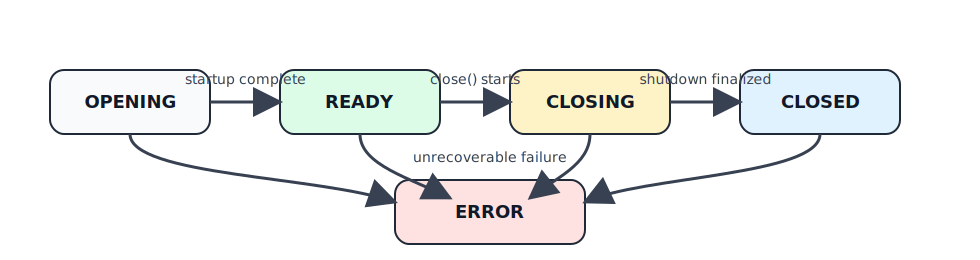

# Segment Index Concurrency & Lifecycle

## Glossary
- Segment index: top-level API that routes operations to segments.
- Key-segment mapping: map of max key -> SegmentId (SegmentRouteMap).
- Mapping version: monotonically increasing counter for optimistic mapping
  checks.
- Segment topology: runtime route state (`ACTIVE`, `DRAINING`, `RETIRED`) plus
  in-flight route leases for mapped segment ids.
- Segment lease service: boundary that combines route snapshots, runtime route
  leases/drains, and registry segment loading into scoped `MappedSegmentLease` and
  `RouteSplitLease` objects.
- Segment registry: cache of Segment instances plus the maintenance executor.
- Split service: accepts split hints, full-scan requests, quiescence waits, and
  lifecycle shutdown for the managed split runtime.
- Split policy coordinator: owns candidate deduplication, periodic
  reconciliation, threshold checks, and admission into split execution.
- Split execution coordinator: owns split execution admission, cooldowns, and
  split-publish exclusivity once a candidate was already admitted.
- Split: replace one routed segment range with child ranges and update the
  route map atomically.

## Core Rules
- SegmentIndex is thread-safe by contract; calls may be concurrent.
- Target: highly concurrent SegmentIndex API; avoid global synchronization and
  only protect minimal shared structures (mapping updates, split swaps).
- Index operations are not globally serialized; concurrency is bounded by
  mapping updates, route-topology leases, and per-segment state machines.
- Segment maintenance IO runs on the segment maintenance executor.
- The segment maintenance executor is supplied by `HestiaStoreRuntime`
  (default 10 workers).
- Automatic post-write flush/compact is optional and enabled by default.
- Segment BUSY is treated as transient and retried internally; callers do not
  see BUSY.
- Mapping changes are applied atomically and validated by version checks.

## Thread Safety Mechanisms
- IndexInternalConcurrent executes sync operations on caller threads without
  a global executor.
- SegmentRegistrySynchronized serializes access to the segment instance map and
  registry mutations.
- SegmentRouteMap publishes the immutable routes and mapping version together
  through one volatile snapshot. Foreground snapshot and version reads do not
  take the route-map lock; updates take the write lock and publish the next
  snapshot after the mutation.
- RouteTopology is rebuilt from the persisted map on startup and reconciled
  after route-map changes. It does not own segment instances or persistence.
- Foreground `put`, `delete`, and `get` use `MappedSegmentLeaseService` to resolve a
  map snapshot, acquire a matching `RouteTopology` route lease, load the
  segment through `SegmentRegistry`, and release the route lease when the
  scoped operation is closed.
- Segment implementations are thread-safe; read/write operations proceed in
  parallel when the segment state allows it.

## API Behavior
- put/get/delete: retry on topology drain, stale route-map versions, registry
  BUSY, and per-segment BUSY using the segment-access retry settings
  (`maintenance().busyBackoffMillis()` +
  `maintenance().busyTimeoutMillis()`). A segment CLOSED result restarts
  routing from a fresh snapshot. Timeouts throw IndexException.
- flush/compact: start maintenance on each segment and return once accepted;
  do not wait for IO completion; BUSY retries follow maintenance retry
  settings.
- flushAndWait/compactAndWait: wait for each segment to return to `READY`
  (or `CLOSED`); do not call from a segment maintenance executor thread.
- getStream: captures a snapshot of segment ids and iterates them using the
  default segment iterator isolation (FAIL_FAST). An overload allows
  FULL_ISOLATION for per-segment exclusivity; the stream must be closed to
  release the segment lock.
- Segment close (sync): once close starts, the segment drains in-flight work
  and rejects/blocks new operations until CLOSED. The caller returns only
  after locks/resources are released or the segment enters `ERROR`. The
  registry should not reopen a closing segment; attempts should retry until
  the close completes. The per-segment `.lock` file enforces single-open at
  the directory level.

## Maintenance & Splits

- SegmentIndex evaluates split thresholds after successful writes and schedules
  follow-up maintenance only when `backgroundMaintenanceAutoEnabled` is true.
- Successful writes and maintenance follow-ups emit split-service hints or
  full-scan requests.
- SplitPolicyScheduler performs both hint-driven wakeups and periodic
  reconciliation, then hands admitted work to SplitTaskCoordinator.
- Admitted splits run on the shared split-maintenance executor; only one split
  per segment id can be in flight.
- RouteSplitPlanner retries BUSY using split retry settings; timeouts
  throw.
- SplitPolicyScheduler uses `MappedSegmentLeaseService.tryAcquireMappedSegment(...)`
  to inspect candidate size without combining topology and registry access
  itself.
- SplitTaskCoordinator schedules by `SegmentId` and uses
  `MappedSegmentLeaseService.tryAcquireForSplit(...)` to acquire a
  `RouteSplitLease`. That lease moves the parent route to `DRAINING`, waits
  for existing route leases to finish, verifies the route is still mapped, and
  loads the parent segment through `SegmentRegistry`.
- While the parent route is draining, new foreground leases for that parent
  fail as BUSY and retry; existing leases are allowed to finish.
- After the split lease is acquired, split materialization reads the parent
  stable data through `FULL_ISOLATION`, materializes child stable segments, and
  then publishes the child routes through SegmentRouteMap.
- After a split, SegmentRouteMap updates the mapping and flushes it to disk.
  `RouteSplitLease.completeAfterPublish()` reconciles RouteTopology from
  the new snapshot so children become `ACTIVE` and the parent route becomes
  `RETIRED`, then completes the drain.

## Index State Machine

States:
- OPENING: index bootstrap/consistency checks (and lock acquisition) in
  progress; operations are rejected.
- READY: operations allowed.
- CLOSING: `close()` is in progress; new API operations are rejected, the
  directory lock is still held, and shutdown may still wait for split/WAL
  durability boundaries to settle.
- ERROR: unrecoverable failure; operations are rejected.
- CLOSED: shutdown completed, resources were released, and operations are
  rejected.

Transitions:
- OPENING -> READY: after initialization and consistency checks complete.
- READY -> CLOSING: `close()` starts and begins shutdown coordination.
- CLOSING -> CLOSED: shutdown completes; file lock released.
- any -> ERROR: unrecoverable failure (e.g., OOM, disk full, failed split/file
  swap, or consistency check failure).

Notes:
- Only one index instance may hold the directory lock at a time.
- The lock is held through `CLOSING` and released only when the instance
  reaches `CLOSED` (or during terminal `ERROR` cleanup).
- `flushAndWait()` and `compactAndWait()` remain explicit maintenance
  boundaries while `close()` now uses the same settlement model before
  finalizing shutdown.

## Failure Handling
- SegmentResultStatus.ERROR from any segment results in IndexException.
- Maintenance failures move the segment to ERROR; flushAndWait/compactAndWait
  propagate as IndexException.
- Split failures surface through the split future and are rethrown when joined.
- If split materialization or pre-publish validation fails, prepared child
  directories are deleted and the `RouteSplitLease` aborts the parent route
  drain.
- If SegmentRouteMap rejects a split because the parent route is no longer
  mapped, prepared children are deleted. If the parent is still mapped, the
  split lease aborts the drain; if another publisher already replaced the
  parent, the split lease completes the drain after topology reconciliation.
- If route-map persistence, split-lease topology reconciliation, or
  retired-parent cleanup fails after the in-memory route map has accepted the
  children, the split failure is fatal. Prepared children are not deleted
  because the current route map may already reference them.
- Retired parent deletion after publish is best-effort. If the segment is busy,
  the directory remains orphaned and recovery/consistency cleanup retries
  deletion through SegmentRegistry.
- Startup rebuilds RouteTopology from the persisted SegmentRouteMap and then
  deletes segment directories that are not referenced by the persisted map.
- When entering ERROR, the index stops accepting operations and requires manual
  intervention (recovery/repair or restore from backups).

## Components
- SegmentIndex (public API): thread-safe entry point.
- SegmentIndexSession: retries BUSY, routes operations to segments, and manages
  maintenance.
- MappedSegmentLeaseService: route snapshot, RouteTopology lease/drain acquisition,
  SegmentRegistry loading, and scoped `MappedSegmentLease` / `RouteSplitLease`
  ownership.
- NonBlockingSegmentOperationGateway: single-attempt stable-segment operation access
  through SegmentRegistry.
- Named retry policies: backoff + timeout for BUSY retries. Current defaults
  come from `maintenance().busyBackoffMillis()` and
  `maintenance().busyTimeoutMillis()`.
- StableSegmentOperationResult/StableSegmentOperationStatus: internal
  OK/BUSY/CLOSED/ERROR wrapper for stable-segment operations.
- SegmentRouteMap: mapping, snapshot versioning, and persistence of segment ids.
- RouteTopology: runtime route state and route leases; rebuilt from
  SegmentRouteMap snapshots.
- SegmentRegistry(Synchronized): caches Segment instances and supplies the
  maintenance executor.
- SplitRuntime: managed split runtime boundary for hints, full scans,
  quiescence, metrics, and shutdown.
- SplitPolicyScheduler: split scheduling decisions.
- SplitTaskCoordinator: split execution admission, cooldowns, split
  worker scheduling, and `RouteSplitLease` lifecycle.
- RouteSplitPlanner: split feasibility check and child materialization.
- RouteSplitPublisher: route-map publish and split cleanup boundaries.

## Iterator Isolation
- FAIL_FAST: iteration is optimistic; any mutation can invalidate the
  iterator and terminate the stream early.
- FULL_ISOLATION: holds exclusive access per segment while its iterator is
  open; writers, flush/compact, and split on that segment block until the
  iterator (or stream) is closed.

## Implementation Mapping
- Index implementation: IndexInternalConcurrent (caller-thread execution).
- Mapping version: SegmentRouteMap.version (AtomicLong).
- Runtime route version: RouteTopology.version, reconciled from
  SegmentRouteMap snapshots.
- Maintenance executor: SegmentRegistry.getMaintenanceExecutor() backed by
  the `HestiaStoreRuntime` segment-maintenance pool.
- Index maintenance pool: `hestia-<indexName>-index-maintenance-*` from
  ExecutorRegistry.
- Split policy scheduler: `hestia-<indexName>-split-policy-*` from
  ExecutorRegistry.
- Registry maintenance pool: `hestia-<indexName>-registry-maintenance-*` from
  ExecutorRegistry.
- WAL append and delayed group sync worker:
  `hestia-<indexName>-wal-append-*`, created by `ExecutorRegistry` and drained
  by `WalRuntime` before executor shutdown.
- Shared segment maintenance pool: `hestia-segment-maintenance-*` from
  HestiaStoreRuntime.
- Shared split worker pool: `hestia-split-maintenance-*` from
  HestiaStoreRuntime.
- Split isolation: SegmentIteratorIsolation.FULL_ISOLATION.
- Retry policy: `IndexConfiguration.maintenance().busyBackoffMillis()` and
  `IndexConfiguration.maintenance().busyTimeoutMillis()`.
