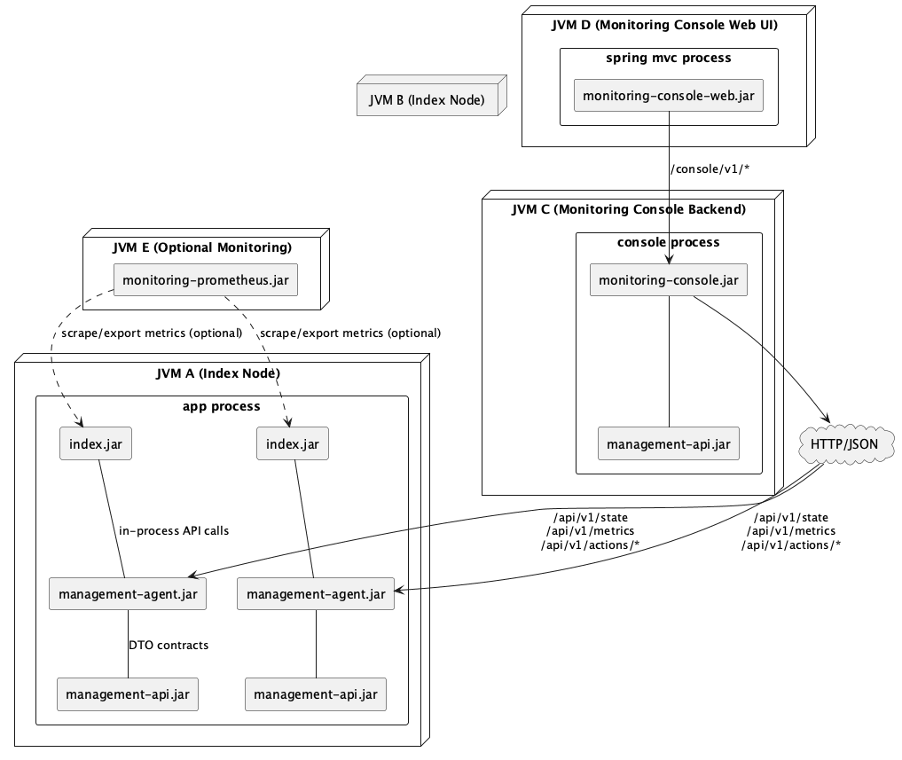

# Monitoring Console Configuration

This page describes the **direct mode** architecture:

- your application JVM runs `engine.jar` + `monitoring-rest-json`
- `monitoring-console-web` connects directly to node `monitoring-rest-json` APIs
- no middle `monitoring-console` service is required

## Runtime topology (recommended)

- Node JVM(s):
  - HestiaStore engine
  - `monitoring-rest-json` exposing `/api/v1/*` for all registered indexes
- Web JVM:
  - `monitoring-console-web` UI
  - polls each node directly and sends actions directly



PlantUML source:
[`docs/configuration/images/monitoring-components.plantuml`](images/monitoring-components.plantuml)

## Node-side API (monitoring-rest-json)

Each node exposes:

- `GET /api/v1/report` (JVM section + per-index sections)
- `POST /api/v1/actions/flush`
- `POST /api/v1/actions/compact`

Action request can optionally target a specific index:

```json
{
  "requestId": "req-1",
  "indexName": "orders"
}
```

When `indexName` is omitted, action is applied to all indexes registered in
that node's `ManagementAgentServer`.

## Configure monitoring-console-web

`monitoring-console-web/src/main/resources/application.yml`:

```yaml
hestia:
  console:
    web:
      nodes:
        - node-id: node-1
          node-name: index-1
          base-url: http://127.0.0.1:9001
          agent-token: ""
      refresh-millis: 2500
```

For multiple nodes, add more entries to `nodes`.

## Start web application

```bash
mvn -pl monitoring-console-web spring-boot:run
```

Open:

- [http://127.0.0.1:8090/](http://127.0.0.1:8090/)

## One-command local demo (direct mode)

This command starts:

- 3 in-memory nodes with `monitoring-rest-json`
- synthetic load generator
- `monitoring-console-web` connected directly to those nodes

```bash
./monitoring-console-web/scripts/start-example.sh
```

Optional ports:

```bash
AGENT_BASE_PORT=19001 WEB_PORT=18090 ./monitoring-console-web/scripts/start-example.sh
```

Then open:

- Web UI: [http://127.0.0.1:8090/](http://127.0.0.1:8090/)
- Example node report: [http://127.0.0.1:9001/api/v1/report](http://127.0.0.1:9001/api/v1/report)

## Notes

This project now uses direct mode only for console UI integration:
`monitoring-console-web` connects directly to `monitoring-rest-json` endpoints.
