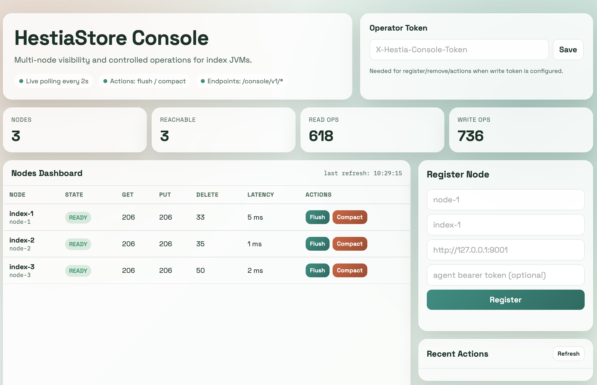

# Monitoring Console Configuration

This page describes how to start and configure `monitoring-console` backend and
`monitoring-console-web` (Spring MVC UI).

## What it is

`monitoring-console` is a control-plane HTTP service. It polls multiple
`management-agent` nodes and exposes:

- dashboard API: `/console/v1/dashboard`
- node registry API: `/console/v1/nodes`
- action APIs: `/console/v1/actions/*`

`monitoring-console-web` is a separate web application (Spring Boot +
Thymeleaf + HTMX) that consumes those backend APIs and provides navigation,
dashboard, actions, and event views.

## Runtime topology (jars and JVMs)


PlantUML source:
[`docs/configuration/images/monitoring-components.plantuml`](images/monitoring-components.plantuml)

## Start options

You can start it as:

1. Embedded server in your own JVM application.
1. Standalone process using `MonitoringConsoleLauncher`.

## Standalone startup

Build module:

```bash
mvn -pl monitoring-console -DskipTests package
```

Run launcher:

```bash
java \
  -Dhestia.console.bindAddress=127.0.0.1 \
  -Dhestia.console.port=8085 \
  -Dhestia.console.writeToken=change-me \
  -Dhestia.console.requireTlsToNodes=false \
  -Dhestia.console.actionRetryAttempts=3 \
  -cp "monitoring-console/target/monitoring-console-*.jar:management-api/target/management-api-*.jar" \
  org.hestiastore.console.MonitoringConsoleLauncher
```

The backend module is API-only. Use `monitoring-console-web` for UI.

## Start Spring MVC web application

Start backend first (previous section or demo script), then start the web app:

```bash
mvn -pl monitoring-console-web spring-boot:run
```

Open:

- [http://127.0.0.1:8090/](http://127.0.0.1:8090/)

Example UI:



Default web app configuration:

- backend URL: `http://127.0.0.1:8085`
- refresh interval: `2500 ms`

Override by JVM/system properties, for example:

```bash
mvn -pl monitoring-console-web \
  -Dspring-boot.run.jvmArguments="\
  -Dhestia.console.web.backend-base-url=http://127.0.0.1:8085 \
  -Dhestia.console.web.write-token=change-me \
  -Dhestia.console.web.refresh-millis=2000" \
  spring-boot:run
```

## One-command local demo

This command starts:

- monitoring console on port `8085`
- 3 in-memory index nodes with management agents
- Spring web UI on port `8090`
- periodic synthetic read/write load so metrics change continuously

```bash
./monitoring-console-web/scripts/start-example.sh
```

Optional custom ports:

```bash
BACKEND_PORT=18085 WEB_PORT=18090 ./monitoring-console-web/scripts/start-example.sh
```

Then open:

- Web UI: [http://127.0.0.1:8090/](http://127.0.0.1:8090/)
- Live stats JSON: [http://127.0.0.1:8085/console/v1/dashboard](http://127.0.0.1:8085/console/v1/dashboard)

## Embedded startup

```java
MonitoringConsoleServer server = new MonitoringConsoleServer(
    "127.0.0.1",
    8085,
    "change-me",
    false,
    3);
server.start();
```

## Configuration properties

| Property | Default | Meaning |
|---|---|---|
| `hestia.console.bindAddress` | `127.0.0.1` | Host/interface to bind |
| `hestia.console.port` | `8085` | Listening port (`0` for random free port) |
| `hestia.console.writeToken` | empty | Required header value for mutating endpoints (`X-Hestia-Console-Token`) |
| `hestia.console.requireTlsToNodes` | `false` | Require `https://` for registered nodes |
| `hestia.console.actionRetryAttempts` | `3` | Retries for mutating node actions |

## Minimal usage flow

1. Start console.
1. Register nodes using `POST /console/v1/nodes`.
1. Read dashboard from `GET /console/v1/dashboard`.
1. Trigger actions through `POST /console/v1/actions/flush` or
   `POST /console/v1/actions/compact`.

## Security notes

- In production set non-empty `hestia.console.writeToken`.
- Prefer `hestia.console.requireTlsToNodes=true` with HTTPS-enabled agents.
