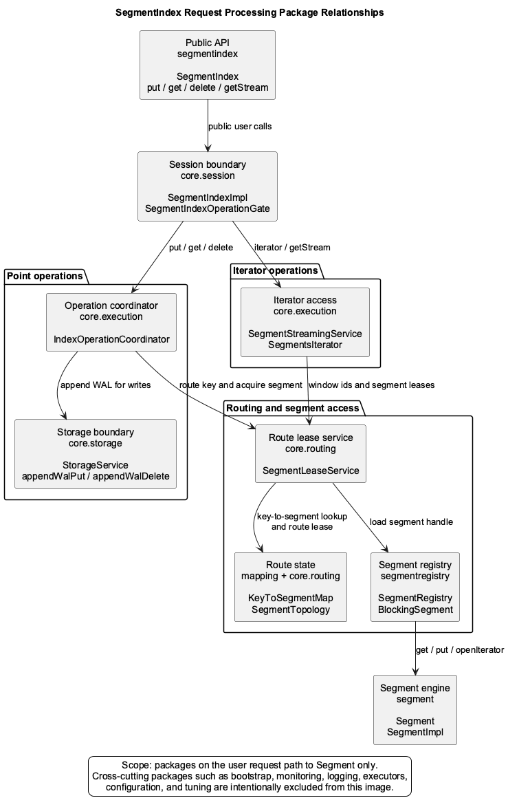

# Configuration Flow

This page describes how HestiaStore turns a user configuration request into the
effective configuration used by storage, runtime services, and execution
packages. The package relationship diagram below is intentionally scoped to
the user data path from `SegmentIndex` calls to `Segment` operations.

Source: [configuration-flow.plantuml](images/configuration-flow.plantuml)

## Diagram Scope

Keep package relationship images focused on packages that process user data
requests to segments: `put`, `get`, `delete`, and iterator or stream paths.
Do not include broad cross-cutting packages such as bootstrap, monitoring,
logging, executors, configuration, or tuning unless the image is specifically
about one of those concerns. Those packages relate to many other packages and
can hide the request path.

## Configuration Layers

There are three separate responsibilities:

1. `configuration.user`

   Public request objects live here. `IndexConfiguration` and its section
   builders describe what the caller asked for. Section values may be `null`;
   `null` means no override was requested.

2. `configuration.effective`

   Runtime-ready values live here. `EffectiveIndexConfiguration` contains fully
   resolved values for identity, segment limits, write-path limits, Bloom
   filter settings, maintenance, I/O, logging, WAL, filter pipelines, runtime
   tuning, and chunk-store cache limits.

3. `configuration.persistence`

   Persistence code lives here. `IndexConfigurationManager` coordinates create
   and open resolution. `IndexConfigurationStore` stores the effective
   configuration in `manifest.txt` through `IndexPropertiesSchema`.

Runtime and storage code should consume `EffectiveIndexConfiguration`, not
`IndexConfiguration`.

## Create Flow

On create, `EffectiveIndexConfigurationResolver.resolveForCreate(...)`:

1. requires key class, value class, and index name
2. chooses defaults from `IndexConfigurationDefaultsRegistry` or
   `IndexConfigurationDefaults`
3. resolves key and value type descriptor names
4. computes derived segment and write-path values
5. resolves Bloom filter, maintenance, I/O, logging, WAL, filters, and
   chunk-store cache sections
6. returns an `EffectiveIndexConfiguration`

The bootstrap flow stores this effective configuration in the bootstrap state.
`SegmentIndexBootstrapOperation` then persists it when the resolution says a
write is required.

## Open Flow

On open, `IndexConfigurationManager.resolveForOpen(...)`:

1. loads the stored effective configuration from `manifest.txt`
2. merges the new user request with the stored configuration
3. rejects changes to fixed persisted properties
4. writes the merged effective configuration only when the merge changed a
   persisted value

The current resolver rejects changes to fixed identity, layout, Bloom filter,
filter pipeline, and WAL values. The fixed checks cover key/value classes,
type descriptors, segment size, chunk size, Bloom filter settings, chunk
filters, and WAL configuration.

The current resolver applies reopen-time overrides for selected runtime-facing
values such as segment cache size, segment write-cache limits, maintenance
settings, I/O buffer size, logging, delta-cache file limit, chunk-store cache
limit, and index name. It keeps stored values for `indexBufferedWriteKeyLimit`
and `segmentSplitKeyThreshold` during open.

## Bootstrap Application

`SegmentIndexBootstrapOperation` applies the effective configuration before and
during runtime construction. The key configuration-consuming actions are:

1. resolve or merge the effective config
2. instantiate key and value descriptors from `identity`
3. persist the effective config when needed
4. map maintenance and logging settings to runtime executors
5. create the parsed chunk page cache
6. pass the effective config into the segment registry builder
7. create storage services and `RuntimeTuningState`
8. wire topology, split, streaming, and operation services
9. open WAL resources and bind storage WAL coordination when WAL is enabled
10. wire maintenance, metrics, monitoring, and runtime tuning
11. use `logging.contextEnabled()` and `identity.name()` to wrap the runtime
    index when context logging is enabled

After this point, execution packages receive concrete runtime collaborators
that were built from the effective configuration.

## Runtime Package Mapping

`core.executorregistry`:
Uses `identity`, `logging`, and `maintenance` to define executor names, context
logging, thread counts, and shutdown timeout.

`chunkstorecache`:
Uses `chunkStoreCache.pageLimit()` to create the index-scoped parsed chunk page
cache.

`core.storage`:
Uses maintenance timing values with the route map, segment registry, and type
descriptors to create the storage service. `SegmentIndexBootstrapOperation`
also creates `RuntimeTuningState` from the effective configuration and stores
it in `OpenedStorageRuntime`.

`segmentregistry`:
Uses the effective configuration, type descriptors, executors, and chunk page
cache to create the registry. The registry builder and `SegmentFactory` read
segment, write-path, Bloom filter, I/O, logging, filter, maintenance, and
chunk-store cache sections.

`segment` through `SegmentFactory`:
Passes `segment`, `writePath`, `bloomFilter`, `io`, `logging`, `filters`,
`chunkStoreCache`, and maintenance background mode to `SegmentBuilder` and the
segment maintenance policy.

`core.storage` WAL coordination:
Uses the `WalRuntime` opened by bootstrap to choose a disabled coordinator or
active WAL coordinator. Active coordination also reads WAL retention limits.

`configuration.tuning`:
Uses `runtimeTuning` to seed runtime tuning state. Tuning changes are applied to
registry cache limits, loaded segments, and the chunk-store cache limit, then
persisted back through `IndexConfigurationStore`.

`metrics` and `runtimemonitoring`:
Include effective configuration in runtime metrics and monitoring snapshots.

## Extension Rules

When adding or changing configuration:

1. Add or update the public request section in `configuration.user`.
2. Add or update the resolved section in `configuration.effective`.
3. Define create defaults and open merge rules in
   `EffectiveIndexConfigurationResolver`.
4. Persist stable values through `IndexConfigurationStore` and
   `IndexPropertiesSchema`.
5. Apply the effective value in the runtime package that owns the behavior.
6. Keep execution packages dependent on effective values, not nullable user
   requests.
7. Add tests for create resolution, open merge behavior, persistence
   round-trip, invalid fixed-property overrides, and the runtime consumer.

Filter configuration is a special case: persisted state stores filter specs,
not runtime suppliers. Runtime suppliers are reconstructed through the
configured `ChunkFilterProviderResolver`.
