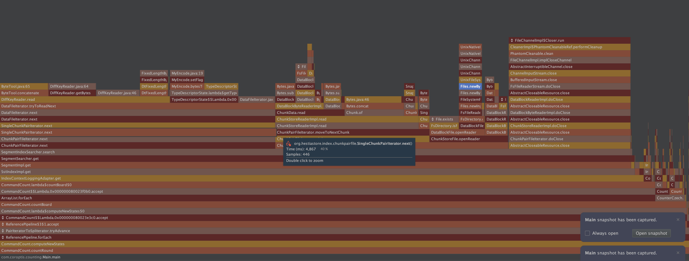

# 🔬 JVM profiler results (YourKit)

This page summarizes a profiling session focused on read and write performance. The goal was to identify where CPU time is spent and highlight concrete improvements.

The workload: a separate generator produced roughly 100,000,000 key–value entries and then executed read-heavy operations against HestiaStore 0.0.5 while YourKit captured CPU samples.

Test environment: run on a Mac mini on 24.10.2025.



## 🧭 How to read the numbers

Percentages shown below approximate the share of total CPU time across the whole run spent in each operation/stack. For example, “40% byte array manipulations” means about 40% of all CPU cycles were consumed in copying/transforming byte arrays end-to-end.

## 📈 Key findings (high level)

- ~40% in byte array manipulation (ultimately `System.arraycopy`) across several layers while moving data between buffers and chunks.
- ~21% in sequential reads through stacked streams and iterators, indicating many small reads and buffer boundaries.
- ~18% during stream/channel closing (clean-up cascades), suggesting repeated finalization work per access.
- ~3% in file open syscalls while creating new channels for short-lived reads.

These four areas dominate the observed CPU budget for the scenario above.

## 🧵 Detailed stacks and context

### ~40%: byte array manipulation

The hot paths converge on `System.arraycopy`, coming from multiple places in the chunk/data-block pipeline. This usually indicates extra copying between intermediate buffers.

### ~3%: file open overhead

Opening files repeatedly costs ~3% CPU. Consider reusing channels across related reads to reduce syscalls and JNI transitions.

```plaintext
sun.nio.fs.UnixNativeDispatcher.open0(Native Method)
sun.nio.fs.UnixNativeDispatcher.open(UnixNativeDispatcher.java:72)
sun.nio.fs.UnixChannelFactory.open(UnixChannelFactory.java:258)
sun.nio.fs.UnixChannelFactory.newFileChannel(UnixChannelFactory.java:133)
sun.nio.fs.UnixChannelFactory.newFileChannel(UnixChannelFactory.java:146)
sun.nio.fs.UnixFileSystemProvider.newByteChannel(UnixFileSystemProvider.java:259)
java.nio.file.Files.newByteChannel(Files.java:380)
java.nio.file.Files.newByteChannel(Files.java:432)
java.nio.file.spi.FileSystemProvider.newInputStream(FileSystemProvider.java:420)
java.nio.file.Files.newInputStream(Files.java:160)
org.hestiastore.index.directory.FsFileReaderStream.<init>(FsFileReaderStream.java:22)
org.hestiastore.index.directory.FsDirectory.getFileReader(FsDirectory.java:29)
org.hestiastore.index.datablockfile.DataBlockFile.getFileReader(DataBlockFile.java:69)
org.hestiastore.index.datablockfile.DataBlockFile.openReader(DataBlockFile.java:61)
org.hestiastore.index.chunkstore.ChunkStoreFile.openReader(ChunkStoreFile.java:52)
org.hestiastore.index.chunkentryfile.ChunkEntryFile.openIteratorAtPosition(ChunkEntryFile.java:42)
org.hestiastore.index.segment.SegmentIndexSearcher.search(SegmentIndexSearcher.java:43)
org.hestiastore.index.segment.SegmentSearcher.get(SegmentSearcher.java:62)
org.hestiastore.index.segment.SegmentImpl.get(SegmentImpl.java:166)
org.hestiastore.index.segmentindex.SegmentIndexImpl.get(SegmentIndexImpl.java:163)
org.hestiastore.index.segmentindex.SegmentIndexContextLoggingAdapter.get(IndexContextLoggingAdapter.java:46)
com.coroptis.counting.CommandCount.lambda$countBoard$0(CommandCount.java:102)
com.coroptis.counting.CommandCount$$Lambda.0x000000080023f0b0.accept()
java.util.ArrayList.forEach(ArrayList.java:1596)
com.coroptis.counting.CommandCount.countBoard(CommandCount.java:99)
com.coroptis.counting.CommandCount.lambda$computeNewStates$0(CommandCount.java:82)
com.coroptis.counting.CommandCount$$Lambda.0x000000080023e3c0.accept()
java.util.stream.ForEachOps$ForEachOp$OfRef.accept(ForEachOps.java:184)
java.util.stream.ReferencePipeline$3$1.accept(ReferencePipeline.java:197)
org.hestiastore.index.segmentindex.EntryIteratorToSpliterator.tryAdvance(EntryIteratorToSpliterator.java:31)
java.util.Spliterator.forEachRemaining(Spliterator.java:332)
java.util.stream.AbstractPipeline.copyInto(AbstractPipeline.java:509)
java.util.stream.AbstractPipeline.wrapAndCopyInto(AbstractPipeline.java:499)
java.util.stream.ForEachOps$ForEachOp.evaluateSequential(ForEachOps.java:151)
java.util.stream.ForEachOps$ForEachOp$OfRef.evaluateSequential(ForEachOps.java:174)
java.util.stream.AbstractPipeline.evaluate(AbstractPipeline.java:234)
java.util.stream.ReferencePipeline.forEach(ReferencePipeline.java:596)
com.coroptis.counting.CommandCount.computeNewStates(CommandCount.java:81)
com.coroptis.counting.CommandCount.countRound(CommandCount.java:48)
com.coroptis.counting.Main.main(Main.java:132)
```

### ~21%: sequential reads through layered streams

Reading through `BufferedInputStream` and custom readers accumulates overhead from many small reads and object boundaries.

```plaintext
sun.nio.ch.ChannelInputStream.read(ChannelInputStream.java)
sun.nio.ch.ChannelInputStream.read(ChannelInputStream.java:103)
java.io.BufferedInputStream.read1(BufferedInputStream.java:345)
java.io.BufferedInputStream.implRead(BufferedInputStream.java:420)
java.io.BufferedInputStream.read(BufferedInputStream.java:399)
java.io.FilterInputStream.read(FilterInputStream.java:95)
org.hestiastore.index.directory.FsFileReaderStream.read(FsFileReaderStream.java:51)
org.hestiastore.index.datablockfile.DataBlockReaderImpl.read(DataBlockReaderImpl.java:35)
org.hestiastore.index.datablockfile.DataBlockReaderImpl.read(DataBlockReaderImpl.java:12)
org.hestiastore.index.datablockfile.DataBlockByteReaderImpl.moveToNextDataBlock(DataBlockByteReaderImpl.java:84)
org.hestiastore.index.datablockfile.DataBlockByteReaderImpl.optionalyMoveToNextDataBlock(DataBlockByteReaderImpl.java:79)
org.hestiastore.index.datablockfile.DataBlockByteReaderImpl.readExactly(DataBlockByteReaderImpl.java:71)
org.hestiastore.index.chunkstore.ChunkData.read(ChunkData.java:85)
org.hestiastore.index.chunkstore.ChunkStoreReaderImpl.read(ChunkStoreReaderImpl.java:42)
org.hestiastore.index.chunkstore.ChunkStoreReaderImpl.read(ChunkStoreReaderImpl.java:13)
org.hestiastore.index.chunkentryfile.ChunkEntryFileIterator.moveToNextChunk(ChunkEntryFileIterator.java:81)
org.hestiastore.index.chunkentryfile.ChunkEntryFileIterator.<init>(ChunkEntryFileIterator.java:42)
org.hestiastore.index.chunkentryfile.ChunkEntryFile.openIteratorAtPosition(ChunkEntryFile.java:42)
org.hestiastore.index.segment.SegmentIndexSearcher.search(SegmentIndexSearcher.java:43)
org.hestiastore.index.segment.SegmentSearcher.get(SegmentSearcher.java:62)
org.hestiastore.index.segment.SegmentImpl.get(SegmentImpl.java:166)
org.hestiastore.index.segmentindex.SegmentIndexImpl.get(SegmentIndexImpl.java:163)
org.hestiastore.index.segmentindex.SegmentIndexContextLoggingAdapter.get(IndexContextLoggingAdapter.java:46)
com.coroptis.counting.CommandCount.lambda$countBoard$0(CommandCount.java:102)
com.coroptis.counting.CommandCount$$Lambda.0x000000080023f0b0.accept()
java.util.ArrayList.forEach(ArrayList.java:1596)
com.coroptis.counting.CommandCount.countBoard(CommandCount.java:99)
com.coroptis.counting.CommandCount.lambda$computeNewStates$0(CommandCount.java:82)
com.coroptis.counting.CommandCount$$Lambda.0x000000080023e3c0.accept()
java.util.stream.ForEachOps$ForEachOp$OfRef.accept(ForEachOps.java:184)
java.util.stream.ReferencePipeline$3$1.accept(ReferencePipeline.java:197)
org.hestiastore.index.segmentindex.EntryIteratorToSpliterator.tryAdvance(EntryIteratorToSpliterator.java:31)
java.util.Spliterator.forEachRemaining(Spliterator.java:332)
java.util.stream.AbstractPipeline.copyInto(AbstractPipeline.java:509)
java.util.stream.AbstractPipeline.wrapAndCopyInto(AbstractPipeline.java:499)
java.util.stream.ForEachOps$ForEachOp.evaluateSequential(ForEachOps.java:151)
java.util.stream.ForEachOps$ForEachOp$OfRef.evaluateSequential(ForEachOps.java:174)
java.util.stream.AbstractPipeline.evaluate(AbstractPipeline.java:234)
java.util.stream.ReferencePipeline.forEach(ReferencePipeline.java:596)
com.coroptis.counting.CommandCount.computeNewStates(CommandCount.java:81)
com.coroptis.counting.CommandCount.countRound(CommandCount.java:48)
com.coroptis.counting.Main.main(Main.java:132)
```

### ~18%: close/cleanup cascades

Closing nested readers triggers multiple cleaner/finalization steps. Reusing readers or collapsing the close hierarchy could help.

```plaintext
java.io.FileDescriptor.close0(Native Method)
java.io.FileDescriptor.close(FileDescriptor.java:304)
java.io.FileDescriptor$1.close(FileDescriptor.java:89)
sun.nio.ch.FileChannelImpl$Closer.run(FileChannelImpl.java:116)
jdk.internal.ref.CleanerImpl$PhantomCleanableRef.performCleanup(CleanerImpl.java:178)
jdk.internal.ref.PhantomCleanable.clean(PhantomCleanable.java:133)
sun.nio.ch.FileChannelImpl.implCloseChannel(FileChannelImpl.java:210)
java.nio.channels.spi.AbstractInterruptibleChannel.close(AbstractInterruptibleChannel.java:113)
sun.nio.ch.ChannelInputStream.close(ChannelInputStream.java:312)
java.io.BufferedInputStream.close(BufferedInputStream.java:618)
org.hestiastore.index.directory.FsFileReaderStream.doClose(FsFileReaderStream.java:33)
org.hestiastore.index.AbstractCloseableResource.close(AbstractCloseableResource.java:23)
org.hestiastore.index.datablockfile.DataBlockReaderImpl.doClose(DataBlockReaderImpl.java:29)
org.hestiastore.index.AbstractCloseableResource.close(AbstractCloseableResource.java:23)
org.hestiastore.index.datablockfile.DataBlockByteReaderImpl.doClose(DataBlockByteReaderImpl.java:48)
org.hestiastore.index.AbstractCloseableResource.close(AbstractCloseableResource.java:23)
org.hestiastore.index.chunkstore.ChunkStoreReaderImpl.doClose(ChunkStoreReaderImpl.java:36)
org.hestiastore.index.AbstractCloseableResource.close(AbstractCloseableResource.java:23)
org.hestiastore.index.chunkentryfile.ChunkEntryFileIterator.doClose(ChunkEntryFileIterator.java:96)
org.hestiastore.index.AbstractCloseableResource.close(AbstractCloseableResource.java:23)
org.hestiastore.index.segment.SegmentIndexSearcher.search(SegmentIndexSearcher.java:59)
org.hestiastore.index.segment.SegmentSearcher.get(SegmentSearcher.java:62)
org.hestiastore.index.segment.SegmentImpl.get(SegmentImpl.java:166)
org.hestiastore.index.segmentindex.SegmentIndexImpl.get(SegmentIndexImpl.java:163)
org.hestiastore.index.segmentindex.SegmentIndexContextLoggingAdapter.get(IndexContextLoggingAdapter.java:46)
com.coroptis.counting.CommandCount.lambda$countBoard$0(CommandCount.java:102)
com.coroptis.counting.CommandCount$$Lambda.0x000000080023f0b0.accept()
java.util.ArrayList.forEach(ArrayList.java:1596)
com.coroptis.counting.CommandCount.countBoard(CommandCount.java:99)
com.coroptis.counting.CommandCount.lambda$computeNewStates$0(CommandCount.java:82)
com.coroptis.counting.CommandCount$$Lambda.0x000000080023e3c0.accept()
java.util.stream.ForEachOps$ForEachOp$OfRef.accept(ForEachOps.java:184)
java.util.stream.ReferencePipeline$3$1.accept(ReferencePipeline.java:197)
org.hestiastore.index.segmentindex.EntryIteratorToSpliterator.tryAdvance(EntryIteratorToSpliterator.java:31)
java.util.Spliterator.forEachRemaining(Spliterator.java:332)
java.util.stream.AbstractPipeline.copyInto(AbstractPipeline.java:509)
java.util.stream.AbstractPipeline.wrapAndCopyInto(AbstractPipeline.java:499)
java.util.stream.ForEachOps$ForEachOp.evaluateSequential(ForEachOps.java:151)
java.util.stream.ForEachOps$ForEachOp$OfRef.evaluateSequential(ForEachOps.java:174)
java.util.stream.AbstractPipeline.evaluate(AbstractPipeline.java:234)
java.util.stream.ReferencePipeline.forEach(ReferencePipeline.java:596)
com.coroptis.counting.CommandCount.computeNewStates(CommandCount.java:81)
com.coroptis.counting.CommandCount.countRound(CommandCount.java:48)
com.coroptis.counting.Main.main(Main.java:132)
```

## 🛠️ What to improve next (actionable)

- Reduce copies in the read path
	- Pool and reuse byte buffers across `ChunkStoreReader`/`ChunkEntryFileIterator`.
	- Where feasible, write directly into the final consumer’s buffer instead of staging arrays.
- Fewer, larger IO operations
	- Increase internal buffer sizes; align chunk/page boundaries to reduce partial reads.
	- Consider a shared channel with a single buffering layer to avoid stacking multiple `BufferedInputStream`s.
- Tame cleanup overhead
	- Scope readers over a batch of gets to amortize `close()` and cleaner activity.
	- Ensure try-with-resources closes only once at the highest level; avoid redundant closes in nested layers.
- Cut file-open churn
	- Cache open channels per data file with reference counting; close when idle for a period.
	- If feasible, pre-open frequently accessed files at segment initialization.

These changes should collectively reclaim the majority of the observed CPU time in this profile.
