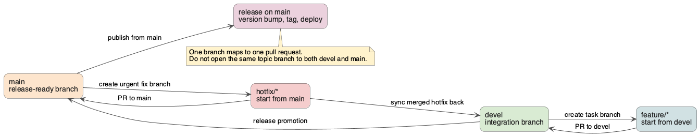

# 🚀 Releasing a New Version

This is a step-by-step guide for making a new HestiaStore release.

## ☝️ Versioning of the project

The project uses the traditional versioning pattern known as Semantic Versioning, detailed at [https://semver.org](https://semver.org). The version number consists of three components separated by dots:

```text
0.3.6
```

Each number has the following meaning:

* `0` - Major project version. Project API could be incompatible between two major versions.
* `3` - Minor project version. Contains changes in features, performance optimizations, and small improvements. Minor versions should be compatible.
* `6` - Patch version. Bug fixing project release.

There are also snapshot versions with version number `0.3.6-SNAPSHOT`. Snapshot versions should not be stored in the Maven repository.

## 🕊️ Branching strategy



We use a simplified GitHub Flow:

* `main`: the primary development and release branch. Small changes may be committed directly to `main`, while larger or experimental features must be developed in a separate branch and merged via pull request.
* Feature branches are created from `main` for larger or isolated changes. Use descriptive names like `feature/compression`, `fix/index-scan`, etc.

The deprecated `devel` branch has been removed and is no longer used.

## 🧑‍💻 Release prerequisites

The release will be published to Maven Central. Release configuration secrets are placed at the Maven settings file `~/.m2/settings.xml`.
Adjust `settings.xml` in `~/.m2/settings.xml` as described in [GitHub's official documentation on how to work with the GitHub Maven repository](https://docs.github.com/en/packages/working-with-a-github-packages-registry/working-with-the-apache-maven-registry). Generate a valid token and you are done.

### Provide correct package signature

In your `~/.m2/settings.xml` file, add the following section:

```xml
<settings>
    ...
   <profile>
     <id>release</id>
       <properties>
       <gpg.executable>gpg</gpg.executable>
       <gpg.passphrase>--pgp-password--</gpg.passphrase>
     </properties>      
   </profile>
    ...
</settings>
```

### Setup maven central accout secrets

This provides `org.sonatype.central:central-publishing-maven-plugin` plugin secrets to enable login to the Maven Central account where release data will be placed.
You must have an account with a verified namespace `org.hestiastore` at [central.sonatype.com](https://central.sonatype.com/). From the `Account` section, generate a key and password. These should be added to:

```xml
<settings>
    ...
    <servers>
        <server>
            <id>central</id>
           <username>------</username>
           <password>---------------token---------------</password>
       </server>
    </servers>
    ...
</settings>
```

## Perform release

Perform the following steps to create a new release:

### 1. 🏷️ Checkout the `main` branch

```bash
git checkout main
```

### 2. 🔢 Set the Release Version

```bash
mvn versions:set -DnewVersion=0.0.12
git commit -am "release: version 0.0.12"
```

### 3. 🏷️ Tag and Push the Release

```bash
git tag v0.0.12
git push --follow-tags
```

### 4. 🚀 Deploy the Release

Deploy the release (can be later automated via GitHub Actions or done manually):

```bash
mvn deploy -P release
```

### 5. 📈 Bump to the Next Snapshot Version

```bash
mvn versions:set -DnewVersion=0.0.13-SNAPSHOT
git commit -am "post-release: bumped to 0.0.13-SNAPSHOT"
git push
```

### 6. 📝 Publish the Release on GitHub

1. Go to [https://github.com/jajir/HestiaStore/releases](https://github.com/jajir/HestiaStore/releases) and choose `Draft a new release`.
1. From the drop-down box `target: main`, select `recent commits` and select the correct one with name `release: version 0.0.12`.
1. From the drop-down box `Choose a tag` enter `release-0.0.12` and click `Create new tag: release ...`. Now in the repo, the tag clearly signals the new release.
1. Release title should be `Release 0.0.3` and in the `Write` field, use the text generated from the template below:
1. Press `Publish release`.

Text template:

````markdown
Release to maven central:

```xml
<dependencies>
  <dependency>
    <groupId>org.hestiastore.index</groupId>
    <artifactId>core</artifactId>
    <version>0.0.3</version> <!-- Replace with the actual version -->
  </dependency>
</dependencies>
```

````

### 7. 🎉 Celebrate

That's it — the release is live and development can continue.

## 🧰 Helpful Commands

At the beginning there may be problems. Here are a few tricks that help to gather more information.

### How to Use a Custom settings.xml File

```bash
mvn --settings ./src/main/settings.xml clean deploy
```

### How to Set the Maven Project Version

```bash
mvn versions:set -DnewVersion=1.0.1-SNAPSHOT
```

### Check dependencies

Try to update dependencies. Check them with:

```bash
mvn versions:display-dependency-updates
```
