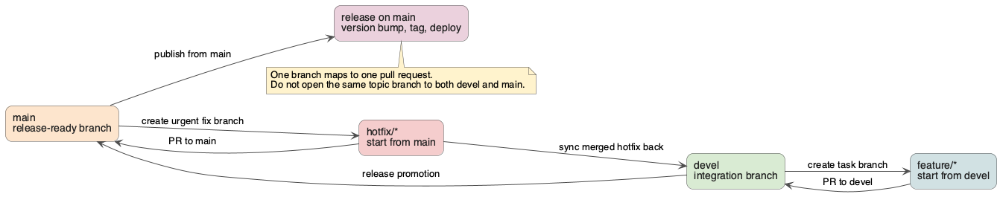

# Releasing a New Version

This is the source-of-truth runbook for making a new HestiaStore release.

When you ask Codex to use the `release-maven-library` skill, it performs the
full local release workflow described on this page: prerequisite checks,
pre-release verification, release version bump, release commit, release tag,
Maven Central deployment, next snapshot bump, next snapshot commit, and Git
pushes.

The only manual step is publishing the GitHub release on the repository
homepage at [https://github.com/jajir/HestiaStore/releases](https://github.com/jajir/HestiaStore/releases).
Codex can prepare the release title and body, but it cannot click `Publish
release` in the GitHub web UI.

## Versioning of the project

The project uses the traditional versioning pattern known as Semantic Versioning, detailed at [https://semver.org](https://semver.org). The version number consists of three components separated by dots:

```text
0.3.6
```

Each number has the following meaning:

* `0` - Major project version. Project API could be incompatible between two major versions.
* `3` - Minor project version. Contains changes in features, performance optimizations, and small improvements. Minor versions should be compatible.
* `6` - Patch version. Bug fixing project release.

There are also snapshot versions with version number `0.3.6-SNAPSHOT`. Snapshot versions should not be stored in the Maven repository.

## Branching strategy



We use a simplified GitHub Flow:

* `main`: the primary development and release branch. Small changes may be committed directly to `main`, while larger or experimental features must be developed in a separate branch and merged via pull request.
* Feature branches are created from `main` for larger or isolated changes. Use descriptive names like `feature/compression`, `fix/index-scan`, etc.

The deprecated `devel` branch has been removed and is no longer used.

## Release prerequisites

The release will be published to Maven Central. Release configuration secrets are placed at the Maven settings file `~/.m2/settings.xml`.

Releases must be prepared from a clean `main` branch worktree with push access
to the repository and tags.

### Provide correct package signature

In your `~/.m2/settings.xml` file, add the following section:

```xml
<settings>
    ...
   <profile>
     <id>release</id>
       <properties>
       <gpg.executable>gpg</gpg.executable>
       <gpg.passphrase>--pgp-password--</gpg.passphrase>
     </properties>      
   </profile>
    ...
</settings>
```

### Setup Maven Central account secrets

This provides `org.sonatype.central:central-publishing-maven-plugin` plugin secrets to enable login to the Maven Central account where release data will be placed.
You must have an account with a verified namespace `org.hestiastore` at [central.sonatype.com](https://central.sonatype.com/). From the `Account` section, generate a key and password. These should be added to:

```xml
<settings>
    ...
    <servers>
        <server>
            <id>central</id>
           <username>------</username>
           <password>---------------token---------------</password>
       </server>
    </servers>
    ...
</settings>
```

## Perform release

Perform the following steps to create a new release:

### 0. Verify module artifacts and tests

Run the standard release verification script:

```bash
./.agents/skills/release-maven-library/scripts/verify-release.sh
```

That script runs the release verification used by the skill:

```bash
mvn -N install
mvn -pl engine,wal-tools,monitoring-micrometer,monitoring-prometheus,monitoring-rest-json-api,monitoring-rest-json,monitoring-console-web -DskipTests package
mvn -pl wal-tools,monitoring-micrometer,monitoring-prometheus,monitoring-rest-json-api,monitoring-rest-json,monitoring-console-web test
mvn -pl engine test -Dtest=IntegrationSegmentIndexMetricsSnapshotConcurrencyTest
mvn -pl monitoring-prometheus test -Dtest=HestiaStorePrometheusExporterTest
mvn clean verify
```

### 1. Checkout and update the `main` branch

```bash
git checkout main
git pull --ff-only
```

### 2. Set the release version

```bash
./.agents/skills/release-maven-library/scripts/bump-version.sh 0.0.12
git commit -am "release: version 0.0.12"
```

### 3. Validate the release profile

Run the root release profile so the parent POM and all release modules are
validated together:

```bash
mvn -P release -DskipTests verify
```

Do not deploy `engine` alone. The release must be run from the repository root
so the parent POM and all publishable modules stay aligned.

### 4. Create the release tag

```bash
git tag release-0.0.12
```

### 5. Deploy the release

Deploy the release to Maven Central from the repository root:

```bash
mvn -P release -DskipTests deploy
```

### 6. Push the release commit and tag

Push both `main` and the release tag after deployment succeeds:

```bash
git push origin main release-0.0.12
```

### 7. Bump to the next snapshot version

```bash
./.agents/skills/release-maven-library/scripts/prepare-next-snapshot.sh 0.0.13-SNAPSHOT
git commit -am "post-release: bumped to 0.0.13-SNAPSHOT"
git push origin main
```

### 8. Publish the release on GitHub

This step is manual and must be completed on the GitHub repository homepage,
not in the generated documentation site:

1. Go to [https://github.com/jajir/HestiaStore/releases](https://github.com/jajir/HestiaStore/releases) and choose `Draft a new release`.
2. Select the existing tag `release-0.0.12`.
3. Keep `main` as the target branch.
4. Set the release title to `Release 0.0.12`.
5. In the `Write` field, use the text generated from the template below.
6. If the release contains breaking changes, add a dedicated `Breaking changes` section with migration steps.
7. Press `Publish release`.

Text template:

````markdown
Release to maven central:

```xml
<dependencies>
  <dependency>
    <groupId>org.hestiastore</groupId>
    <artifactId>engine</artifactId>
    <version>0.0.12</version> <!-- Replace with the actual version -->
  </dependency>
</dependencies>
```

````

## Multi-module release artifacts

Each release publishes aligned versions of:

- `org.hestiastore:hestiastore-parent` (POM)
- `org.hestiastore:engine`
- `org.hestiastore:wal-tools`
- `org.hestiastore:monitoring-rest-json-api`
- `org.hestiastore:monitoring-micrometer`
- `org.hestiastore:monitoring-prometheus`
- `org.hestiastore:monitoring-rest-json`
- `org.hestiastore:monitoring-console-web`

The `benchmarks` module participates in the build but is not deployed because
its POM sets `maven.deploy.skip=true`.

Compatibility and staged upgrade guidance:

- [Compatibility Matrix](compatibility-matrix.md)
- [Upgrade Notes (Multi-Module)](upgrade-notes-multimodule.md)

### 9. Finish the release

That's it — the release is live and development can continue.

## Helpful Commands

At the beginning there may be problems. Here are a few tricks that help to gather more information.

### How to Use a Custom settings.xml File

```bash
mvn --settings ./src/main/settings.xml clean deploy
```

### How to Set the Maven Project Version

```bash
mvn versions:set -DnewVersion=1.0.1-SNAPSHOT
```

### Check dependencies

Try to update dependencies. Check them with:

```bash
mvn versions:display-dependency-updates
```
