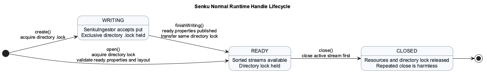
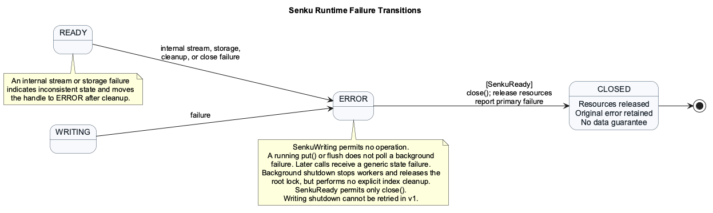
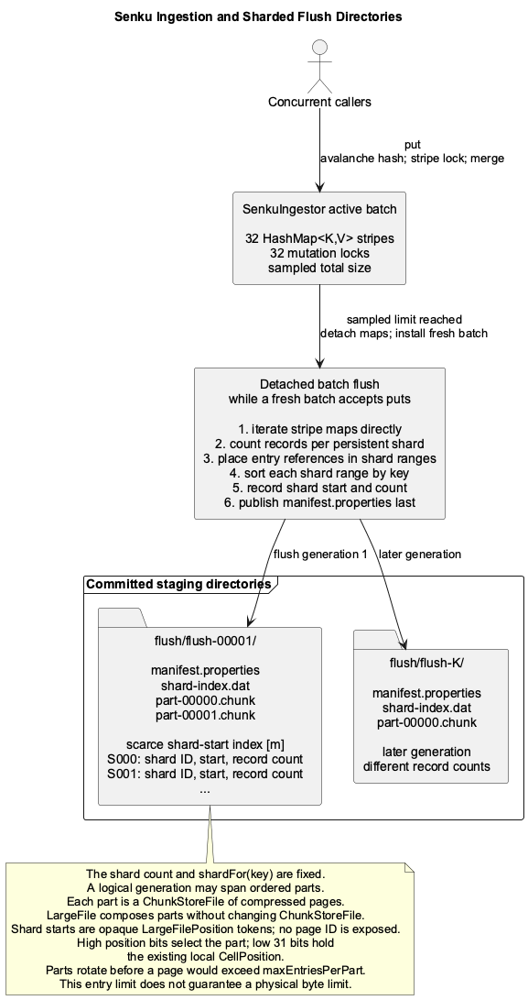
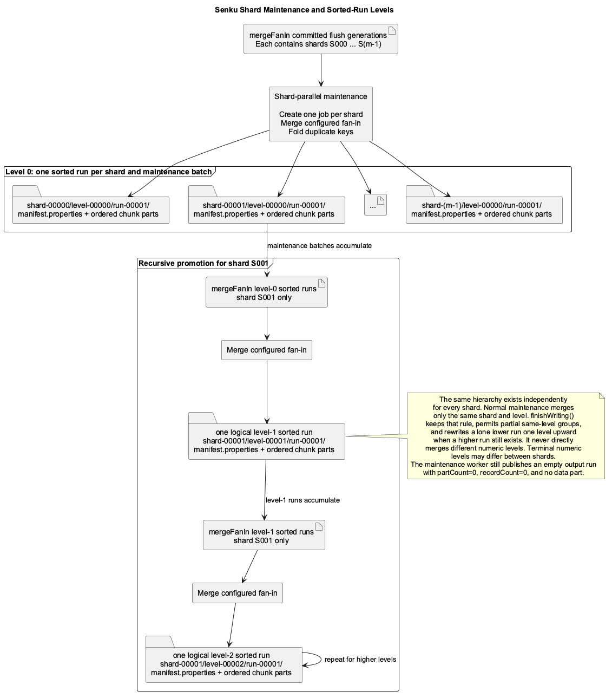
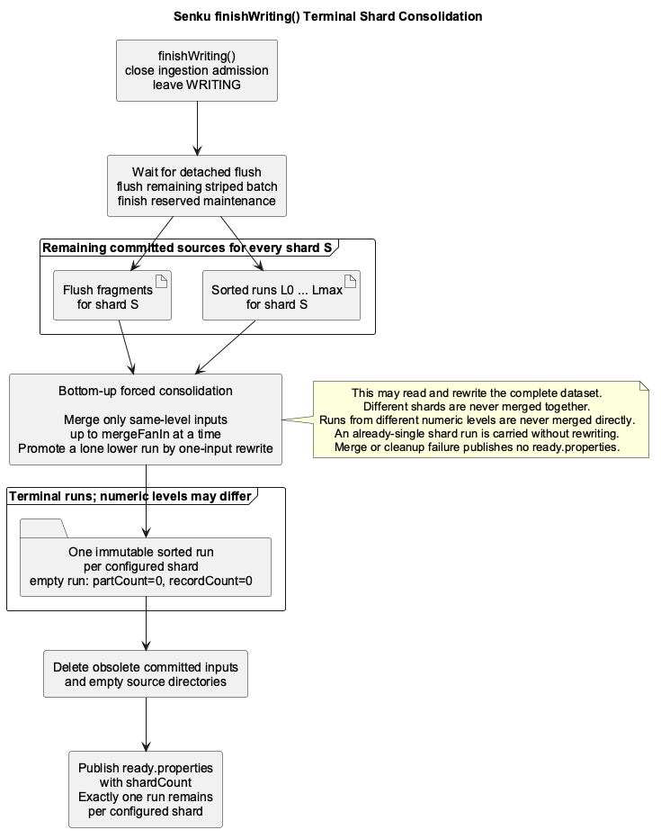
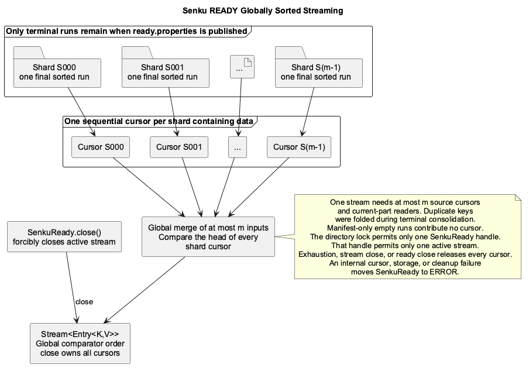
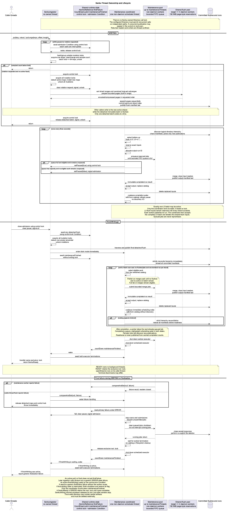

# Senku Index

This page defines a write-once, finalize-once, stream-many index optimized for
fast bulk ingestion from concurrent callers. Senku has no point-read API and
lives in the separate `org.hestiastore.index.senku` package.

## Primary Goal

Performance is the primary design goal. API compatibility and completion of
background maintenance are secondary. An API operation may be changed or
removed when it adds measurable cost.

The primary metric is **end-to-end ingest-to-first-sorted-result latency**: time
from the first accepted write until the first entry of the globally sorted
stream is available. This is also called bulk-load time-to-first-result.

The target volume is `100_000_000_000_000` numbers. Stored as raw 64-bit values,
that is 800 TB before values, metadata, or redundancy. One sequential pass takes
about 22 hours even at 10 GB/s, so minimizing full-data passes and write
amplification matters more than small API-level optimizations.

## User-Facing API

Each lifecycle state exposes only its valid operations. Names are provisional.

```java
public final class SenkuIndex {

    public static <K, V> SenkuIndexBuilder<K, V> builder(
            Directory directory,
            TypeDescriptor<K> keyTypeDescriptor,
            TypeDescriptor<V> valueTypeDescriptor,
            SenkuMergeFunctionRegistry<K, V> functions);

    public static <K, V> SenkuReady<K, V> open(
            Directory directory,
            TypeDescriptor<K> keyTypeDescriptor,
            TypeDescriptor<V> valueTypeDescriptor,
            int diskIoBufferSize);
}

public final class SenkuIndexBuilder<K, V> {

    public SenkuIndexBuilder<K, V> shardHashFunction(
            ToIntFunction<K> shardHashFunction);

    public SenkuIndexBuilder<K, V> shardCount(int shardCount);

    public SenkuIndexBuilder<K, V> maxInMemoryEntries(
            int maxInMemoryEntries);

    public SenkuIndexBuilder<K, V> maxKeysPerPage(int maxKeysPerPage);

    public SenkuIndexBuilder<K, V> mergeFanIn(int mergeFanIn);

    public SenkuIndexBuilder<K, V> maintenanceThreads(
            int maintenanceThreads);

    public SenkuIndexBuilder<K, V> maintenanceQueueSize(
            int maintenanceQueueSize);

    public SenkuIndexBuilder<K, V> diskIoBufferSize(
            int diskIoBufferSize);

    public SenkuIndexBuilder<K, V> maxEntriesPerPart(
            long maxEntriesPerPart);

    public SenkuWriting<K, V> create();
}

public interface SenkuWriting<K, V> {

    void put(K key, V value);

    SenkuReady<K, V> finishWriting();
}

public interface SenkuReady<K, V> extends AutoCloseable {

    Stream<Entry<K, V>> openStream();

    @Override
    void close();
}
```

`SenkuWriting` is thread-safe. Ingestion uses 32 independently locked mutation
stripes, so operations on different stripes can proceed concurrently while
operations on one key remain serialized. Concurrent operations have no
guaranteed order. Duplicate values for one key are merged rather than resolved
by call order.
`putIfAbsent` and conditional `replace` are intentionally excluded because they
would add state-resolution work.

Each active ingestion batch contains one `HashMap` per mutation stripe.
`openStream()` is backed by a Senku-owned lazy merge implementation rather than
materializing the complete result in memory.

Invalid or missing builder settings fail with `IllegalArgumentException` that
names the setting. `create()` completes all builder validation before it changes
storage. Storage, locking, merge, lifecycle, and streaming failures crossing a
created Senku handle are reported as `IndexException`; lower-level runtime
exceptions are wrapped with their original cause.

Senku follows one failure rule: **fail fast**. Any detected lifecycle,
ownership, catalog, metadata, storage, merge, or cleanup invariant violation
stops the current operation immediately and is reported as `IndexException`.
A created handle moves to `ERROR` unless this document explicitly defines the
failure as operation-scoped. Senku never silently repairs, skips, retries, or
guesses in order to continue normal processing with inconsistent state.

An API call rejected only because the caller lost a lifecycle race or used a
handle in the wrong state is operation-scoped. It throws `IndexException`, does
not record `firstFailure`, and does not change the current handle or index
state. This rule covers a `put()` that loses the race with `finishWriting()`, a
losing concurrent `finishWriting()`, use of a transferred `SenkuWriting`, a
second active `openStream()`, and `openStream()` after `CLOSED`. Repeated
`SenkuReady.close()` remains a no-op. A call made after the handle has entered
`ERROR` because of background maintenance receives only a generic state
failure; the worker exception and its cause are not propagated to caller
threads.

The builder is deliberately flat and much smaller than the Segment Index
builder. It creates the component graph but contains no runtime monitoring,
runtime tuning, or nested configuration sections.

### Builder Configuration Summary

The table covers every `SenkuIndexBuilder` setting. Constructor dependencies
passed to `SenkuIndex.builder(...)` are also required and must be non-null.

| Setting | Required or default | Accepted value | Failure | Persisted |
| --- | --- | --- | --- | --- |
| `shardHashFunction` | Required | Non-null; comparator-equal keys must route to the same shard | `IllegalArgumentException` if missing or null | No |
| `shardCount` | Required | 1 through `1_000_000` | `IllegalArgumentException` if missing or outside the range | Yes, in `ready.properties` |
| `maxInMemoryEntries` | Required | 1 through `805_306_368` | `IllegalArgumentException` if missing or outside the range | No |
| `mergeFanIn` | Required | Integer greater than or equal to 2 | `IllegalArgumentException` if missing or outside the range | No |
| `maintenanceThreads` | Required | Positive integer | `IllegalArgumentException` if missing or outside the range | No |
| `maxKeysPerPage` | Default: `1_000_000` | Positive integer | `IllegalArgumentException` if outside the range | No |
| `maxEntriesPerPart` | Default: `10_000_000` | Positive long greater than or equal to `maxKeysPerPage` | `IllegalArgumentException` if outside the range | No |
| `maintenanceQueueSize` | Default: `42` | Positive integer | `IllegalArgumentException` if outside the range | No |
| `diskIoBufferSize` | Default: `8_192` | Positive integer divisible by 1,024 | `IllegalArgumentException` if outside the range | No; the caller supplies it again to `open()` |

The builder validates only that `shardHashFunction` is present. Ensuring that
comparator-equal keys always route to the same shard is the caller's
responsibility and cannot be proven from the function alone.

The initial configuration has four required performance parameters:

- `shardCount`: from 1 through `1_000_000`, fixed for the index lifetime.
- `maxInMemoryEntries`: the current distinct-key count that triggers a flush;
  duplicate puts merged into an existing key do not increase it.
- `mergeFanIn`: the normal merge-group size and the maximum number of inputs
  accepted by one merge job. Finalization may use a smaller same-level group or
  a one-input promotion as described below.
- `maintenanceThreads`: the maximum number of merge jobs that may run in
  parallel.

`diskIoBufferSize` is the same storage parameter used by Segment Index. It
defaults to `IndexConfigurationDefaults.DEFAULT_DISK_IO_BUFFER_SIZE_BYTES`
(`8_192` bytes) when creating an index and is used to construct the existing
`DataBlockSize`. Because Senku does not persist configuration, `open()` requires
the caller to supply the matching value. A wrong value is not compared against
metadata. It may fail during storage decoding, but Senku cannot promise that it
will be detected before incorrect results are produced.

The optional `maxKeysPerPage` setting controls the maximum number of sorted
key-value entries in one page and defaults to `1_000_000`. It must be positive.
A page closes when it reaches this count or the current shard ends, whichever
happens first. This setting bounds entry count, not encoded bytes or retained
memory.

The optional `maxEntriesPerPart` setting controls the maximum number of
key-value entries in one physical `LargeFile` part and defaults to
`10_000_000`. It must be at least `maxKeysPerPage`. All four required values and
the shard hash are supplied to `create()`; the page-key, part-entry, disk-I/O,
and maintenance-queue settings use their defaults when omitted.

The optional `maintenanceQueueSize` setting bounds submitted merge jobs that
have not started. It defaults to `42`. A larger queue can absorb
short scheduling bursts, but does not add I/O parallelism and makes newly
discovered lower-level work wait behind more already-queued jobs. It also delays
queue-saturation backpressure because more jobs can wait before ingestion is
paused.

Builder validation is eager, and each numeric check and capacity calculation is
overflow-safe. `shardCount` must be from 1 through 1,000,000. At minimum,
`maxKeysPerPage`, `maxEntriesPerPart`,
`maintenanceThreads`, and `maintenanceQueueSize` must be positive. The page
limit is validated with
`Vldtn.requireGreaterThanZero(maxKeysPerPage, "maxKeysPerPage")`.
`maxEntriesPerPart` must be at least `maxKeysPerPage` so one permitted page
always fits within the part's entry limit. `maxInMemoryEntries` must be from 1
through 805,306,368, `mergeFanIn` must be at least two, and `diskIoBufferSize`
must pass the same
`Vldtn.requireIoBufferSize(...)` rule as Segment Index: positive and divisible
by 1,024. The first version deliberately imposes no combined heap,
encoded-page-size, or file-handle budget across otherwise valid configuration
values.

Senku does not persist write-path builder configuration, type/comparator
identity, shard hash, or merge-function identity. The one exception is the
structural `shardCount` stored in `ready.properties`, which allows `open()` to
detect an incomplete ready layout. Directory names encode source, shard, level,
and run identity. Every `manifest.properties` stores its expected physical part
count and acts as the source publication marker. A sorted-run manifest also
stores its exact record count; `shard-index.dat` contains flush shard positions
and counts.

`open()` performs no proactive compatibility comparison. It uses the supplied
type descriptors and comparator directly. An incompatible descriptor may fail
while decoding bytes, but no fail-fast detection is guaranteed. A wrong but
byte-compatible descriptor or comparator is more dangerous: it may silently
produce incorrect values or a stream that is not globally ordered. This is an
explicitly accepted initial limitation.

Property files are authoritative. The `open()` API deliberately does not
receive `shardCount`; it reads the expected count from `ready.properties` and
requires exactly one committed terminal run for every shard ID from zero through
`shardCount - 1`. A missing or extra shard, multiple committed runs for one
shard, a missing or non-empty `flush/` directory, temporary file, or unknown
root entry fails fast with `IndexException`.

## Merge Function Registry

Exactly one merge function is configured for a writing index through the
dedicated registry. Creating an index with zero functions or registering a
second function fails with `IndexException`. No function ID is selected by a
write call or persisted.

```java
@FunctionalInterface
public interface SenkuMergeFunction<K, V> {

    V apply(K key, V firstValue, V secondValue);
}

public final class SenkuMergeFunctionRegistry<K, V> {

    public SenkuMergeFunctionRegistry<K, V> register(
            SenkuMergeFunction<K, V> function);
}
```

The registry is frozen when the index is created. Senku does not retain mutation
order, so merge functions must be deterministic, associative, and commutative.
Before acquiring the selected mutation-stripe lock, `put()` validates the
arguments with
`Vldtn.requireNonNull(key, "key")` and
`Vldtn.requireNonNull(value, "value")`. A null argument therefore throws
`IllegalArgumentException` before the map changes and leaves the handle in
`WRITING`. Senku then calls `HashMap.get(key)`. A null result means absent
because null values are forbidden, so the supplied value is stored directly.
Otherwise Senku calls the sole merge function and stores its result. For
example, three puts for one key cause two logical merge calls, but Senku does
not define their grouping or argument order. A merge function is hot-path code:
it must be fast, non-blocking, allocation-conscious, and isolated from external
state. It must not perform I/O, acquire application locks, invoke remote
services, or depend on call order. The same function may execute on an
ingestion caller or multiple maintenance workers, so it must be thread-safe.

Keys, supplied values, and merge results must be non-null. A merge function that
throws from `put()` fails that call and moves the index to `ERROR`. A merge
failure in a maintenance worker is reported only to the coordinator, which
stops new maintenance submission and eventually moves the writing runtime to
`ERROR`. A running `put()` or caller-driven flush does not poll for that failure
and may complete before the coordinator closes ingestion admission. A waiting
`finishWriting()` rethrows the recorded first failure with its original cause
chain. Returning null has the same effect; null is never interpreted as
deletion.

Senku does not interpret `TypeDescriptor.getTombstone()` and has no tombstone
semantics. A non-null value equal to the descriptor's tombstone is stored,
merged, and streamed as an ordinary value.

Keys, supplied values, and merge results must not be mutated after being passed
to Senku. In addition, key identity must be consistent across the in-memory map,
sorting, and sharding: `comparator.compare(a, b) == 0` if and only if
`a.equals(b)`, equal keys must have equal `hashCode()` values, and
comparator-equal keys must produce the same configured shard hash. Violating
this contract can create duplicate logical keys or a wrongly ordered result.
When equal key objects from different sources are folded, Senku does not define
which object instance is retained, passed to later merge calls, or emitted.

The key comparator and both type descriptors are shared configuration objects.
Maintenance may invoke them concurrently from different shard workers. They
must therefore be deterministic and thread-safe, and descriptor methods that
create readers, writers, encoders, or decoders must not return mutable runtime
state shared between jobs.

## Runtime Handle Lifecycle

The runtime handle lifecycle moves forward and never returns to an earlier
state:

### Normal Transitions

```text
create() -> WRITING -> READY
open() --------------> READY

READY -> CLOSED on close()
```



### Failure Transitions

```text
WRITING -> ERROR on write, maintenance, or finalization failure
READY -> ERROR on internal stream, storage, cleanup, or close failure
ERROR SenkuReady -> CLOSED on close()
```



`CLOSED` describes only the runtime handle: its resources have been released and
it cannot be used again. It does not mean that the persistent index is valid.
The first `close()` of a failed `SenkuReady` reports the original failure after
cleanup, and corrupted or incomplete on-disk state remains corrupted or
incomplete. Once that close reaches `CLOSED`, repeated `close()` calls are
no-ops. `SenkuWriting` deliberately has no `close()` operation and does not
implement `AutoCloseable`. The first version exposes no operation for abandoning
a healthy writing handle.

After any write, flush, merge, cleanup, or finalization failure, Senku makes no
promise that previously written data remains persistent, complete, or reusable.
Senku closes owned resources but performs no coordinated filesystem cleanup.
It does not traverse or delete temporary or other index artifacts. The user must
delete the failed directory externally; it cannot be opened or resumed. Only
successful publication of `ready.properties` creates a valid index.

- `WRITING` accepts mutations and rejects reads.
- `SenkuWriting` has no `close()` or abandonment operation. Callers must use
  `finishWriting()`.
- `READY` allows streams and rejects mutations.
- A Senku failure while opening or advancing a ready stream indicates an index
  or runtime inconsistency and moves `SenkuReady` to `ERROR` after attempting
  complete stream cleanup.
- A `SenkuReady` in `ERROR` allows only `close()`; the failure is reported as an
  `IndexException`.
- A `SenkuWriting` in `ERROR` allows no operation. Minimal failure shutdown
  stops the owned threads and releases the root `FileLock`, but performs no
  explicit index cleanup.
- `CLOSED` is terminal for the runtime handle. `openStream()` throws the
  operation-scoped `IndexException`; repeated `SenkuReady.close()` calls are
  harmless.

Dropping a healthy `SenkuWriting` handle without calling `finishWriting()` is
unsupported. Its non-daemon coordinator and exclusive directory lock remain
owned. Adding explicit destructive abandonment is recorded as technical debt.

### Exclusive Directory Lock

`create()` acquires the exclusive Senku root-directory `.lock` through the
existing `Directory.getLock(...)` and `FileLock` APIs, using the same lock-file
name as Segment Index. The lock covers `WRITING`,
background maintenance, and `finishWriting()` finalization, then transfers to
the returned `SenkuReady` handle without a release gap. `open()` acquires the
same exclusive lock before returning a ready handle. Both factory paths invoke
the existing `FileLock.lock()` once and add no pre-check, timeout, retry, or
post-acquisition verification. Contention behavior therefore follows the
backend. The shipped memory and filesystem implementations currently throw when
they consider the lock held, but Senku does not promise immediate failure
because the `FileLock` contract permits blocking.

The lock is held for the complete `WRITING` and `READY` handle lifetime and is
released by successful minimal writing-failure shutdown or
`SenkuReady.close()`. A ready handle in `ERROR` retains it until `close()`. Each
release attempt invokes the existing `FileLock.unlock()` once and adds no
post-release verification. An
observed unlock exception follows the existing lifecycle rules: ready close may
retry, while writing-failure shutdown has no public retry operation. If a
backend returns normally without removing its lock artifact, Senku cannot
detect that failure and treats the lock as released. Consequently, only one
Senku handle and one ready stream can exist for an index directory at a time
within the exclusion guarantees of the `Directory` backend. The current
filesystem `FileLock` checks for a lock file and then writes it in two separate
operations, so it does not prove atomic exclusion between racing handles,
whether they are threads or processes. The first version accepts this risk and
adds no second locking, verification, or recovery mechanism; it uses the
existing `FileLock` as-is.
Backends that do not implement `Directory.getLock(...)` are unsupported and
cause `create()` or `open()` to fail with `IndexException`.

Ignoring the backend-owned `.lock` artifact, `create()` requires an empty Senku
root and rejects an existing ready marker, committed source, or unknown file.
`open()` requires `ready.properties`, reads its structural `shardCount`, and
validates the complete ready layout before returning a handle. Malformed names,
missing or extra sources, a missing or non-empty `flush/` directory, remaining
writing artifacts, and unreadable discovered files fail with `IndexException`.

`SenkuReady` implements `AutoCloseable`; `SenkuWriting` deliberately does not.
Neither handle implements `CloseableResource` or extends
`AbstractCloseableResource`, because that contract requires an already-closed
resource to reject another `close()` call. A successful `finishWriting()`
changes the writing handle to an internal transferred state while holding its
`ReentrantLock`, then hands ready resources and the same directory `FileLock`
to the new `SenkuReady` handle. The old writing handle can no longer mutate or
finish the index: both methods throw the operation-scoped `IndexException`
without affecting the ready handle. It exposes no cleanup operation after
transfer. Repeated `SenkuReady.close()` is harmless.

`finishWriting()` blocks until finalization succeeds or fails. Internally it
closes ingestion admission, waits for a detached batch already being flushed,
then rotates and publishes the remaining active batch while the lifecycle
remains `WRITING`. Puts that lose the admission race fail without changing the
batch. Only after the final flush manifest is committed does the runtime
transition to `FINISHING`. The coordinator can then drain all remaining flush
generations into shard runs, consolidate every configured shard to exactly one
terminal sorted run, and publish `ready.properties` with the structural shard
count. This ordering prevents a periodic coordinator scan from entering drain
mode while the final flush is present but not yet visible through its manifest.
The finalization work can read and rewrite substantial data and therefore
delays the first sorted result. Failure moves the writing handle directly to
`ERROR`.

The first `finishWriting()` caller that acquires the lock owns that terminal
attempt. It records that admission is closed before releasing the lock.
Concurrent calls fail immediately with `IndexException`; they do not join or
wait for the winning attempt, record `firstFailure`, or change the winning
attempt's state. After a failed `finishWriting()` leaves the handle in `ERROR`,
no operation is permitted. This requires an internal transition-in-progress
flag, not another public lifecycle state such as `PREPARING`.

`READY` is published only after the final data and metadata are committed.
The initial design provides no WAL and no recovery or resume mechanism for an
unfinished index. Only a successfully published `READY` index is considered
valid and openable.

## Architecture

- `SenkuIndex` owns lifecycle transitions and the thread-safe public API.
- `SenkuIngestor` accepts all user `put` calls during `WRITING`,
  owns one active striped batch and at most one detached batch being flushed.
  Its per-stripe locks allow concurrent mutation and its control lock protects
  rotation, lifecycle admission, and flush backpressure.
- A completed flush produces one immutable logical directory holding a fixed
  number of independently sorted, addressable shards.
- The structural `flush/` directory is created once by `create()` and retained
  permanently. Only its individual `flush-N/` generation directories are
  removed.
- Background maintenance produces immutable sorted-run directories containing
  one shard at one merge level.
- Each flush or sorted-run directory is one `LargeFile`: an ordered set of
  compressed page parts backed by `ChunkStoreFile`.
- `SenkuMaintenanceCoordinator` discovers eligible merge groups and a bounded
  worker pool executes at most `maintenanceThreads` merge jobs concurrently.
  Each worker publishes its completed sorted-run output before reporting
  completion; only the coordinator changes the source catalog and deletes
  replaced inputs.
- A ready index contains exactly one terminal sorted run for every configured
  shard and a published `ready.properties` marker. A shard without entries has
  an empty run.
- The merge-function registry supplies the one reduction function used by all
  duplicate keys.

The write path is:

```text
put
  -> SenkuIngestor
  -> avalanche the configured shard hash into one of 32 mutation stripes
  -> acquire that stripe lock
  -> stripe HashMap.get(key), optionally merge, then HashMap.put(key, value)
  -> sampled distinct-key total reaches its configured limit
  -> detach the complete stripe-map list and install a fresh active batch
  -> detached entries are distributed directly to persistent shards
  -> every shard is sorted
  -> one immutable flush generation is published
  -> ingestion may continue in the active batch during publication
```

Mutation stripes are selected by an avalanche mix of the configured persistent
shard hash. The extra mix is deliberate: selecting a stripe with the same low
spread bits that Java `HashMap` uses for buckets would force every stripe map
into only one thirty-second of its buckets and cause treeification. Stripe and
control locks are non-fair because ingestion throughput, not waiter ordering,
is the goal.

The 32 Java 17 `HashMap` instances divide an overflow-safe total initial
capacity calculated for `maxInMemoryEntries`. Rotation installs a new batch;
the detached maps stay immutable while the caller that claimed them publishes
the flush. The simultaneous active and detached batches are an accepted peak-
memory consequence and must be included in ingestion benchmarks.

`HashMap` has a maximum table capacity of `2^30`. At its normal `0.75` load
factor, the largest entry threshold that preserves the no-resize guarantee is
therefore 805,306,368. The builder accepts `maxInMemoryEntries` from 1 through
that value and calculates the constructor capacity with `long` arithmetic before
the checked cast to `int`:

```java
private static final int MAX_IN_MEMORY_ENTRIES = 805_306_368;

long requestedCapacity = (4L * maxInMemoryEntries + 2L) / 3L;
int initialCapacity = (int) requestedCapacity;
```

The JDK rounds that request to a supported power-of-two table capacity. This
validation protects the sizing arithmetic and load-factor contract; it does not
predict available heap. A valid configuration can still fail allocation when
the selected entry count or key/value objects exceed the process memory budget.

### Striped Rotation and Caller-Driven Flush

`put()` performs its get, optional merge, put, and sampled size publication
while holding only the selected mutation-stripe lock. Sampling avoids a shared
atomic increment on every distinct insertion. The approximate trigger may lag
the real distinct-key count by less than 25 percent of the configured threshold.
The limit counts key-value entries, not bytes, so the user must size it for the
dataset's encoded key and value sizes.

The caller that observes the rotation request acquires the control lock and all
mutation locks, detaches the active list of 32 maps, and installs a new list.
After releasing the mutation locks it performs the flush while other callers
can fill the new active batch. At most one detached batch is flushed; if the
active batch reaches its threshold before publication finishes, subsequent
puts wait for capacity. The flush writer first counts entries for every
persistent shard across all detached maps and computes each shard's start
offset in one reference array. A second pass places each `Map.Entry<K, V>`
reference directly into its contiguous shard range; it does not construct a
third combined `HashMap`. Each range is
then sorted independently by the configured key comparator. The writer consumes
the sorted ranges and writes compressed pages into a `flush/flush-N/` directory.
A page never contains entries from two shards: the writer closes the current
page when it reaches `maxKeysPerPage` or at every non-empty shard boundary,
whichever comes first. Every page starts with fresh differential-key state so
it can be decoded independently by `SingleChunkEntryIterator`. Other writing
calls wait for the same lock. Part transactions write `part-N.chunk.tmp` and
rename it to `part-N.chunk` on commit. The directory becomes committed only
when its `manifest.properties` file is published last. No maintenance thread
reads or controls the active or detached maps or their locks.

The map cannot be cleared before every entry has been written, so the configured
map limit is not a peak-memory limit. The partition uses one reference per map
entry plus `O(shardCount)` counts and offsets. Sorting one shard range at a time
adds only that sort's temporary workspace; Senku creates no wrapper object per
entry. The two map passes compute the configured shard hash twice, which is
accepted to avoid retaining one shard ID per entry. The physical pages store
only key and value because the shard-start index already defines their
boundaries.

A failed flush closes its currently owned resources, moves the index to
`ERROR`, and leaves its incomplete output in place. It does not guarantee
preservation of the map, previously committed sources, or any file. Background
maintenance must ignore `.tmp` files because they are never valid inputs on the
successful path.

### Sharded Flush Directories

The configured shard count `m` is fixed for the lifetime of an index. Every key
is routed to the same shard in every flush generation using:

```text
shardFor(key) = floorMod(hash(key), m)
```

The hash must remain stable for the writing lifetime. Its equality contract must
also match the configured comparator: comparator-equal keys must produce the
same hash and therefore reach the same shard.

Every logical flush generation contains all `m` shard slots. Shards have
variable record counts and may be empty. A provisional example uses 128 shards.
The generation may use multiple physical parts. Its `manifest.properties`,
containing `partCount`, commits the container, while `shard-index.dat` stores one
addressable region for every configured shard:

```text
shard-index.dat:
  m x { shard ID, start LargeFilePosition, record count }
```

`shard-index.dat` is ordered by shard ID and also stores each ID explicitly so
the reader can require the exact sequence from zero through `shardCount - 1`.
Pages for one shard are contiguous in the logical `LargeFile`, and no page
contains records from two shards. A `LargeFilePosition` is an opaque logical
source position understood only by `LargeFile`; higher layers never observe a
page ID or its physical part and `CellPosition`. An empty shard has
`recordCount = 0` and its position is ignored. A non-empty shard has a positive
record count and a valid start position. Invalid IDs, counts, or positions fail
with `IndexException` before shard data is read. This preserves direct access
without scanning earlier shards.

The counting partition makes every shard contiguous, and the independent range
sort orders its keys by the configured comparator. Comparator-equal keys must
always reach the same shard. A sequence of hash shards is not globally sorted
when concatenated; the logical flush generation is a container of independently
sorted shard regions.



### Sorted Runs and Merge Levels

An immutable `SenkuMergeJob` is one executable maintenance unit. It names
its exact read-only input source directories and one unique planned output run
directory. Every worker task, whether flush-to-L0, higher-level compaction, or
finalization promotion, uses this same job shape.

An **L0 batch** is one transient, coordinator-owned unit of work that converts
one fixed group of committed flush generations into one published level-0 run
for every configured shard. It is not a persisted object, a group of user
`put()` calls, an executable job type, or the executor queue. It logically
requires one `SenkuMergeJob` per shard and provides the batch barrier required
before its shared flush inputs can be deleted. Jobs are instantiated only as
they become eligible for submission rather than allocating all shard-job
objects in advance. The batch's exact input flush IDs and planned output run
IDs remain reserved until all shard jobs complete and the coordinator either
accepts the complete batch or enters minimal failure shutdown.

When `mergeFanIn` committed flush generations are available, the maintenance
coordinator reserves their exact source identities as one L0 batch before it
submits any work. The reservation remains active for the complete batch. The
coordinator lazily creates an independent merge job for each shard as submission
capacity becomes available. Each job merges that shard from all inputs, applies
the configured merge function to duplicate keys, and publishes one level-0
sorted run.

Before submitting those jobs, L0 batch preparation validates each input flush's
exact part layout and reads its `shard-index.dat` exactly once. The resulting
immutable source descriptions and sparse maps contain the contiguous parts and
every shard's start position and record count. A shard job uses those
already-known values to open each flush at the start of its shard and read
exactly that shard's records; it neither relists the source directory nor
reopens `shard-index.dat`. Because every input shard region is already sorted,
the job performs a streaming k-way merge rather than collecting and sorting the
records again.

Every shard job publishes a run directory, including a shard with zero entries.
An empty run contains only `manifest.properties` with `partCount=0` and
`recordCount=0`; it has no data part. The immutable worker result is the
batch-completion evidence for every shard, including an empty one. A published
output remains reserved and cannot participate in another merge until the
coordinator processes its result and, for L0, accepts the complete batch.

The first implementation permits exactly one active L0 batch. Only the
coordinator thread reads or changes its in-memory state, so the batch needs no
lock. Workers receive immutable job descriptions and return immutable
completed-run results to that thread. The minimal state is:

```java
final class SenkuL0Batch {

    private final long[] inputFlushIds;
    private final LargeFile[] inputFlushFiles;
    private final long[][] packedStartPositionsByFlushAndShard;
    private final long[][] recordCountsByFlushAndShard;
    private final long[] outputRunIdsByShard;
    private final SenkuCompletedRun[] completedRunsByShard;
    private int nextShardToSubmit;
    private int completedShardCount;
}
```

The two primitive matrices are the batch's immutable in-memory sparse maps.
They avoid allocating one metadata object per flush and shard. When a shard job
is instantiated, it reconstructs only that shard's at-most-`mergeFanIn`
`LargeFilePosition` values and copies the corresponding counts into its
immutable input description. A zero record count ignores its packed position.

The coordinator submits shard IDs in ascending order. Shard status is derived
rather than stored in another enum: IDs at or above `nextShardToSubmit` are
pending, lower IDs without a completed result are queued or running, and a
non-null completed result is complete. The runtime-wide `firstFailure` remains
the only failure holder. On failure, the coordinator discards pending shards
and queued jobs. A job already doing storage work is not interrupted; it closes
its owned readers and writers and returns. Senku failure logic does not delete
its published or incomplete output.

A **sorted run** is an immutable logical sequence containing sorted entries for
exactly one shard at one level. It is stored in a `LargeFile`-backed directory.
Example directory names are:

```text
shard-00007/level-00000/run-00001/
shard-00007/level-00000/run-00002/
shard-00007/level-00001/run-00001/
```

`L0` is the first maintenance level; flush generations are staging containers
outside the level hierarchy. The parent directories identify the shard and
level; the final number identifies the run generation. Ordered physical part
names live inside the run directory.

Flush and run generation IDs are non-negative `long` values. Flush IDs form one
index-wide sequence owned by `SenkuIngestor`. Run IDs form an independent
sequence within each shard and level, owned by the maintenance coordinator; the
same numeric run ID may therefore appear in another shard or level. Every
sequence increases monotonically from zero.

Every persisted numeric name uses a canonical decimal suffix with a minimum
width of five digits and grows naturally beyond five digits:

```text
flush-00001
shard-00001
level-00001
run-00001
part-00001.chunk
```

Flush and run suffixes are parsed as non-negative `long` values. Shard, level,
and part suffixes are parsed as non-negative `int` values, and a part must not
exceed `Integer.MAX_VALUE - 1`. Discovery parses the suffix, range-checks it,
regenerates the canonical name with minimum width five, and requires an exact
string match. It therefore rejects signs, whitespace, missing digits, excessive
leading zeros, and aliases such as `run-1` or `run-000001`. Temporary names are
formed only by appending `.tmp` to the canonical committed name. Discovery
compares numeric IDs and never relies on lexicographic filename order.
Allocating an ID after its sequence reaches `Long.MAX_VALUE` fails with
`IndexException` and moves the writing handle to `ERROR`.

When a shard accumulates `mergeFanIn` sorted runs at level `L`, maintenance
reserves them and merges them into one sorted run at level `L + 1`. Every level
uses the same configured fan-in. Runs from different shards are never merged
together. Normal maintenance also does not merge different levels. This process
repeats for as many levels as the stored volume requires. Finalization preserves
the same rule: one merge job never consumes runs from different numeric levels.
It may use a partial same-level group or promote a lone run by rewriting it one
level higher so consolidation can continue.

Maintenance workers dynamically consume shard merge jobs. The configured
`maintenanceThreads` value must be benchmarked against the storage device;
additional threads do not guarantee additional I/O throughput.

Every maintenance job uses a `PriorityQueue` containing one reusable head node
per input cursor. It removes the smallest key, drains every comparator-equal
head (including an equal key exposed when a drained cursor advances), folds the
values with the merge function, and writes one output entry. Advanced heads are
reinserted. For `n` input entries and `k` sources this gives `O(n log k)` head
selection and `O(k)` heap state, in addition to the current input and output
pages; it does not allocate one heap node per entry.

New run part transactions write `part-N.chunk.tmp` while incomplete and commit
them as `part-N.chunk`. A worker counts every output record with overflow-safe
`long` arithmetic, commits the output parts, closes all input readers, writes
`manifest.properties.tmp` with the exact `partCount` and `recordCount`, renames
it to `manifest.properties`, and only then returns an immutable completed-run result
to the coordinator. Workers never change the active-source catalog or delete
replaced inputs. Immediately before publishing the manifest, a worker checks
`firstFailure`; if an error is already recorded, it skips publication, closes
its resources, and returns. Another thread may record the first failure
immediately after that check, so a late published output may remain in the
failed directory.

L0 shard jobs share the same flush directories, so no individual shard job may
delete those inputs. The coordinator waits for every shard result in the batch.
If all shard jobs succeed, it accepts the already-published outputs, replaces
the flush batch in its catalog, deletes the flush inputs, and releases the
output reservations. If any shard job fails, it moves the index to `ERROR` and
performs no explicit deletion of batch inputs or published or incomplete
outputs; no input or output persistence is guaranteed.

A higher-level merge reserves only its exact same-shard, same-level input runs.
After the worker publishes the output and reports success, the coordinator
replaces the input catalog entries with the output, synchronously deletes every
replaced input file, removes the empty source directories, and finally releases
the reservation. A failed job closes its resources and reports the failure. The
index moves to `ERROR` and performs no explicit deletion of its input or output
paths; it does not guarantee that any input or output remains usable.

Successful replacement cleanup uses only existing `Directory.deleteFile(...)`
calls followed by bottom-up `Directory.rmdir(...)` calls. A missing expected
deletion or any cleanup exception moves the index to `ERROR` and stops all
further filesystem cleanup. Failed operations, process crashes, and machine
crashes may therefore leave temporary, obsolete, or partially published files.
Such an unfinished index is invalid and must be removed externally.



### Final Shard Consolidation and Ready Marker

`finishWriting()` produces the terminal shard runs and marker required by
`READY`:

1. Close ingestion admission, wait for any detached flush, and publish the
   remaining striped batch.
2. Transition the lifecycle to `FINISHING` after the flush is committed.
3. Finish already-reserved maintenance work.
4. Merge every remaining flush generation into level-0 shard runs, allowing the
   last group to contain fewer than `mergeFanIn` inputs.
5. For each shard, process levels from lowest to highest. Merge only runs from
   the same level, using groups of two through `mergeFanIn`, and write each
   output at the next level. If exactly one run remains at a level while another
   run exists at a higher level, perform a one-input promotion: rewrite that run
   alone at the next level. Repeat until exactly one run remains for the shard.
6. Carry an already-single run without rewriting it when no higher-level run
   exists for that shard.
7. Delete every obsolete committed flush generation, non-terminal run, and
   empty level or shard directory. Retain the empty structural `flush/`
   directory.
8. Publish `ready.properties`, containing `shardCount`, last.

Finalization does not scan for or delete unexpected `.tmp` files. A failure may
leave them in the invalid index directory, and their cleanup is the user's
responsibility.

There is no special physical `final/` directory and no common terminal numeric
level. `READY` requires exactly one committed run per configured shard,
including an empty run for a shard without entries. Those runs may remain at
different levels across shards. Different shards are never merged together.
Within one shard, a lone lower-level run is promoted only when necessary to meet
another run at the same numeric level. This same-level-only rule can perform
more read-and-write passes than directly merging differently leveled runs; the
first version accepts that cost.

If no put was ever accepted, finalization creates one empty terminal run per
configured shard directly; it does not invent a data flush merely to establish
the ready layout.

This policy resolves ready-stream source fan-in, but it deliberately moves work
to `finishWriting()`. Depending on remaining runs, finalization may perform one
or more complete read/write passes and requires temporary space until each
replacement commits and its inputs are deleted. A merge or cleanup failure
publishes no `READY` marker and moves the handle to `ERROR`; the initial design
does not recover or resume that unfinished index.



### Sorted Streaming

`open()` validates `ready.properties` and the complete terminal-run layout
before returning `SenkuReady`. `openStream()` opens one sequential cursor for
every non-empty terminal run. An empty shard contributes no cursor. Senku
merges those cursors, producing the complete dataset in configured comparator
order. The stream must inspect the head of every cursor
before emitting its first entry. Duplicate keys have already been folded during
shard consolidation.
It uses the same reusable-head `PriorityQueue` pattern as maintenance, but does
not invoke the merge function because no duplicate should remain in `READY`.

Only one ready stream may be active for the exclusively locked index. A second
`openStream()` call while the first stream is active fails with the
operation-scoped `IndexException`; it does not record `firstFailure` or move the
handle from `READY`. Exhausting or closing the first stream releases the local
guard and allows another stream to open on the same handle.

The returned stream is sequential and backed by an unsplittable Senku
`Spliterator`; calling `parallel()` does not make the shard cursors concurrently
usable. The stream owns all shard cursors and releases them and the stream guard
exactly once on exhaustion, explicit `Stream.close()`, or a failure raised by
Senku while opening, reading, decoding, or comparing source entries. Such an
internal failure records the primary `IndexException`, moves the ready handle to
`ERROR`, closes every cursor opened for that stream, releases the active-stream
guard, and throws the primary failure. Cleanup failures are added as suppressed
exceptions. A later `openStream()` cannot retry an inconsistent ready index;
only `SenkuReady.close()` remains valid.

The spliterator invokes the downstream `Consumer` outside its internal failure
handling. An exception thrown by user `map`, `filter`, `forEach`, or other
pipeline code therefore propagates unchanged and does not alter Senku state.
Java streams do not automatically run close handlers after a downstream
exception or a short-circuit operation, so callers must use the stream with
try-with-resources. This matches Segment Index stream ownership rather than
introducing a stricter Senku lifecycle rule.
`SenkuReady.close()` forcibly closes any active stream and its cursors, attempts
every cleanup step after a failure, and releases the directory lock last. An
in-progress stream operation may deliver an entry already obtained, but its next
advance fails rather than continuing on closed resources. Existing
cursor resources are not safe to close concurrently with an advance, so
`SenkuReady` uses one explicit non-fair `ReentrantLock` to serialize
`openStream()`, each source advance, stream close, and ready close. An advance
holds the lock only while it checks state and obtains the next `Entry`; it
releases the lock before invoking the downstream `Consumer`. Ready close waits
for any such bounded advance, marks the stream closed, and then closes each
cursor exactly once. It never waits for arbitrary user callback code. A cleanup
failure is recorded as `firstFailure` and moves the handle to `ERROR`. If lock
release succeeds, close then moves the handle to `CLOSED` and throws the primary
failure; repeated close is a no-op. If lock release fails, the handle remains in
`ERROR`, reports the primary failure, and permits `close()` to retry unfinished
cleanup and lock release.

A logical source may span many signed-`int`-bounded parts, but a sequential
source cursor needs only its current physical part open. One ready stream
therefore needs at most `m` source cursors and current-part readers.



Materializing one globally sorted physical run is not part of the initial
design. Hash shards still require the final `m`-way stream merge. Senku
implements that merge directly with the priority-queue algorithm above;
existing `DataFileSorter` merge behavior is not a design constraint.

Senku should reuse `Directory`, `FileLock`, `TypeDescriptor`, `Entry`,
`ByteSequence`, `ChunkStoreFile`, the Snappy and magic-number chunk filters,
`SingleChunkEntryWriterImpl`, `SingleChunkEntryIterator`, `IndexException`, and
`Vldtn`. The surrounding flush or merge loop counts entries and closes the
current `SingleChunkEntryWriterImpl` at `maxKeysPerPage`; no custom page writer
is needed. Senku owns its ready-stream adapter and handle lifecycle because the
corresponding existing abstractions do not expose the required stream-close and
ownership-transfer contracts. Existing code remains unchanged.
`CloseableResource` and `AbstractCloseableResource` may still be reused by
internal resources whose lifecycle matches their exact contract, but not by the
idempotently closed `SenkuReady` handle. `SenkuWriting` is not closeable. Senku
must still close each reused inner resource exactly once.

The existing storage code is a fixed implementation boundary. Senku must not
change `Directory`, `ChunkStoreFile`, `ChunkStoreWriter`, `ChunkStoreReader`,
`CellPosition`, `DataBlockPosition`, or their implementations. Senku-specific
composition belongs in the new package and uses only their existing contracts.

`SortedDataFile` and `UnsortedDataFile` are single-physical-file abstractions and
do not fit the page-part layout directly. `DataFileSorter` is also a complete
sorting workflow rather than a low-level building block. The existing
`MergedEntryIterator` linearly scans all inputs, and allocates helper objects,
for every emitted key. Senku should instead use a `PriorityQueue`-based merge so
the head selection cost is `O(log k)`. It should not reuse `segmentindex`
routing, monitoring, maintenance, or lifecycle orchestration.

## Performance Constraints

- The initial object-based `put()` and in-memory map are accepted as a simple
  baseline. A primitive or batch path may be added only after measurement.
- Caller-driven flush consumes CPU and I/O on the caller that claimed rotation,
  and a second full active batch applies backpressure until publication ends.
- The striped `HashMap` baseline has object, hashing, and lock overhead. Its
  costs and the distribution of configured hashes across mutation stripes must
  be measured before choosing a replacement.
- The shard count and routing function must remain stable for the lifetime of an
  index.
- Comparator-equal keys must always route to the same shard.
- Hash shards improve work distribution but require an additional `m`-way merge
  for a globally sorted stream.
- Terminal consolidation bounds stream-time source fan-in to one run per
  configured shard; empty runs contribute no stream cursor.
- The uncontended ready-stream lock is acquired once per emitted entry so
  `SenkuReady.close()` cannot race an underlying cursor advance. Its cost must
  be benchmarked; weakening it requires a different safe close protocol, not an
  unsynchronized reader close.
- Skewed routing can produce uneven shard sizes and idle maintenance workers.
- Maintenance inputs must be reserved so concurrent jobs cannot merge the same
  source.
- At most one sorted-run merge per shard may be queued, running, or awaiting
  completion processing at a time. An L0 shard job may run concurrently with
  that job because their exact inputs and planned outputs do not overlap.
- Promotion merges `mergeFanIn` same-shard, same-level sorted runs instead of
  rewriting all existing data for every new flush. Every level uses the same
  fan-in.
- Finalization may rewrite substantial data while consolidating each shard and
  therefore directly increases ingest-to-first-sorted-result latency. It does
  not merge runs from different numeric levels; a lone lower run may instead be
  rewritten upward one level at a time. An already-single shard run is not
  rewritten merely to equalize its level with another shard. Every ready stream
  then pays only the global shard merge cost.
- `maintenanceThreads` depends on storage parallelism. More workers can reduce
  throughput by competing for the same device.
- Producing one L0 sorted-run directory per shard creates exactly `m` manifests
  and up to `m` chunk-store parts for every group of `mergeFanIn` flush
  generations; file-count and open-file costs must be measured.
- Compression may reduce physical I/O and disk consumption, but it does not
  remove logical merge passes. It helps only when the data compresses enough to
  repay its CPU cost.
- The existing Snappy filter materializes byte arrays. Its copy and allocation
  cost must be measured at the selected `maxKeysPerPage` and the dataset's
  actual encoded sizes.
- `maxInMemoryEntries` limits entry count rather than bytes. The same setting can
  therefore consume very different amounts of memory for different key and
  value types. It also does not bound peak flush memory: sorting needs at least
  an additional `O(maxInMemoryEntries)` reference/index representation while
  both the detached and new active batches may remain live.
- Each active merge worker can retain up to `mergeFanIn` decompressed input
  pages, one output page, priority-queue state, and transient compression
  arrays. Ready streaming can retain one decompressed page for each non-empty
  shard. `maxKeysPerPage` does not bound those pages in bytes, so its product
  with actual encoded entry size, fan-in, worker count, and shard count must be
  treated as one memory budget rather than tuned independently.
- With readers kept open for speed, maintenance can require approximately
  `maintenanceThreads * (mergeFanIn + 1)` current-part file handles, plus
  metadata handles. A ready stream can require one current-part handle per
  non-empty shard. Positive configuration values alone therefore do not make a
  resource-safe configuration. The first version accepts this and leaves these
  values free; sizing them for the available heap and process file limit is the
  caller's responsibility.
- Before `READY`, Senku provides no durability, crash recovery, or resume
  guarantee. WAL support is explicitly outside the initial design.
- `SenkuWriting` is not closeable; `finishWriting()` is its only supported
  terminal operation in the first version.

## Physical File Limit and Splitting

A 4 GiB maximum is not a general operating-system limit. It is the FAT32
maximum file size. Microsoft documents substantially larger limits for NTFS and
exFAT, and Apple documents a `2^63`-byte APFS maximum. Java `FileChannel` uses
`long` file positions and sizes:

- [Microsoft filesystem comparison](https://learn.microsoft.com/en-us/windows/win32/fileio/filesystem-functionality-comparison)
- [Apple filesystem comparison](https://developer.apple.com/library/archive/documentation/FileManagement/Conceptual/APFS_Guide/VolumeFormatComparison/VolumeFormatComparison.html)
- [Java `FileChannel`](https://docs.oracle.com/en/java/javase/17/docs/api/java.base/java/nio/channels/FileChannel.html)

Those filesystem limits are not the effective Senku limit. The existing
`ChunkStoreFile` stack addresses one physical file with signed-`int`
`CellPosition` and `DataBlockPosition` values. `LargeFile` deliberately does not
change those classes. Every physical position must therefore remain below
`Integer.MAX_VALUE`, including block headers, compressed payloads, filter bytes,
and padding.

Hestia's filesystem-backed `Directory` uses `FileChannel` and exposes
`FileReaderSeekable.seek(long)`, but that does not remove the lower-level
signed-`int` constraint. Senku uses a `long` only as a composite logical address
across physical parts. Senku deliberately does not estimate a physical part's
encoded byte size from configuration. Key size, value size, compression ratio,
chunk framing, and padding make such an estimate data-dependent. The user must
benchmark representative data and configure `maxEntriesPerPart` accordingly.

Both logical flush generations and non-empty sorted runs have a one-to-many
mapping to ordered physical files. Each logical source is therefore an actual
`Directory` containing a manifest and zero or more chunk-store parts. Only an
empty sorted run has zero parts. Example non-empty contents are:

```text
manifest.properties
part-00000.chunk
part-00001.chunk
```

Writers rotate only between complete compressed pages. A page that cannot fit
into an otherwise empty part fails with `IndexException`. Part names are
deterministic and contiguous from zero. Readers parse their numeric suffix,
reject duplicates, gaps, and out-of-range part numbers, and order by that
number rather than by filename text. They expose the parts as one logical page
sequence; the manifest stores the expected contiguous part count. Splitting
happens while flushing or merging and never requires an additional full-data
pass.

The surrounding flush or merge loop supplies each completed page together with
its positive entry count. Before appending a page, `LargeFileWriterTx` rotates
when the current part is non-empty and adding that page would exceed
`maxEntriesPerPart`. It then writes the complete page to the new part. Because
builder validation requires `maxEntriesPerPart >= maxKeysPerPage`, no physical
part exceeds the configured entry limit. Entry counts use `long` and
overflow-safe addition.

This entry limit is not a byte limit. Senku does not promise that a valid
entry-count configuration stays below the signed-`int` physical-position wall.
If an entry, page, or part exceeds an existing storage limit, the write fails
with `IndexException` and the handle moves to `ERROR`. Lowering
`maxKeysPerPage` and `maxEntriesPerPart` reduces the risk for representative
large entries but cannot make one oversized entry valid. No existing writer,
reader, position, or `Directory` API is changed.

## Implementation Plan

### Package Layout

The public API lives directly in `org.hestiastore.index.senku`. The first
implementation uses only one additional package,
`org.hestiastore.index.senku.internal`, for storage, ingestion, merge,
maintenance, stream, and lifecycle implementation classes. This keeps the
supported API obvious without creating speculative `util`, `spi`, `factory`,
or one-class component packages. Internal types may be split into narrower
packages later only when their real dependencies show a cohesive boundary.

The root package contains the public `SenkuIndex`, `SenkuIndexBuilder`,
`SenkuWriting`, `SenkuReady`, `SenkuMergeFunction`, and
`SenkuMergeFunctionRegistry` types. Assembly remains in the builder. The
internal package does not define alternative public API contracts or extension
points.

Unit and integration tests mirror these packages. Every Senku storage test uses
`MemDirectory`; the first implementation has no Senku test backed by
`FsDirectory` or a temporary filesystem directory.

### Minimal Builder

The first builder is one flat object. It validates inputs and constructs Senku
components; it does not own index logic or reproduce Segment Index configuration
sections.

```java
SenkuMergeFunctionRegistry<Long, Long> functions =
        new SenkuMergeFunctionRegistry<>();
functions.register(mergeFunction);

SenkuWriting<Long, Long> writing = SenkuIndex
        .builder(directory, keyTypeDescriptor, valueTypeDescriptor, functions)
        .shardHashFunction(Long::hashCode)
        .shardCount(128)
        .maxInMemoryEntries(10_000_000)
        .maxKeysPerPage(1_000_000)
        .mergeFanIn(8)
        .maintenanceThreads(8)
        .maintenanceQueueSize(8)
        .diskIoBufferSize(8_192)
        .maxEntriesPerPart(10_000_000L)
        .create();

SenkuReady<Long, Long> ready = writing.finishWriting();
```

Opening an already-ready index bypasses the writing builder and does not require
the merge-function registry or write-path tuning. It does require the same
`diskIoBufferSize` used at creation because that value is not persisted:

```java
SenkuReady<Long, Long> ready = SenkuIndex.open(
        directory, keyTypeDescriptor, valueTypeDescriptor, 8_192);
```

### Example Directory Layout

During `WRITING`, the root contains disk flush generations produced from the
in-memory map and numeric run levels produced by maintenance. Every shown leaf
is a real file and every flush or run is a real subdirectory opened through
`Directory.openSubDirectory(...)`. Each fixed shard has a `shard-N/` directory
directly under the index root. A separate `runs/` wrapper would duplicate the
meaning already expressed by the `level-N/run-N/` hierarchy.

The shown `.lock` exists only while the writing or ready handle owns the
directory. It is removed when that handle successfully releases the lock and is
not part of the persistent ready layout.

```text
senku-index/
├── .lock
├── flush/
│   ├── flush-00042/
│   │   ├── manifest.properties
│   │   ├── shard-index.dat
│   │   ├── part-00000.chunk
│   │   └── part-00001.chunk
│   └── flush-00043/
│       ├── manifest.properties
│       ├── shard-index.dat
│       └── part-00000.chunk
├── shard-00000/
│   ├── level-00000/
│   │   └── run-00019/
│   │       ├── manifest.properties
│   │       └── part-00000.chunk
│   ├── level-00001/
│   │   └── run-00003/
│   │       ├── manifest.properties
│   │       └── part-00000.chunk
│   └── level-00002/
│       └── run-00001/
│           ├── manifest.properties
│           ├── part-00000.chunk
│           └── part-00001.chunk
└── shard-00007/
    └── level-00000/
        └── run-00021/
            ├── manifest.properties
            └── part-00000.chunk
```

After `finishWriting()`, every configured shard has one run. Terminal run levels
may differ between shards because finalization does not equalize their terminal
levels. For example:

```text
senku-index/
├── .lock
├── ready.properties
├── flush/
├── shard-00000/
│   └── level-00003/
│       └── run-00020/
│           ├── manifest.properties
│           ├── part-00000.chunk
│           └── part-00001.chunk
├── shard-00007/
│   └── level-00001/
│       └── run-00022/
│           ├── manifest.properties
│           └── part-00000.chunk
└── shard-00127/
    └── level-00000/
        └── run-00023/
            └── manifest.properties
```

`shard-00127` illustrates an empty terminal run: its manifest contains
`partCount=0` and `recordCount=0`, acts as the run commit marker, and has no
chunk-store part.

A data writer opens the existing transaction for `part-N.chunk` and writes
`part-N.chunk.tmp`. The owner closes that writer and commits the transaction,
which renames the temporary file to `part-N.chunk`. The source owner then publishes
`manifest.properties` last: `SenkuIngestor` owns flush publication and
the maintenance worker executing a merge job owns that sorted run's
publication. `Directory` cannot rename a directory, so the manifest is the
logical commit marker: a source directory without `manifest.properties` is
incomplete and is never selected for a merge or a ready stream. A planned
output whose manifest becomes visible before its completion result is processed
remains reserved and cannot be selected for another merge. Obsolete source
files are deleted as soon as their replacement is committed, the coordinator
has processed the completion, and all input readers have closed.
`ready.properties` is published last at the index root only after cleanup leaves
an empty `flush/` directory and exactly one run per configured shard. Senku
relies on the existing `Directory`
transaction and `renameFile(...)` operations for logical publication during a
successful process lifetime; it adds no second publication or recovery
mechanism. The `Directory` contract does not promise an atomic, durable rename,
so the marker protocol is not a crash-consistency guarantee.

The structural `flush/` directory is created once during `create()` and is never
removed. Obsolete `flush-N/` generation directories are removed after a
complete L0 batch is accepted, and `finishWriting()` requires their parent to
be empty before publishing `ready.properties`. Empty level and shard
directories are removed bottom-up. No obsolete source file or empty level or
shard directory is intentionally retained.

### Metadata Files

There is no backward-compatibility contract in the first implementation.
`manifest.properties` is the source commit marker. A flush manifest contains
exactly its physical part count:

```properties
partCount=2
```

A sorted-run manifest contains both its physical part count and exact logical
record count:

```properties
partCount=2
recordCount=2500000
```

Source kind, generation, shard, level, and run number come from the directory
path. `partCount` is a non-negative `int`; zero represents an empty sorted run.
Otherwise, readers require exactly the contiguous files `part-00000.chunk`
through `part-(partCount-1).chunk`; a missing or extra part fails fast. Creating
a part that would increase the count beyond `Integer.MAX_VALUE` fails with
`IndexException` and moves the writing handle to `ERROR`. A sorted-run
`recordCount` is a non-negative `long`. An empty sorted run requires both counts
to be zero; a non-empty sorted run requires both counts to be positive. A
committed flush always has a positive `partCount` because Senku never publishes
an empty flush, and the sum of its shard record counts must be positive. A
missing, extra, malformed, negative, or inconsistent manifest property fails
fast with `IndexException`. The temporary manifest is written through the
existing properties infrastructure and renamed for publication.

`ready.properties` contains exactly the structural count needed to validate the
ready layout. For example:

```properties
shardCount=128
```

Its temporary file is written after successful finalization creates exactly one
committed terminal run for every configured shard, then renamed last. A
completely empty index therefore contains one manifest-only terminal run per
configured shard. `open()` parses a positive `shardCount`, requires precisely
those shard IDs, and requires exactly one committed run beneath every shard.
Because `Directory.openSubDirectory(...)` creates a missing directory,
`open()` first enumerates existing names and opens only those discovered; it
must never manufacture a missing part of the ready layout while reading it.

Together, `ready.properties` and the terminal run manifests detect a missing or
extra shard, run, or physical part without reading the full dataset. Exact
record-count validation occurs while a run is streamed. The manifests do not
provide a payload checksum; corruption that preserves the record count may fail
only when the affected data is decoded.

`shard-index.dat` is one existing `ChunkStoreFile`, not a new raw-file format.
It stores one compressed chunk whose payload is a fixed-order table with one
20-byte, big-endian record per configured shard:

```text
record[shardId]: shard ID (int)
                 packed LargeFilePosition (long)
                 record count (long)
```

Its write filters are `ChunkFilterSnappyCompress` followed by
`ChunkFilterMagicNumberWriting`. Its read filters are
`ChunkFilterMagicNumberValidation` followed by
`ChunkFilterSnappyDecompress`. The existing chunk header and filters replace a
custom Senku header, trailer, or checksum format. The shard-index writer passes
`SHARD_INDEX_VERSION = 1` to `ChunkStoreWriter.writeSequence(...)`. The reader
requires `chunk.getHeader().getVersion() == SHARD_INDEX_VERSION` immediately
after reading the single chunk and before parsing any shard record. A mismatch
fails with `IndexException`. This version identifies only the shard-table
payload layout; it is unrelated to shard level, run ID, or index generation.

The selected filters do not provide a payload checksum. Magic-number validation
can reject the wrong format, but it is not a corruption detector. Silent data
damage is an accepted first-version limitation unless the filter decision is
reopened.

The uncompressed shard table is exactly `20L * shardCount` bytes and is
therefore at most 20,000,000 bytes. Builder validation calculates that product
without overflow and requires it to fit in one chunk addressed by the existing
signed-`int` storage API.

This table is Senku's scarce shard-start index: it records the beginning of each
contiguous shard region rather than indexing every key. The existing
`ScarceSegmentIndex<K>` is not reused because it is a `K -> Integer` index backed
by `SortedDataFile`, while Senku needs fixed shard IDs, packed `long` positions,
and 64-bit counts. Reusing it would reintroduce the single-file and signed-int
limits that `LargeFile` is intended to avoid.

The packed position and record count are 64-bit. Empty shards have zero records,
so their position is ignored. Sorted runs contain only one shard and therefore
do not need `shard-index.dat`; their exact expected record count is stored in
`manifest.properties`. A sorted-run cursor fails with `IndexException` if EOF
arrives before that count or if another record exists after the count reaches
zero.

All persisted record counts and runtime count aggregation are non-negative and
use overflow-checking arithmetic; overflow is an `IndexException`, never a
wrapped negative count.

Publication order is:

1. Close every part writer and commit its transaction, renaming
   `part-N.chunk.tmp` to `part-N.chunk`.
2. For a flush, rename `shard-index.dat.tmp` to `shard-index.dat`.
3. Rename `manifest.properties.tmp` to `manifest.properties` as the source
   commit marker. `SenkuIngestor` performs this step for a flush, and the
   maintenance worker performs it for a sorted run.
4. After all terminal runs are committed, rename `ready.properties.tmp` to
   `ready.properties`.

### LargeFile

`LargeFile` is a concrete Senku-owned composition of multiple existing
`ChunkStoreFile` instances. It does not virtualize `Directory` and is not a
replacement for arbitrary files. `Directory` only locates deterministic
`part-N.chunk` files. Its initial contract is just the contract Senku needs:
append compressed pages, return an opaque logical source position, and read
pages sequentially from such a position while crossing physical parts
transparently. It does not assign or expose page IDs.

`LargeFile`, `LargeFileWriterTx`, `LargeFileReader`, and `LargeFilePosition` are
package-private final implementation classes in the Senku internal package.
They are not public extension points, and no Senku-specific interface is
introduced for their single implementations. Their minimal API shape is:

```java
final class LargeFile {

    LargeFileWriterTx openWriterTx();

    LargeFileReader openReader();

    LargeFileReader openReader(
            LargeFilePosition position);
}

final class LargeFileWriterTx {

    private static final int SENKU_PAGE_VERSION = 1;

    LargeFilePosition appendPage(ByteSequence page, int entryCount);

    int commit();
}

final class LargeFileReader
        implements Reader<ByteSequence>, AutoCloseable {

    @Override
    public ByteSequence read();

    @Override
    public void close();
}
```

`appendPage(...)` validates the positive entry count, rotates by
`maxEntriesPerPart`, hides the version required by
`ChunkStoreWriter.writeSequence(...)`, and always supplies
`SENKU_PAGE_VERSION`. It returns the opaque start position of the appended page;
that position is never a page ID. A caller cannot mix page versions within one
Senku source, and the version is not builder configuration. `LargeFileReader`
validates that every entry page has this version and fails with `IndexException`
on a mismatch.

The whole-source `openReader()` starts at the beginning and reads through every
part declared by the source manifest. It is used for a complete sorted run. The
positioned overload starts at the supplied opaque logical source position and
otherwise has the same sequential behavior. A flush shard cursor uses that
overload and owns the exact `recordCount` boundary. A sorted-run cursor similarly
owns the manifest's exact `recordCount` and requires EOF immediately after its
last expected entry. `LargeFileReader` itself has no shard boundary or record
count.

`LargeFileReader.read()` returns the next decoded page payload and returns null
at manifest EOF. Once it returns null, it continues returning null. It closes
the current physical reader before moving to the next contiguous part.
`close()` is idempotent and closes an underlying `CloseableResource` at most
once; reading after close fails. The class implements the existing
`Reader<ByteSequence>` contract directly and uses `AutoCloseable` rather than
`CloseableResource`, whose repeated-close contract is incompatible with the
Senku wrapper.

`LargeFilePosition` wraps one non-negative packed `long`. The high 32 bits below
the sign bit identify the physical part and the low 31 bits contain the
non-negative local `CellPosition` value:

```text
bit 63      bits 62..31          bits 30..0
reserved    part number          local CellPosition
```

Its internal encoding is:

```java
final class LargeFilePosition {

    private static final int PART_SHIFT = 31;
    private static final long MAX_PART_NUMBER = 0xffff_ffffL;
    private static final long LOCAL_POSITION_MASK = 0x7fff_ffffL;

    private final long packed;

    static LargeFilePosition of(long partNumber, int localPosition);

    static LargeFilePosition fromPacked(long packed);

    long getPacked();

    long getPartNumber();

    int getLocalPosition();
}

packed = (partNumber << PART_SHIFT)
        | (localPosition & LOCAL_POSITION_MASK);
partNumber = packed >>> PART_SHIFT;
localPosition = (int) (packed & LOCAL_POSITION_MASK);
```

The factory requires `partNumber` from zero through `MAX_PART_NUMBER` and a
non-negative `localPosition`. `fromPacked(...)` requires a non-negative value
and reconstructs the opaque token read from `shard-index.dat`; callers never
shift or mask the value themselves. Before opening a positioned reader,
`LargeFile` also requires the decoded part number to be lower than the source
manifest's `partCount`. Java has no unsigned `int`, so the physical
part number is explicitly represented as a `long`; the local `CellPosition`
remains an `int` for the existing `ChunkStoreFile` API. The sign bit remains
clear, numeric position order follows part order, and the format can address
`2^32` parts without exposing a position larger than the existing signed-`int`
API to a `ChunkStoreFile`. This packing is private to `LargeFile`; it is not a
page ID or page number. `shard-index.dat` persists `getPacked()` only as an
opaque shard-start token. The initial API deliberately has no byte-level seek,
append-after-commit, truncation, or random mutation.

Although the packed position format can represent `2^32` part numbers, the
first format's signed-`int` manifest count limits one `LargeFile` to
`Integer.MAX_VALUE` parts. Valid part numbers are therefore zero through
`Integer.MAX_VALUE - 1`, inclusive. The writer checks the count before opening
each new part.

Each physical part is one existing `ChunkStoreFile`. The first implementation
uses `ChunkFilterSnappyCompress` and `ChunkFilterMagicNumberWriting` while
writing, and `ChunkFilterMagicNumberValidation` and
`ChunkFilterSnappyDecompress` while reading. Each page uses the existing
`SingleChunkEntryWriterImpl`; the surrounding flush or merge loop counts entries
and closes the page at `maxKeysPerPage` or a shard boundary. Reading reuses
`SingleChunkEntryIterator`. Senku neither counts encoded bytes nor prevalidates
an encoded page size.

The reused `DiffKeyWriter` still validates its own one-byte differential-key
length fields while encoding. This inherited format limit is not builder
configuration. A key that cannot be represented, or data that exceeds another
existing storage limit, fails during flush or merge and moves the writing handle
to `ERROR` with `IndexException`.

The writer owns one `ChunkStoreWriterTx` at a time. It commits a part before
opening the next and never splits one encoded page between parts. Publication
of `manifest.properties` remains the logical commit for the complete
multi-part source. A reader decodes the part number, passes only the local
`CellPosition` to `ChunkStoreFile.openReader(...)`, and moves to the next part
at EOF. It closes the previous part first, so each logical source needs only one
physical reader. A flush shard with `recordCount = 0` opens no reader. A
non-empty shard cursor opens a positioned reader and decrements the exact
persisted record count while it already decodes entries. Reaching EOF before
zero, or reaching zero while the current page still contains another entry,
fails with `IndexException`. When zero coincides with the end of the current
page, the cursor closes the reader without requesting the next page. No
additional pass is performed.

A sorted-run cursor uses the same decrementing count, but its expected boundary
is the end of the complete source rather than the start of another shard. After
the last expected entry it therefore checks the remainder of the current page
and requests the next page once, requiring manifest EOF. Any additional entry
or early EOF fails with `IndexException`; this validation adds no full-data
pass.

`LargeFileWriterTx` opens its first physical part lazily on the first
`appendPage(...)`. Committing without an appended page creates no part and
returns zero, which supports an empty sorted run. Otherwise,
`LargeFileWriterTx.commit()` first closes the current `ChunkStoreWriter`, commits
its `ChunkStoreWriterTx`, and returns the final non-negative `int` part count to
the source owner. Previously rotated parts have already been committed, but
remain unpublished because the source manifest does not exist yet. The ingestor
uses that count after writing `shard-index.dat`; a merge worker uses it to write
and publish its run manifest. Appending after commit fails. `ChunkStoreWriterTx`
has no close operation: its writer must be closed before `commit()`, and
violating that contract throws an exception. If writing fails, Senku closes the
active writer if possible, propagates the failure as `IndexException`, and does
not commit that transaction. It neither deletes the resulting temporary part
nor revisits earlier committed parts.
After `commit()` returns, later metadata or manifest publication failure leaves
the committed parts in place. A reader remains at EOF once the source is
consumed, and repeated Senku reader close is harmless; every underlying
`CloseableResource` is closed only once. Senku promises neither rollback nor
persistence of any part or source after failure.

The `10_000_000`-entry default is only a starting point. It does not imply a
physical byte size. Users must measure representative encoded keys, values, and
compression. The fixed shard and run directories distribute physical parts,
but part creation, traversal, and the signed-`int` position wall remain
important benchmark targets.

### Thread Ownership and Lifecycle

Senku owns no ingestion thread. Public ingestion and ready streaming execute on
their caller threads. The only Senku-owned background threads belong to
maintenance:

| Component | Thread ownership | Lifetime |
| --- | --- | --- |
| `SenkuIngestor` | No owned thread; `put()` and caller-driven detached-batch flush execute on caller threads | `WRITING` |
| `SenkuMaintenanceCoordinator` | One non-daemon scheduled control thread | `WRITING` through final drain or minimal failure shutdown |
| Maintenance worker pool | Up to `maintenanceThreads` non-daemon threads, created lazily, with a bounded FIFO work queue | First submitted merge through final drain or minimal failure shutdown |
| Ready stream | No owned thread; the merge executes on the `openStream()` caller | One active stream in `READY` |

Creation acquires the exclusive root `FileLock` and constructs the `HashMap`,
writing `ReentrantLock`, coordinator, and worker pool before exposing the
`WRITING` handle. The coordinator starts its three-second schedule only after
initialization succeeds. All owned threads are non-daemon so their termination
is explicit and controllable. A healthy writing handle that is not finished
will keep the JVM alive; this is an accepted first-version limitation.

If `create()` fails before returning a handle, it cancels any started schedule,
terminates created executors, and releases the root `FileLock` before throwing.
It does not delete temporary or other index artifacts; if any were created, the
user must remove the failed directory. If `open()` fails validation or reader
construction after acquiring the lock, it closes opened resources and releases
it without changing persistent files. Cleanup failures are suppressed on the
primary `IndexException`; neither factory method leaks an owned non-daemon
thread or lock.

#### Concurrent Directory Access

Senku does not serialize `Directory` calls and has no locking adapter around the
supplied instance. The supplied `Directory` must support concurrent method
calls, including listing a directory while another thread creates or publishes
an entry beneath it, and independent operations on files and subdirectories. A
concurrent publication may appear in the current listing or the next one, but
Senku otherwise treats `getFileNames()` as reliable. It does not require one
atomic view of the complete tree.

Each returned reader or writer is owned by one thread, and no reader or writer
instance is shared between threads. Workers publish distinct planned run paths.
Published sources are immutable, an incomplete source has no
`manifest.properties`, and reservations prevent a source or planned output from
being scheduled twice. The coordinator alone deletes replaced inputs, after
the affected workers have closed their readers. Minimal failure shutdown starts
no new scan or merge work and deletes nothing.

While creating a reservation, the single coordinator thread creates the whole
planned output path, including any missing shard, level, and run directories,
before submitting the job. The worker writes only inside that unique,
pre-created run leaf. Concurrent workers may use different leaves in the same
shard tree, but only the coordinator creates or removes their shared parent
directories. It does not remove a parent while the catalog or a reservation
still owns a child. No filesystem-level synchronization is added.

The exclusive root `.lock` still prevents another Senku handle from using the
same index. It does not serialize the ingestor, coordinator, and workers inside
that handle. Waiting for an extra flush generation is unnecessary because
`manifest.properties` publication already separates incomplete and committed
inputs.

During normal writing, `SenkuIngestor` samples each stripe's distinct-key count
and owns a control-lock `Condition` for rotation and maintenance backpressure.
A `put()` waits on that condition before touching its stripe map while ingestion
is paused; waiting releases the control lock. The caller that claims a requested
rotation detaches the full batch and flushes it after releasing all mutation
locks. It does not notify the coordinator. The coordinator wakes on its next three-second
interval and scans the logical directory hierarchy for committed sources.
Maintenance workers merge their reserved file sources, publish their output
runs, and return immutable completion results. The coordinator changes catalog
membership and eagerly deletes replaced inputs using the L0 batch barrier
described above.

`finishWriting()` serializes the terminal lifecycle request, clears any
backpressure pause, closes `SenkuIngestor` admission, waits for any detached
flush, and publishes the remaining active batch. The lifecycle stays `WRITING`
during that publication, but concurrent puts fail the closed admission check.
After the committed flush manifest is visible, `finishWriting()` changes the
lifecycle to `FINISHING`, wakes the coordinator immediately, and switches it to
drain mode. Drain mode
bypasses the normal three-second delay and starts with one immediate logical-
hierarchy scan. Later job completions process their results and release their
reservations but do not perform another eligibility pass. An available worker
automatically takes the next job already in the executor queue; newly eligible
work waits for the next scheduled scan. The coordinator and worker pool stop
before the `SenkuReady` handle is returned; `READY` owns no background threads.
The same exclusive root `FileLock` transfers to that handle without being
released.

Every writing runtime owns one `CountDownLatch maintenanceFinished`, initialized
to one. The code waiting in `finishWriting()` runs on the user caller thread
after the final ingestion flush; the ingestor owns no thread.
Maintenance workers only return results or record `firstFailure`; they never
complete the latch. `SenkuMaintenanceCoordinator` is its sole completer and
calls `countDown()` once as its final control action after the terminal outcome
is fixed and no worker remains active. On success it does not unlock or
reacquire the root `FileLock`; `finishWriting()` transfers that same lock to the
returned `SenkuReady` handle, which retains it until `close()`. On failure the
coordinator attempts the exceptional lock release before completing the latch.
A `finishWriting()` caller waits for both maintenance executors to terminate,
then checks whether finalization succeeded. A failed drain rethrows the recorded
first `IndexException` without replacing its cause chain. A background failure
with no waiting caller still performs minimal thread shutdown and completes the
latch.

`put()` and its caller-driven flush path never read `firstFailure` and never wait
on `maintenanceFinished`. If they are already mutating or publishing when a
background job fails, they may finish that current work before admission closes.
Later calls are rejected by the generic lifecycle state check. This deliberately
permits additional data to be published after a background job has failed.

`finishWriting()` waits uninterruptibly to completion because returning early
could orphan non-daemon threads or transfer an index whose outcome is unknown.
`SenkuReady.close()` likewise completes its bounded resource shutdown before
returning. Senku records an `InterruptedException`, continues waiting, and
restores the caller's interrupt flag before returning or throwing. Interruption
is not itself an index failure and never interrupts a maintenance worker.

#### Writing Failure Coordination and Minimal Shutdown

Every Senku runtime owns one `AtomicReference<IndexException>` named
`firstFailure`. The first reporter whose `compareAndSet(null, failure)` succeeds
defines the primary failure. This means first successfully recorded, not
necessarily first by wall-clock time, which cannot be established reliably
across threads. Once the reference is non-null, the runtime is treated as
`ERROR`.

The outer runnable for every periodic scan, completion callback, and merge job
catches `Exception`, converts it to `IndexException`, and reports it through
this same reference. It does not catch `Throwable`. This is required because an
uncaught exception from a scheduled task would otherwise silently suppress its
future executions. On the healthy path, every successful merge job posts one
immutable completion result. After `ERROR`, job completion messages and catalog
reconciliation are unnecessary because the index will never resume.

Failure shutdown follows this order:

1. The first reporter records the primary failure for coordinator use and wakes
   the coordinator. It moves the runtime to `ERROR`, closes ingestion admission,
   clears the pause, and signals callers waiting on `ingestionMayProceed`. Later
   exceptions never replace the internally retained failure.
2. A caller-thread `put()` or flush failure is thrown back to that same caller.
   A background failure is never injected into an active or later ingestion
   caller; later calls receive only the generic `ERROR` lifecycle rejection.
3. The coordinator stops periodic scans and new submissions, discards its
   unsubmitted jobs, clears the bounded worker queue, and calls
   `workerExecutor.shutdown()`. A task concurrently taken from the queue checks
   `firstFailure`, performs no storage work, and returns.
4. Already-running storage jobs are not cancelled or interrupted. They close
   their owned readers and writers and return without publishing further output
   after observing `ERROR`. Senku performs no explicit deletion of temporary,
   published, obsolete, or input files. An active `ChunkStoreWriter` is closed,
   but its `ChunkStoreWriterTx` is not committed or closed. A late publication
   racing with the first failure may remain in the failed directory.
5. The coordinator may block its own background thread until the worker
   executor terminates. It performs no catalog reconciliation or filesystem
   cleanup during this wait. It then invokes `FileLock.unlock()` once, shuts
   down its scheduled executor, and counts down `maintenanceFinished`.
6. A `finishWriting()` caller that had already begun the terminal operation
   waits for this shutdown without holding the writing `ReentrantLock`, then
   throws a generic finalization `IndexException` without the worker exception
   or cause. Later calls on the failed writing handle receive only the generic
   lifecycle rejection and do not provide a way to await shutdown.
7. Senku performs no filesystem traversal or explicit deletion. Artifacts may
   remain in any partially completed state, so the directory is invalid and
   must be deleted externally before reuse. An observed worker-shutdown or
   root-lock-release failure is retained on the primary failure, and the first
   version has no public retry operation.

This minimal shutdown applies only to `SenkuWriting`. `SenkuReady` owns no
maintenance threads; its stream and close failure behavior remains defined in
the Sorted Streaming section. Unexpected executor or worker cancellation
records an `IndexException` and enters the same minimal writing shutdown.



### Maintenance Scheduling

`SenkuMaintenanceCoordinator` owns one scheduled control thread and a fixed
worker pool of `maintenanceThreads`. During ordinary `WRITING`, it checks
eligible committed files with `scheduleWithFixedDelay(...)`, waiting three
seconds after each scan rather than trying to catch up missed ticks. It receives
no immediate signal from `SenkuIngestor` and has no reference to the in-memory
map. It invokes `SenkuIngestor.setPaused(...)`; the ingestor updates the pause
under its control lock and signals its `ingestionMayProceed` condition.

The initial worker pool is a JDK `ThreadPoolExecutor` with equal core and maximum
sizes, an `ArrayBlockingQueue` of `maintenanceQueueSize`, and the Senku
non-daemon thread factory. Workers are created lazily. The queue contains
reserved jobs waiting to start and preserves FIFO order. It is not reprioritized
after submission. The rejection handler waits only for a queue slot already
admitted by the coordinator, avoiding the executor's transient worker-handoff
race. Shutdown or interrupted submission is an `IndexException`
and triggers normal first-failure shutdown.

Every periodic scan traverses only the logical Senku directory hierarchy: the
root, flush generations, shards, levels, and runs. It uses `getFileNames()` only
on structural parent directories to discover their child directories. At a
flush or run directory it checks the exact `manifest.properties` name with
`isFileExists(...)` and reads that properties file directly. It never calls
`getFileNames()` on a source directory, enumerates `part-N.chunk`, opens a data
part, or reads `shard-index.dat` during the scan. After a flush group is
selected, L0 batch preparation validates each selected flush's part layout and
sparse index once before submitting shard jobs. A selected higher-level merge
worker performs complete run validation when it opens its inputs;
`SenkuIndex.open()` does the same for terminal runs. Temporary files are never
valid inputs. The logical traversal every three seconds is accepted as a simple
first implementation and must be benchmarked as the directory count grows.

Property files remain authoritative during reconciliation. A newly discovered
committed source is added to the catalog unless its ID is a reserved planned
output still awaiting completion processing; that source remains reserved and
unschedulable. A source directory without a published manifest is ignored as
incomplete. A committed source already known or reserved by the coordinator but
missing from disk, or committed metadata that conflicts with the catalog
identity, fails immediately with `IndexException` and moves the writing handle
to `ERROR`. The coordinator trusts the directory listing and performs no
additional `isFileExists(...)` recheck. The coordinator does not repair,
reconstruct, or silently skip inconsistent state.

The active-source catalog is the coordinator's in-memory view of committed
flush and sorted-run directories; it is not another persisted file. The
coordinator is its sole owner, together with reserved source IDs, planned output
IDs, and in-flight job reservations. Workers communicate
only by publishing their planned output and returning an immutable completion
result. Completion handling is submitted back to the coordinator's
single-thread executor, so periodic scans and completions are serialized without
a catalog lock. If a scan observes a published planned output before its
completion result, the coordinator recognizes its reserved output ID and does
not schedule it.

The same ownership applies to the single active L0 batch. A later eligible
flush group remains an unreserved on-disk backlog until the current L0 batch is
accepted or fails. Higher-level jobs for other shards may still use otherwise
available worker capacity.

The coordinator-owned set of shard IDs with an active sorted-run merge prevents
two such merges for one shard from being queued or running together. L0 jobs do
not use that no-go set: an L0 job may run beside an older sorted-run merge for
the same shard because it reads flush inputs and writes a unique level-0 run,
while the other job reads reserved sorted runs and writes another unique planned
run. Exact input source IDs and both planned output IDs remain reserved through
worker publication, completion processing, catalog replacement, and input
cleanup.
L0 jobs may read the same flush directories because every such job processes a
different shard. The coordinator does not inspect worker threads or compare
task-object identities. It allocates an output run ID unique within its
destination shard and level and creates its directory path before submission.

The executor queue is not the complete maintenance backlog. Immutable committed
sources and coordinator-owned pending L0 batch state are the on-disk backlog. On
every scan the coordinator:

1. Continues the remaining shard jobs of an already-started L0 batch first, so
   its shared flush inputs can eventually be deleted.
2. Orders new eligible work by ascending output level: flush-to-L0 first,
   L0-to-L1 second, L1-to-L2 next, and so on. Within one output level it chooses
   shards by ascending shard ID and the oldest run IDs within each shard and
   level for deterministic progress.
3. Reserves the exact input IDs and planned output ID before submission.
4. Enqueues jobs until all worker and queue capacity is occupied. The maximum is
   `maintenanceThreads` running jobs plus `maintenanceQueueSize` not-yet-started
   jobs. Once enqueued, jobs remain FIFO and are not reprioritized. If the queue
   is full while eligible work remains unqueued, the coordinator pauses
   ingestion as described below.
5. Receives a worker result only after the worker has closed its input readers
   and published its output run.
6. Accepts the published output, replaces the catalog entries, deletes every
   obsolete input file and empty input directory, and releases the reservation.
   It does not submit newly eligible work. An available worker takes the next
   job already in the executor queue, while new work waits for the next
   scheduled scan.
7. On failure, enters minimal writing shutdown without deleting any source or
   output path and without resubmitting the reservation.

The coordinator must never submit one task for every shard, run, or level at
once. An L0 batch therefore keeps shard jobs that do not fit in the bounded
executor queue in coordinator-owned pending state. Its flush source IDs remain
reserved until all shard jobs and batch cleanup complete.

Strict bottom-up selection deliberately has no fairness rule. Sustained
flush-to-L0 work can therefore starve higher-level compaction and increase disk
consumption. The queue bound limits only submitted in-memory work; it neither
bounds committed sources on disk nor fixes that starvation risk.

During `finishWriting()`, the same coordinator enters drain mode. Drain mode may
reserve a partial flush group and partial same-level run groups, but it never
merges runs from different numeric levels. A lone run is promoted by a one-input
rewrite when a higher-level run still exists. Every job still respects
`mergeFanIn` and `maintenanceThreads`. Drain completes only when the catalog
contains one terminal source per configured shard. Numeric terminal levels may
differ between shards.

### Ingestion Backpressure

The first implementation uses one shared boolean `ingestionPaused` and one
`Condition ingestionMayProceed`, both guarded by the ingestion
`ReentrantLock`. `SenkuIngestor` never inspects the executor. Before touching the
map, `put()` waits with `awaitUninterruptibly()` while `ingestionPaused` is true,
releasing the lock during the wait and preserving the caller's interrupt status.

After every logical-hierarchy scan, the coordinator fills available worker and
queue slots from its known committed sources. It sets
`ingestionPaused` to true only when the bounded queue is full and eligible work
still remains unqueued on disk or in coordinator-owned L0 pending state. Queue
fullness alone is not the high-water condition.

The coordinator clears `ingestionPaused` and calls `signalAll()` only when the
queue has capacity and no eligible work remains unqueued. Queue emptiness alone
is not the low-water condition because workers may still be active and more
eligible sources may remain on disk. The coordinator changes the flag only
after completing its catalog and scheduling work; the callback acquires the
ingestor control lock briefly and performs no storage operation while holding
it. Repeated
observations of the same state do not signal again.

This backpressure bounds throughput imbalance only after the coordinator has
discovered merge-eligible work. The three-second scan interval allows ingestion
to produce additional flushes before a pause begins. Partial groups smaller than
`mergeFanIn`, numeric file size, free disk space, and bytes temporarily required
for merge output are not represented by queue saturation.

## First-Version Limitations

- `maxKeysPerPage` limits entries, not encoded bytes. Senku performs no
  proactive encoded-size validation. The reused `DiffKeyWriter` and storage
  stack may therefore reject an unrepresentable key, value, page, or part during
  flush or merge after earlier puts succeeded.
- An incorrect flush `recordCount` that differs by complete pages and still ends
  on a page boundary is not detectable without page-level shard metadata or
  rehashing every decoded key. The first version accepts this limitation.
- Queue-saturation backpressure does not impose a physical disk-space bound.
- Senku does not serialize `Directory` calls or validate backend concurrency.
  A custom implementation that cannot list and mutate independent paths
  concurrently is unsupported.

## Technical Debt

- Add an explicit destructive abandonment operation for `SenkuWriting`. Until
  then, every healthy writing handle must reach `finishWriting()`; dropping it
  leaves its non-daemon coordinator and exclusive directory lock owned. The same
  operation should provide a retry path when minimal failure shutdown or root
  lock release does not complete.
- Add physical-byte debt limits and disk-space reservation before flushes and
  merges. Queue saturation cannot account for partial merge groups or guarantee
  enough temporary space to publish output before deleting its inputs.

## Possible Improvements

- Replace hash shards with comparator-ordered range shards if measurements show
  that stream-time global merging costs more than hash balancing saves. Range
  boundaries would need sampling or another skew-control strategy because the
  input distribution is not known in advance.
- Move detached-batch publication off the caller thread if benchmarks show that
  one caller paying the complete flush cost harms producer scheduling.
- Add primitive or batch ingestion and flatter in-memory storage if object and
  map overhead dominates.
- Refill executor capacity from the active L0 batch during completion handling
  if benchmarks show that waiting for the next three-second scan leaves workers
  idle. This refill needs no directory scan because the pending shard jobs are
  already known to the coordinator.
- Skip forced terminal shard consolidation and lazily merge remaining sources
  if measurements show that `finishWriting()` latency matters more than bounded
  stream resources.
- Pack small non-empty same-batch shard runs into fewer container files.
- Replace the initial Snappy page filter or delta-key encoding only when
  benchmarks show a net reduction in elapsed time and disk use.

## Open Points

Keep this chapter in the document even when every open point has been resolved.
When the list becomes empty, retain the heading and this instruction without
adding placeholder entries. Resolved decisions belong in the document body and
must be removed from the numbered list below.
