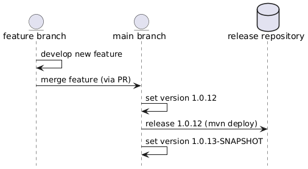

# Versioning of the project

Project use traditional versioning pattern. Version number consist of three numbers separated by dots. For example:

```
0.3.6
```

Meaning of number is:
* `0` - Major project version, project API could be incompatible between two major versions
* `3` - Minor project version contains changes in features, performance optimizations and small improvement. Minor versions should be compatible.
* `6` - Bug fixing project release

There are also snapshot versions with version number `0.3.6-SNAPSHOT`. Snapshot versions should not by sotred into maven repository.

# Project branching



there are following branches:
- main - the main stable release branch
- devel - sed for ongoing development and bug fixes
- feature branches - optionaly created for new features; especially useful for large or experimental changes

# How to deploy new version

## prerequisities
 Adjust settings.xml in `~/.m2/settings.xml` like this described at [github official documentaion how to wootk with github maven repository](https://docs.github.com/en/packages/working-with-a-github-packages-registry/working-with-the-apache-maven-registry). Get correct token and it's done.

## make release

1) perform steps according to previous image
2) It's done

## How to perfom some tasks

### How to use custome settings.xml file

```
mvn --settings ./src/main/settings.xml clean deploy
```

### How to use set maven project version

```
mvn versions:set -DnewVersion=1.0.1-SNAPSHOT
```

it's done.


# How to use project

As release repository is used github packages. Released packages could be easily used in your project. In case of maven:

```
<dependency>
  <groupId>com.coroptis</groupId>
  <artifactId>jbindex</artifactId>
  <version>1.0.0-SNAPSHOT</version>
</dependency>
```
