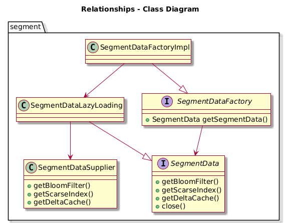

# Segment implementation

Segment is core part of index. It represents one string sorted table file with:

* Partial consistency - iterator stop working or return consistent data
* Support Writing changes into delta files
* Bloom filter for faster evaluating if key is in index
* Scarce index for faster searching for data in main index

## Segment put/get and iterate consistency

operations like write and get should be always consistent. What is written is read. Iteration behave differently. better than provide old data it stop providing any data.

Let's have a followin key value pairs in main index:
```text
<a, 20 >
<b, 30 >
<c, 40 >
```

In segment cache are following pairs:
```text
<a, 25>
<e, 28>
<b, tombstone>
```

When user will iterate throught segment data, there will be followin cases:

### Case 1 - Read data

```text
iterator.read() --> <a, 25>
iterator.read() --> <c, 40>
iterator.read() --> <e, 28>
```

### Case 2 - Change data

```text
iterator.read() --> <a, 25>
segment.write(c, 10)
iterator.read() --> null
```

Any segment write operation will break segment iterator. It's easier way to secure segment consistency.  

## Caching of segment data

In segment following object are cached:

* SegmentDeltaCache - contains changed key value pair from segment
* BloomFilter - bloom filter data
* ScarceIndex - scarce index data

When in segment is needed for example BloomFilter that it obtained like this:


Object `SegmentData` could contains objects `SegmentDeltaCache`, `BloomFilter` and `ScarceIndex`. All of them are lazy loaded from `SegmentDataLoader`. Segment data and segment data loaders have interface and it's implementation in different packages. Main reason is to avoid dependency from `com.coroptis.index.segment` package to `com.coroptis.index.sst` package.



Following image shows references between objects in runtime:


## Writing to segment

Opening segment writer immediatelly close all segment readers. When writing operation add key that is in index but is not in cache this value will not returned updated. 

Putting new pair into segment is here:


