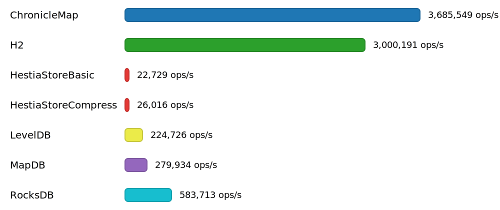
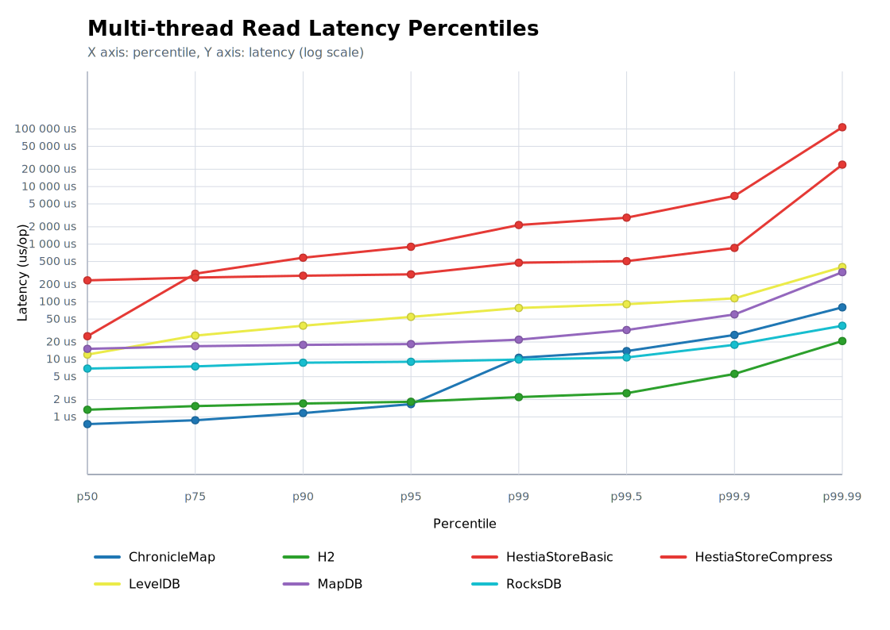

# Benchmark for 'Multi-thread read' operation

## Chart

## Percentile Chart

This chart shows the latency percentile curve for the benchmarked engines. The X axis runs from p50 to p99.99, and the Y axis uses a logarithmic latency scale so tail-latency differences are easier to compare.

## Test Conditions - Multi-thread Read Benchmarks

- Multi-thread read runs reuse the same controlled JVM flags, hardware, and storage directory preparation as the other benchmark suites. Each trial starts from a clean directory provided through the `dir` system property, then preloads the dataset before measurement begins.
- Setup inserts 10 000 000 deterministic key/value pairs before the benchmark starts. Keys are generated by `HashDataProvider` from numeric indexes, while values remain the constant text `"opice skace po stromech"`.
- Each benchmark thread performs the same read operation in two JMH modes during the same run: `SampleTime` to capture latency distribution and `Throughput` to capture aggregate operations per second.
- The configured thread count for this result set is 4 benchmark threads, matching the `threads4` suffix used by the generated result files.
- Read traffic mixes hits and misses using the same policy as the single-thread read suite: 80% existing keys and 20% guaranteed misses, controlled by `benchmarkMissProbability=0.2`.
- Warm-up uses 10 iterations of 20 seconds, followed by 25 measurement iterations of 20 seconds, so the numbers reflect sustained concurrent lookup behavior rather than a short burst.
- After measurements finish, resources are closed and the populated directories remain on disk so report generation can capture occupied space and CPU usage.
- Tests executed on Mac mini 2024, 16 GB, macOS 15.6.1 (24G90).

## Data for Throughtput Chart

| Engine | Threads | Throughput [ops/s] | CPU Usage |
|:-------|--------:|-------------------:|----------:|
| ChronicleMap | 4 | 3 685 549 | 12% |
| H2 | 4 | 3 000 191 | 12% |
| HestiaStoreBasic | 4 | 20 021 | 21% |
| HestiaStoreCompress | 4 | 44 830 | 30% |
| LevelDB | 4 | 224 726 | 13% |
| MapDB | 4 | 279 934 | 11% |
| RocksDB | 4 | 583 713 | 13% |

## Source Data for Percentile Chart

| Engine | p50 [us/op] | p75 [us/op] | p90 [us/op] | p95 [us/op] | p99 [us/op] | p99.5 [us/op] | p99.9 [us/op] | p99.99 [us/op] |
|:-------|-------------:|-------------:|-------------:|-------------:|-------------:|-------------:|-------------:|-------------:|
| ChronicleMap | 0.75 | 0.875 | 1.166 | 1.542 | 10.496 | 16.24 | 35.072 | 79.744 |
| H2 | 1.334 | 1.542 | 1.708 | 1.834 | 2.208 | 2.624 | 7.704 | 19.872 |
| HestiaStoreBasic | 251.392 | 277.504 | 309.248 | 421.888 | 641.024 | 703.488 | 1 095.68 | 4 080.22 |
| HestiaStoreCompress | 228.864 | 340.48 | 468.48 | 524.288 | 921.6 | 1 259.52 | 2 957.312 | 8 093.696 |
| LevelDB | 10 | 23.552 | 34.432 | 48.448 | 69.632 | 73.984 | 85.248 | 379.392 |
| MapDB | 14.784 | 16.416 | 17.312 | 17.888 | 19.872 | 21.312 | 42.048 | 308.224 |
| RocksDB | 6.832 | 7.536 | 8.576 | 8.912 | 9.696 | 10.288 | 14.656 | 36.416 |
