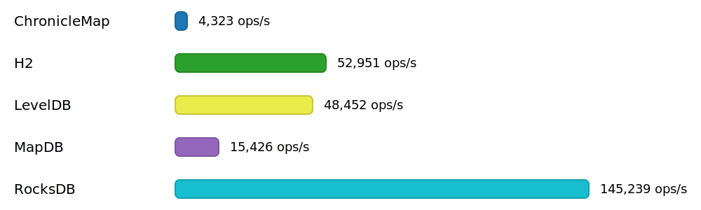
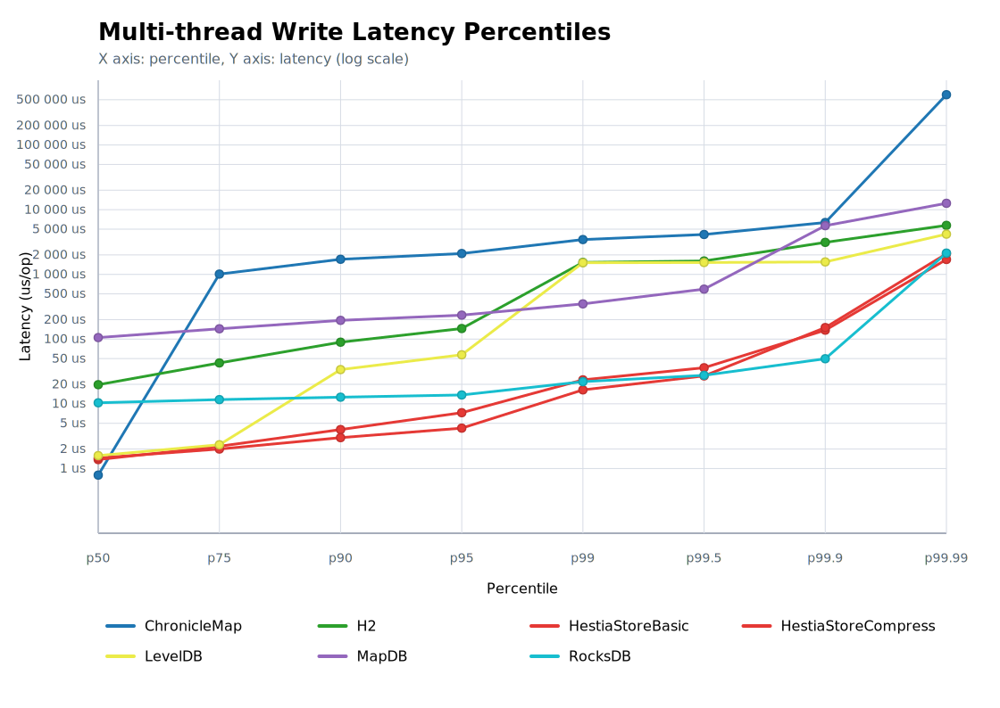

# Benchmark for 'Multi-thread write' operation

## Chart

## Percentile Chart

This chart shows the latency percentile curve for the benchmarked engines. The X axis runs from p50 to p99.99, and the Y axis uses a logarithmic latency scale so tail-latency differences are easier to compare.

## Test Conditions - Multi-thread Write Benchmarks

- Multi-thread write runs reuse the same controlled JVM flags and hardware as the other benchmark suites. Each trial wipes the working directory supplied through the `dir` system property and creates a fresh storage instance before any benchmark thread starts.
- Each benchmark thread performs the same write operation in two JMH modes during the same run: `SampleTime` to capture latency percentiles and `Throughput` to capture aggregate write throughput.
- The configured thread count for this result set is 4 benchmark threads, matching the `threads4` suffix used by the generated result files.
- Every operation generates a pseudo-random key via `HashDataProvider.makeHash(ThreadLocalRandom.current().nextLong())`, so concurrent writers insert independent keys while using the constant payload `"opice skace po stromech"`.
- Warm-up uses 10 iterations of 20 seconds, followed by 25 measurement iterations of 20 seconds, so the results represent sustained concurrent write pressure rather than startup behavior.
- The benchmark focuses on contention and latency under concurrent insert load. There is no preload phase for this suite; the store starts empty at the beginning of each trial.
- After measurements complete, the storage is closed and the resulting directory remains available so the reporting scripts can capture occupied space and CPU usage.
- Test was performed at Mac mini 2024, 16 GB, macOS 15.6.1 (24G90).

## Data for Throughtput Chart

| Engine | Threads | Throughput [ops/s] | CPU Usage |
|:-------|--------:|-------------------:|----------:|
| ChronicleMap | 4 | 3 715 | 16% |
| H2 | 4 | 37 088 | 32% |
| HestiaStoreBasic | 4 | 101 525 | 13% |
| HestiaStoreCompress | 4 | 316 822 | 21% |
| LevelDB | 4 | 62 152 | 19% |
| MapDB | 4 | 17 127 | 17% |
| RocksDB | 4 | 129 179 | 14% |

## Source Data for Percentile Chart

| Engine | p50 [us/op] | p75 [us/op] | p90 [us/op] | p95 [us/op] | p99 [us/op] | p99.5 [us/op] | p99.9 [us/op] | p99.99 [us/op] |
|:-------|-------------:|-------------:|-------------:|-------------:|-------------:|-------------:|-------------:|-------------:|
| ChronicleMap | 2.372 | 1 191.936 | 2 314.24 | 3 317.76 | 5 832.704 | 7 028.736 | 19 450.659 | 670 040.064 |
| H2 | 36.288 | 70.016 | 136.96 | 227.072 | 1 331.2 | 1 591.296 | 3 043.328 | 4 800.512 |
| HestiaStoreBasic | 1.374 | 2.124 | 3.708 | 6.368 | 22.848 | 37.76 | 179.712 | 2 928.64 |
| HestiaStoreCompress | 1.5 | 2.248 | 3.832 | 4.704 | 20.704 | 46.528 | 444.416 | 3 645.44 |
| LevelDB | 1.582 | 2.292 | 33.408 | 56.32 | 1 511.424 | 1 525.76 | 1 562.624 | 4 341.76 |
| MapDB | 107.264 | 146.688 | 199.168 | 241.408 | 430.08 | 3 477.504 | 7 725.056 | 13 942.784 |
| RocksDB | 9.072 | 11.456 | 12.528 | 13.36 | 20.064 | 26.624 | 1 542.144 | 1 562.624 |
