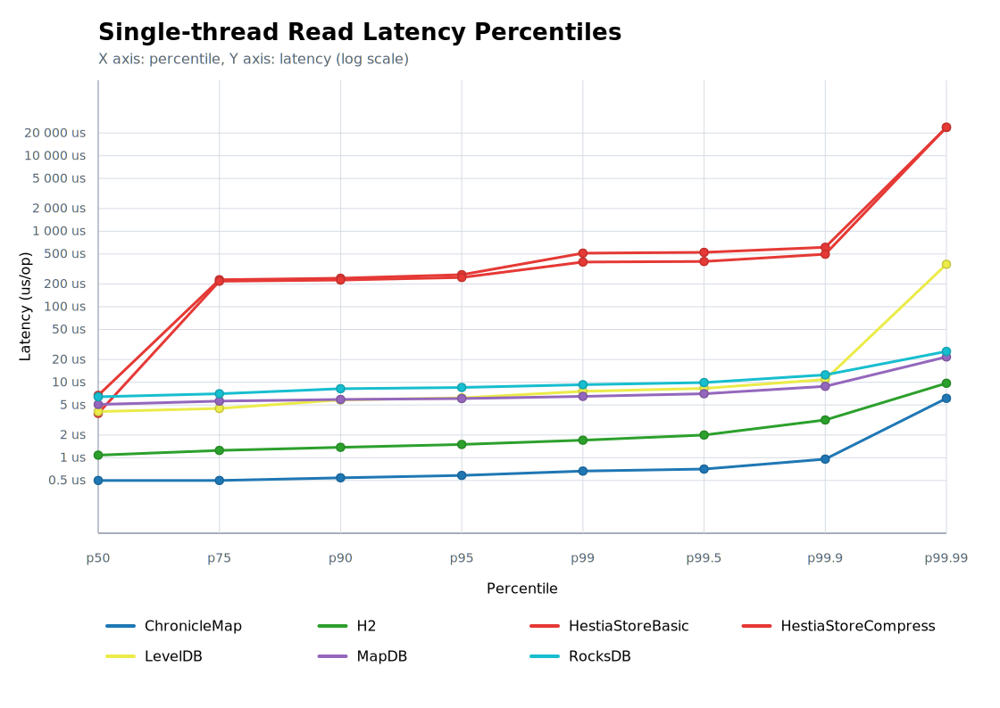

# Benchmark for 'Single-thread read' operation

## Chart

## Percentile Chart

This chart shows the latency percentile curve for the benchmarked engines. The X axis runs from p50 to p99.99, and the Y axis uses a logarithmic latency scale so tail-latency differences are easier to compare.

## Test Conditions - Single-thread Read Benchmarks

- Read-focused runs reuse the same controlled JVM, hardware, and JVM flag configuration as the write suite. Each trial prepares a clean directory pointed to by the `dir` system property before preloading the dataset.
- Setup inserts 10 000 000 deterministic key/value pairs (seed `324432L`) so every engine serves identical data. Keys come from `HashDataProvider`, while values remain the constant string `"opice skace po stromech"`.
- Warm-up iterations issue random lookups (80 % hits, 20 % misses) to trigger JIT compilation, cache population, and to ensure index structures have settled before measurements start.
- Each run exposes the same single-threaded read loop in two JMH modes: `SampleTime` to capture per-operation latency distribution and `Throughput` to capture sustained lookup performance over 20-second windows.
- Each benchmark keeps a consistent random sequence per iteration, ensuring engines experience the same access pattern and allowing apples-to-apples comparisons.
- After measurements finish, readers close their resources but the populated directories remain on disk so sizes can be captured by the reporting scripts.
- Tests executed on Mac mini 2024, 16 GB RAM, macOS 15.6.1 (24G90).

## Data for Throughtput Chart

| Engine | Score [ops/s] | Mean [us/op] | p50 [us/op] | p95 [us/op] | p99 [us/op] | Occupied space | CPU Usage |
|:-------|--------------:|-------------:|------------:|------------:|------------:|---------------:|----------:|
| ChronicleMap |     2 202 147 | 0.469 | 0.5 | 0.583 | 0.666 | 2.03 GB | 8% |
| H2 |       912 427 | 1.11 | 1.082 | 1.5 | 1.708 | 8 KB | 9% |
| LevelDB |       253 469 | 4.232 | 4.084 | 6.208 | 7.576 | 363.36 MB | 8% |
| MapDB |       201 583 | 4.964 | 5.08 | 6.08 | 6.496 | 1.3 GB | 7% |
| RocksDB |       156 017 | 6.465 | 6.416 | 8.528 | 9.28 | 324.23 MB | 8% |

## Source Data for Percentile Chart

| Engine | p50 [us/op] | p75 [us/op] | p90 [us/op] | p95 [us/op] | p99 [us/op] | p99.5 [us/op] | p99.9 [us/op] | p99.99 [us/op] |
|:-------|-------------:|-------------:|-------------:|-------------:|-------------:|-------------:|-------------:|-------------:|
| ChronicleMap | 0.5 | 0.5 | 0.542 | 0.583 | 0.666 | 0.708 | 0.959 | 6.12 |
| H2 | 1.082 | 1.25 | 1.374 | 1.5 | 1.708 | 2 | 3.164 | 9.696 |
| LevelDB | 4.084 | 4.496 | 5.832 | 6.208 | 7.576 | 8.288 | 10.864 | 365.056 |
| MapDB | 5.08 | 5.624 | 5.912 | 6.08 | 6.496 | 7.04 | 8.832 | 21.664 |
| RocksDB | 6.416 | 7.04 | 8.208 | 8.528 | 9.28 | 9.904 | 12.528 | 25.6 |
