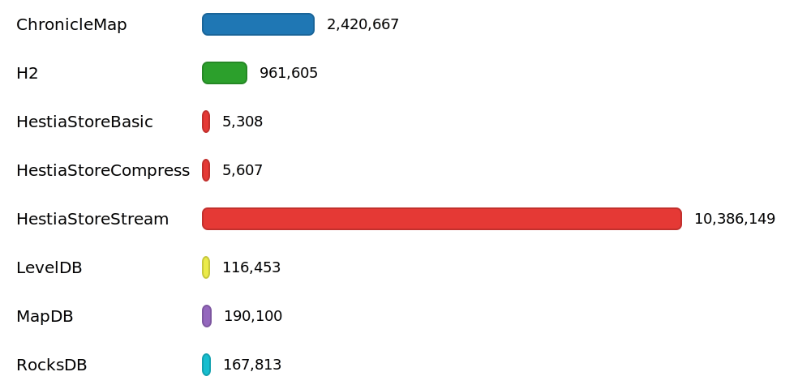
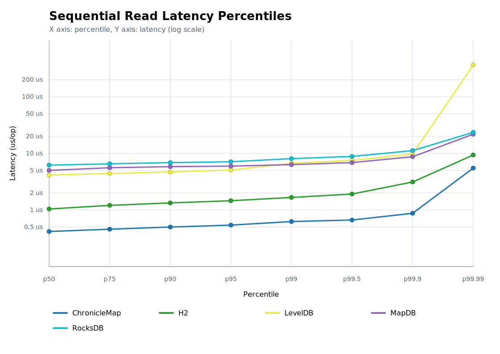

# Benchmark for 'Sequential read' operation

## Chart

## Percentile Chart

This chart shows the latency percentile curve for the benchmarked engines. The X axis runs from p50 to p99.99, and the Y axis uses a logarithmic latency scale so tail-latency differences are easier to compare.

## Test Conditions - Sequential Read Benchmarks

- Each sequential scenario uses the same JVM flags, hardware, and scratch directory handling as the write/read suites. The `dir` property is cleaned before every run to guarantee a fresh start.
- Setup writes 10 000 000 deterministic key/value pairs (seed `324432L`) into the engine. Keys are generated via `HashDataProvider` so that the exact ordering is reproducible across runs.
- After preloading, the benchmark resets its sequential cursor. Warm-up iterations walk the keyspace from the first key to the last key so caches and OS I/O buffers reflect streaming access.
- Each run exposes the same single-threaded sequential scan in two JMH modes: `SampleTime` to capture per-operation latency distribution and `Throughput` to capture sustained ordered-read performance.
- The read workload remains single-threaded; each invocation issues exactly one lookup to keep measurements comparable with the other suites.
- Directories remain on disk after the run so disk usage and auxiliary metrics can be collected by reporting scripts.
- Tests for HestiaStoreStream use dedicated stream API. Without using Stream API is performance visible in line HestiaStoreBasic.
- Tests executed on Mac mini 2024, 16 GB RAM, macOS 15.6.1 (24G90).

## Data for Throughtput Chart

| Engine | Score [ops/s] | Mean [us/op] | p50 [us/op] | p95 [us/op] | p99 [us/op] | Occupied space | CPU Usage |
|:-------|--------------:|-------------:|------------:|------------:|------------:|---------------:|----------:|
| ChronicleMap |     2 420 667 | 0.43 | 0.417 | 0.541 | 0.625 | 2.03 GB | 8% |
| H2 |       961 605 | 1.075 | 1.042 | 1.458 | 1.666 | 8 KB | 8% |
| HestiaStoreBasic |         9 629 | 200.582 | 197.888 | 350.72 | 478.72 | 1.32 GB | 11% |
| HestiaStoreCompress |         4 655 | 149.74 | 190.208 | 231.168 | 372.224 | 819.86 MB | 13% |
| HestiaStoreStream |     8 873 078 | 0.259 | 0.042 | 0.166 | 0.25 | 816.85 MB | 10% |
| LevelDB |       116 453 | 8.589 | 7.744 | 11.536 | 13.408 | 363.44 MB | 9% |
| MapDB |       190 100 | 5.476 | 5.288 | 6.288 | 6.624 | 1.3 GB | 6% |
| RocksDB |       167 813 | 5.968 | 6.08 | 6.912 | 7.744 | 324.23 MB | 8% |

## Source Data for Percentile Chart

| Engine | p50 [us/op] | p75 [us/op] | p90 [us/op] | p95 [us/op] | p99 [us/op] | p99.5 [us/op] | p99.9 [us/op] | p99.99 [us/op] |
|:-------|-------------:|-------------:|-------------:|-------------:|-------------:|-------------:|-------------:|-------------:|
| ChronicleMap | 0.417 | 0.459 | 0.5 | 0.541 | 0.625 | 0.666 | 0.875 | 5.416 |
| H2 | 1.042 | 1.208 | 1.334 | 1.458 | 1.666 | 1.834 | 3 | 9.04 |
| HestiaStoreBasic | 197.888 | 209.664 | 221.44 | 350.72 | 478.72 | 498.688 | 642.048 | 965.632 |
| HestiaStoreCompress | 190.208 | 199.936 | 208.896 | 231.168 | 372.224 | 403.968 | 740.352 | 2 212.885 |
| HestiaStoreStream | 0.042 | 0.042 | 0.125 | 0.166 | 0.25 | 0.333 | 16.24 | 204.544 |
| LevelDB | 7.744 | 9.952 | 10.944 | 11.536 | 13.408 | 14.528 | 18.784 | 380.416 |
| MapDB | 5.288 | 5.912 | 6.16 | 6.288 | 6.624 | 7.16 | 9.072 | 22.528 |
| RocksDB | 6.08 | 6.368 | 6.704 | 6.912 | 7.744 | 8.528 | 10.528 | 20.096 |
