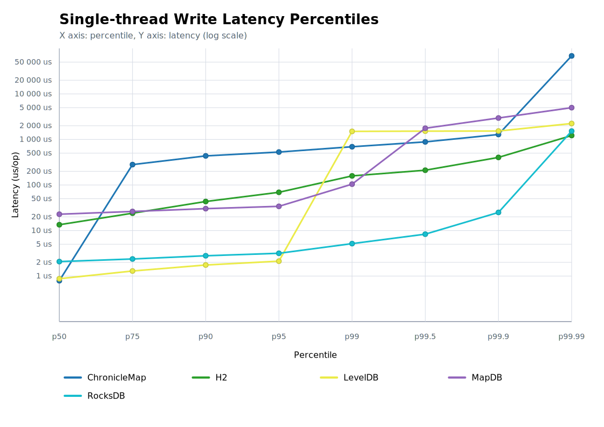

# Benchmark for 'Single-thread write' operation

## Chart

## Percentile Chart

This chart shows the latency percentile curve for the benchmarked engines. The X axis runs from p50 to p99.99, and the Y axis uses a logarithmic latency scale so tail-latency differences are easier to compare.

## Test Conditions

- Every benchmark in the single-thread write suite runs inside the same controlled JVM environment with identical JVM flags and hardware resources. Runs start by wiping the working directory supplied through the `dir` system property, so each trial writes into a fresh, empty location.
- Execution stays single-threaded from warm-up through measurement. The test focuses purely on how quickly one writer can push key/value pairs into the storage engine without any coordination overhead from additional threads.
- Warm-up phases fill the database as aggressively as possible for several 20-second stretches. This stage is meant to trigger JIT compilation, populate caches, and let LevelDB settle into steady-state behaviour before any numbers are recorded.
- Each run exposes the same single-threaded write loop in two JMH modes: `SampleTime` to capture per-operation latency distribution and `Throughput` to capture sustained operations per second.
- Each write operation uses a deterministic pseudo-random long (seed `324432L`) to generate a unique hash string via `HashDataProvider`. The payload is the constant text `"opice skace po stromech"`, so variability comes exclusively from the changing keys.
- After measurements complete, the map is closed and the directory remains available for inspection. The log records how many keys were created, providing a quick sanity check that the run processed the expected volume.
- Test was performed at Mac mini 2024, 16 GB, macOS 15.6.1 (24G90).

## Data for Throughtput Chart

| Engine | Score [ops/s] | Mean [us/op] | p50 [us/op] | p95 [us/op] | p99 [us/op] | Occupied space | CPU Usage |
|:-------|--------------:|-------------:|------------:|------------:|------------:|---------------:|----------:|
| ChronicleMap |         2 854 | 396.956 | 2.332 | 813.056 | 1 296.384 | 20.54 GB | 14% |
| H2 |        32 688 | 26.641 | 16.24 | 66.688 | 163.328 | 8 KB | 20% |
| HestiaStoreBasic |       146 818 | 75.696 | 0.708 | 4.16 | 10.656 | 17.58 GB | 12% |
| LevelDB |        62 661 | 25.083 | 0.917 | 2.164 | 1 505.28 | 1.93 GB | 12% |
| MapDB |        13 991 | 95.678 | 23.872 | 35.456 | 1 435.648 | 2.28 GB | 14% |
| RocksDB |       125 932 | 9.982 | 2.08 | 3 | 3.832 | 6.43 GB | 10% |

## Source Data for Percentile Chart

| Engine | p50 [us/op] | p75 [us/op] | p90 [us/op] | p95 [us/op] | p99 [us/op] | p99.5 [us/op] | p99.9 [us/op] | p99.99 [us/op] |
|:-------|-------------:|-------------:|-------------:|-------------:|-------------:|-------------:|-------------:|-------------:|
| ChronicleMap | 2.332 | 329.216 | 581.632 | 813.056 | 1 296.384 | 1 488.896 | 2 523.136 | 597 688.32 |
| H2 | 16.24 | 27.328 | 46.272 | 66.688 | 163.328 | 215.296 | 399.36 | 1 095.68 |
| HestiaStoreBasic | 0.708 | 1 | 2.748 | 4.16 | 10.656 | 21.568 | 97.024 | 1 247.232 |
| LevelDB | 0.917 | 1.374 | 1.832 | 2.164 | 1 505.28 | 1 523.712 | 1 533.952 | 2 222.936 |
| MapDB | 23.872 | 27.264 | 31.36 | 35.456 | 1 435.648 | 2 236.416 | 3 264.512 | 4 800.512 |
| RocksDB | 2.08 | 2.372 | 2.708 | 3 | 3.832 | 4.744 | 11.952 | 1 513.472 |
